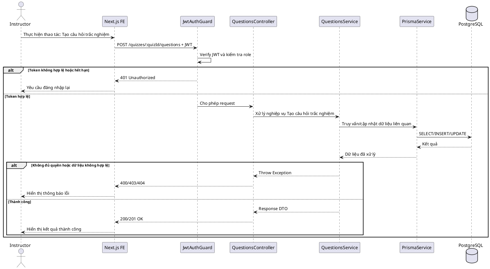
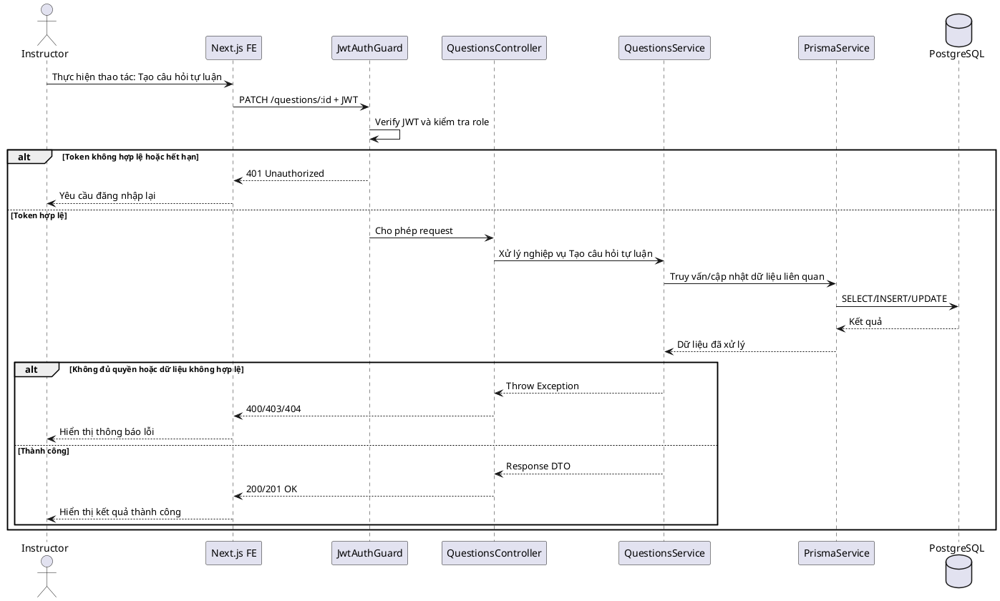
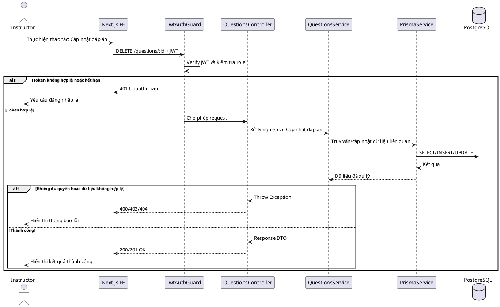

# SKILL.md — Use-case: Quản lý câu hỏi

## 1. Mục tiêu use-case

Use-case **Quản lý câu hỏi** cho phép giảng viên tạo câu hỏi trắc nghiệm/tự luận, đáp án, điểm và thứ tự câu hỏi trong quiz.

Hệ thống sử dụng:

```txt
Frontend: Next.js
Backend: NestJS
Database: PostgreSQL
ORM: Prisma
Auth: JWT access token
Video: Mux
Storage tài liệu: S3/R2 hoặc storage tương đương
```

Trong phạm vi tài liệu này, hệ thống **không sử dụng bảng refresh_tokens**. JWT access token được dùng để xác thực request; khi đăng xuất, frontend xóa token/cookie đang lưu.

---

## 2. Actor tham gia

| Actor | Mô tả |
|---|---|
| Instructor | Giảng viên đã được duyệt role |
| LMS System | Backend xử lý xác thực, nghiệp vụ và dữ liệu |

Actor chính của use-case này:

```txt
Instructor
```

---

## 3. Phạm vi chức năng

Use-case **Quản lý câu hỏi** bao gồm:

```txt
Tạo câu hỏi MULTIPLE_CHOICE
Tạo câu hỏi ESSAY
Thêm đáp án
Đánh dấu đáp án đúng
Sửa câu hỏi
Xóa câu hỏi
Sắp xếp câu hỏi
Thiết lập điểm câu hỏi
```

Không bao gồm:

```txt
Học viên làm bài
Tổng hợp điểm attempt
```

Các chức năng không bao gồm sẽ được tách sang use-case khác để báo cáo rõ ràng và dễ triển khai theo module.

---

## 4. Tiền điều kiện và hậu điều kiện

### 4.1. Tạo câu hỏi trắc nghiệm

| Mục | Nội dung |
|---|---|
| Tiền điều kiện | Actor đã đăng nhập nếu chức năng yêu cầu xác thực; tài khoản phải ở trạng thái `ACTIVE`; dữ liệu liên quan phải tồn tại trong database. |
| Hậu điều kiện | Hệ thống hoàn tất luồng **Tạo câu hỏi trắc nghiệm**, dữ liệu được cập nhật trong bảng liên quan và frontend hiển thị trạng thái mới. |

### 4.2. Tạo câu hỏi tự luận

| Mục | Nội dung |
|---|---|
| Tiền điều kiện | Actor đã đăng nhập nếu chức năng yêu cầu xác thực; tài khoản phải ở trạng thái `ACTIVE`; dữ liệu liên quan phải tồn tại trong database. |
| Hậu điều kiện | Hệ thống hoàn tất luồng **Tạo câu hỏi tự luận**, dữ liệu được cập nhật trong bảng liên quan và frontend hiển thị trạng thái mới. |

### 4.3. Cập nhật đáp án

| Mục | Nội dung |
|---|---|
| Tiền điều kiện | Actor đã đăng nhập nếu chức năng yêu cầu xác thực; tài khoản phải ở trạng thái `ACTIVE`; dữ liệu liên quan phải tồn tại trong database. |
| Hậu điều kiện | Hệ thống hoàn tất luồng **Cập nhật đáp án**, dữ liệu được cập nhật trong bảng liên quan và frontend hiển thị trạng thái mới. |

---

## 5. Database liên quan

Use-case này chủ yếu sử dụng các bảng: `users`, `courses`, `quizzes`, `questions`, `question_options`, `quiz_answers`.

### Bảng `users`
```dbml
Table users {
  id uuid [primary key]
  full_name varchar [not null]
  email varchar [not null, unique]
  password_hash text [not null]
  avatar_url text
  role user_role [not null, default: 'STUDENT']
  status user_status [not null, default: 'ACTIVE']
  created_at timestamp
  updated_at timestamp
}
```

Quan hệ chính:
- users 1 - N courses thông qua courses.instructor_id
- users 1 - N enrollments thông qua enrollments.student_id
- users 1 - N quiz_attempts thông qua quiz_attempts.student_id

### Bảng `courses`
```dbml
Table courses {
  id uuid [primary key]
  instructor_id uuid [not null]
  category_id uuid
  title varchar [not null]
  slug varchar [not null, unique]
  short_description text
  description text
  thumbnail_url text
  level course_level [not null, default: 'BEGINNER']
  status course_status [not null, default: 'DRAFT']
  price decimal(10,2) [default: 0]
  created_at timestamp
  updated_at timestamp
}
```

Quan hệ chính:
- users 1 - N courses
- categories 1 - N courses
- courses 1 - N course_sections
- courses 1 - N enrollments
- courses 1 - N quizzes

### Bảng `quizzes`
```dbml
Table quizzes {
  id uuid [primary key]
  course_id uuid [not null]
  lesson_id uuid
  title varchar [not null]
  description text
  time_limit_minutes integer
  passing_score decimal(5,2) [default: 0]
  max_attempts integer [default: 1]
  created_at timestamp
  updated_at timestamp
}
```

Quan hệ chính:
- courses 1 - N quizzes
- lessons 1 - N quizzes nếu lesson_id khác null
- quizzes 1 - N questions
- quizzes 1 - N quiz_attempts

### Bảng `questions`
```dbml
Table questions {
  id uuid [primary key]
  quiz_id uuid [not null]
  question_text text [not null]
  question_type question_type [not null]
  score decimal(5,2) [default: 1]
  order_index integer [not null]
  created_at timestamp
  updated_at timestamp
}
```

Quan hệ chính:
- quizzes 1 - N questions
- questions 1 - N question_options
- questions 1 - N quiz_answers

### Bảng `question_options`
```dbml
Table question_options {
  id uuid [primary key]
  question_id uuid [not null]
  option_text text [not null]
  is_correct boolean [default: false]
  order_index integer [not null]
}
```

Quan hệ chính:
- questions 1 - N question_options
- question_options 1 - N quiz_answers

### Bảng `quiz_answers`
```dbml
Table quiz_answers {
  id uuid [primary key]
  attempt_id uuid [not null]
  question_id uuid [not null]
  selected_option_id uuid
  essay_answer text
  score decimal(5,2) [default: 0]
  feedback text
  graded_by uuid
  graded_at timestamp
  created_at timestamp
  updated_at timestamp
}
```

Quan hệ chính:
- quiz_attempts 1 - N quiz_answers
- questions 1 - N quiz_answers
- question_options 1 - N quiz_answers

### Enum liên quan

```dbml
Enum user_role {
  STUDENT
  INSTRUCTOR
  ADMIN
}

Enum user_status {
  ACTIVE
  INACTIVE
  BANNED
}

Enum course_status {
  DRAFT
  PUBLISHED
  HIDDEN
  ARCHIVED
}

Enum enrollment_status {
  ACTIVE
  COMPLETED
  CANCELLED
}

Enum question_type {
  MULTIPLE_CHOICE
  ESSAY
}

Enum attempt_status {
  IN_PROGRESS
  SUBMITTED
  GRADED
}
```

### Ý nghĩa nghiệp vụ dữ liệu

- `users`: phục vụ lưu trữ/truy vấn dữ liệu cho use-case **Quản lý câu hỏi**.
- `courses`: phục vụ lưu trữ/truy vấn dữ liệu cho use-case **Quản lý câu hỏi**.
- `quizzes`: phục vụ lưu trữ/truy vấn dữ liệu cho use-case **Quản lý câu hỏi**.
- `questions`: phục vụ lưu trữ/truy vấn dữ liệu cho use-case **Quản lý câu hỏi**.
- `question_options`: phục vụ lưu trữ/truy vấn dữ liệu cho use-case **Quản lý câu hỏi**.
- `quiz_answers`: phục vụ lưu trữ/truy vấn dữ liệu cho use-case **Quản lý câu hỏi**.

---

## 6. Kiến trúc xử lý

### 6.1. Tổng quan kiến trúc

```txt
Next.js Frontend
   |
   | HTTP Request + JWT
   v
NestJS Backend
   |
   | QuestionsModule / Guards / Services
   v
Prisma ORM
   |
   v
PostgreSQL Database
```

### 6.2. Các module NestJS liên quan

```txt
src/
├── auth/
│   ├── guards/jwt-auth.guard.ts
│   ├── guards/roles.guard.ts
│   └── strategies/jwt.strategy.ts
├── questions/
│   ├── questions.module.ts
│   ├── questions.controller.ts
│   ├── questions.service.ts
│   └── dto/
│       ├── create.dto.ts
│       ├── update.dto.ts
│       └── query.dto.ts
└── prisma/
    ├── prisma.module.ts
    └── prisma.service.ts
```

### 6.3. Trách nhiệm từng thành phần

| Thành phần | Trách nhiệm |
|---|---|
| `questions.controller.ts` | Nhận request, đọc user từ JWT, gọi service và trả response |
| `questions.service.ts` | Xử lý nghiệp vụ chính của use-case **Quản lý câu hỏi** |
| `JwtAuthGuard` | Xác thực access token |
| `RolesGuard` | Kiểm tra role `STUDENT`, `INSTRUCTOR`, `ADMIN` |
| `PrismaService` | Thao tác dữ liệu PostgreSQL |
| `DTO` | Validate dữ liệu đầu vào |

---

## 7. API design

### 7.1. Tạo câu hỏi
```http
POST /quizzes/:quizId/questions
Authorization: Bearer access_token
```

Request gợi ý:
```json
{
  "exampleField": "exampleValue",
  "note": "Tạo câu hỏi"
}
```

Response thành công:
```json
{
  "message": "Tạo câu hỏi thành công",
  "data": {
    "id": "uuid"
  }
}
```

### 7.2. Sửa câu hỏi
```http
PATCH /questions/:id
Authorization: Bearer access_token
```

Request gợi ý:
```json
{
  "exampleField": "exampleValue",
  "note": "Sửa câu hỏi"
}
```

Response thành công:
```json
{
  "message": "Sửa câu hỏi thành công",
  "data": {
    "id": "uuid"
  }
}
```

### 7.3. Xóa câu hỏi
```http
DELETE /questions/:id
Authorization: Bearer access_token
```

Request gợi ý:
```json
// Không bắt buộc body. Có thể dùng query string để search/filter/pagination.
```

Response thành công:
```json
{
  "message": "Xóa câu hỏi thành công",
  "data": {
    "id": "uuid"
  }
}
```

### 7.4. Thêm đáp án
```http
POST /questions/:questionId/options
Authorization: Bearer access_token
```

Request gợi ý:
```json
{
  "exampleField": "exampleValue",
  "note": "Thêm đáp án"
}
```

Response thành công:
```json
{
  "message": "Thêm đáp án thành công",
  "data": {
    "id": "uuid"
  }
}
```

### 7.5. Sửa đáp án
```http
PATCH /options/:id
Authorization: Bearer access_token
```

Request gợi ý:
```json
{
  "exampleField": "exampleValue",
  "note": "Sửa đáp án"
}
```

Response thành công:
```json
{
  "message": "Sửa đáp án thành công",
  "data": {
    "id": "uuid"
  }
}
```

### 7.6. Xóa đáp án
```http
DELETE /options/:id
Authorization: Bearer access_token
```

Request gợi ý:
```json
// Không bắt buộc body. Có thể dùng query string để search/filter/pagination.
```

Response thành công:
```json
{
  "message": "Xóa đáp án thành công",
  "data": {
    "id": "uuid"
  }
}
```

---

## 8. Data flow

### 8.1. Data flow — Tạo câu hỏi trắc nghiệm

```txt
Instructor mở màn hình /instructor/quizzes/:quizId/questions
→ Next.js kiểm tra trạng thái đăng nhập
→ Next.js gửi POST /quizzes/:quizId/questions
→ NestJS JwtAuthGuard xác thực access token
→ RolesGuard kiểm tra quyền phù hợp với use-case
→ QuestionsController nhận request
→ QuestionsService kiểm tra dữ liệu đầu vào
→ Service kiểm tra quan hệ dữ liệu và quyền sở hữu nếu có
→ Service gọi Prisma để thao tác bảng chính: questions
→ PostgreSQL trả kết quả
→ Service chuẩn hóa response DTO
→ Controller trả response về frontend
→ Frontend cập nhật UI, hiển thị thông báo và chuyển bước tiếp theo
```

### 8.2. Data flow — Tạo câu hỏi tự luận

```txt
Instructor mở màn hình /instructor/quizzes/:quizId/questions
→ Next.js kiểm tra trạng thái đăng nhập
→ Next.js gửi PATCH /questions/:id
→ NestJS JwtAuthGuard xác thực access token
→ RolesGuard kiểm tra quyền phù hợp với use-case
→ QuestionsController nhận request
→ QuestionsService kiểm tra dữ liệu đầu vào
→ Service kiểm tra quan hệ dữ liệu và quyền sở hữu nếu có
→ Service gọi Prisma để thao tác bảng chính: questions
→ PostgreSQL trả kết quả
→ Service chuẩn hóa response DTO
→ Controller trả response về frontend
→ Frontend cập nhật UI, hiển thị thông báo và chuyển bước tiếp theo
```

### 8.3. Data flow — Cập nhật đáp án

```txt
Instructor mở màn hình /instructor/quizzes/:quizId/questions
→ Next.js kiểm tra trạng thái đăng nhập
→ Next.js gửi DELETE /questions/:id
→ NestJS JwtAuthGuard xác thực access token
→ RolesGuard kiểm tra quyền phù hợp với use-case
→ QuestionsController nhận request
→ QuestionsService kiểm tra dữ liệu đầu vào
→ Service kiểm tra quan hệ dữ liệu và quyền sở hữu nếu có
→ Service gọi Prisma để thao tác bảng chính: questions
→ PostgreSQL trả kết quả
→ Service chuẩn hóa response DTO
→ Controller trả response về frontend
→ Frontend cập nhật UI, hiển thị thông báo và chuyển bước tiếp theo
```

### 8.99. Quy tắc xử lý dữ liệu chung

```txt
Luôn lấy userId và role từ JWT, không lấy role từ body request.
Luôn kiểm tra bản ghi tồn tại trước khi cập nhật/xóa.
Với dữ liệu thuộc khóa học, phải kiểm tra quyền sở hữu của instructor nếu actor là Instructor.
Với dữ liệu của học viên, phải kiểm tra enrollment nếu chức năng yêu cầu đã đăng ký khóa học.
Không trả dữ liệu nhạy cảm như password_hash về frontend.
Chuẩn hóa response DTO để frontend dễ xử lý trạng thái loading/error/success.
```

---

## 9. Sequence diagram

### 9.1. Sequence — Tạo câu hỏi trắc nghiệm



### 9.2. Sequence — Tạo câu hỏi tự luận



### 9.3. Sequence — Cập nhật đáp án



---

## 10. Activity flow

### 10.1. Activity flow — Tạo câu hỏi trắc nghiệm

```txt
Bắt đầu
→ Actor chọn chức năng: Tạo câu hỏi trắc nghiệm
→ Hệ thống kiểm tra đăng nhập
   ├── Chưa đăng nhập → chuyển đến /login
   └── Đã đăng nhập
       → Kiểm tra role
          ├── Không đủ quyền → báo lỗi 403
          └── Đủ quyền
              → Validate dữ liệu đầu vào
                 ├── Không hợp lệ → báo lỗi 400
                 └── Hợp lệ
                     → Kiểm tra dữ liệu liên quan
                        ├── Không tồn tại → báo lỗi 404
                        └── Tồn tại
                            → Xử lý nghiệp vụ
                            → Cập nhật/truy vấn database
                            → Trả response
                            → Frontend cập nhật giao diện
Kết thúc
```

### 10.2. Activity flow — Tạo câu hỏi tự luận

```txt
Bắt đầu
→ Actor chọn chức năng: Tạo câu hỏi tự luận
→ Hệ thống kiểm tra đăng nhập
   ├── Chưa đăng nhập → chuyển đến /login
   └── Đã đăng nhập
       → Kiểm tra role
          ├── Không đủ quyền → báo lỗi 403
          └── Đủ quyền
              → Validate dữ liệu đầu vào
                 ├── Không hợp lệ → báo lỗi 400
                 └── Hợp lệ
                     → Kiểm tra dữ liệu liên quan
                        ├── Không tồn tại → báo lỗi 404
                        └── Tồn tại
                            → Xử lý nghiệp vụ
                            → Cập nhật/truy vấn database
                            → Trả response
                            → Frontend cập nhật giao diện
Kết thúc
```

### 10.3. Activity flow — Cập nhật đáp án

```txt
Bắt đầu
→ Actor chọn chức năng: Cập nhật đáp án
→ Hệ thống kiểm tra đăng nhập
   ├── Chưa đăng nhập → chuyển đến /login
   └── Đã đăng nhập
       → Kiểm tra role
          ├── Không đủ quyền → báo lỗi 403
          └── Đủ quyền
              → Validate dữ liệu đầu vào
                 ├── Không hợp lệ → báo lỗi 400
                 └── Hợp lệ
                     → Kiểm tra dữ liệu liên quan
                        ├── Không tồn tại → báo lỗi 404
                        └── Tồn tại
                            → Xử lý nghiệp vụ
                            → Cập nhật/truy vấn database
                            → Trả response
                            → Frontend cập nhật giao diện
Kết thúc
```

---

## 11. Kiểm tra phân quyền

### 11.1. JWT payload

```json
{
  "sub": "user_id",
  "email": "user@example.com",
  "role": "STUDENT|INSTRUCTOR|ADMIN"
}
```

### 11.2. Quyền truy cập API

| API | Quyền truy cập | Ghi chú |
|---|---|---|
| `POST /quizzes/:quizId/questions` | INSTRUCTOR | Tạo câu hỏi |
| `PATCH /questions/:id` | INSTRUCTOR | Sửa câu hỏi |
| `DELETE /questions/:id` | INSTRUCTOR | Xóa câu hỏi |
| `POST /questions/:questionId/options` | INSTRUCTOR | Thêm đáp án |
| `PATCH /options/:id` | INSTRUCTOR | Sửa đáp án |
| `DELETE /options/:id` | INSTRUCTOR | Xóa đáp án |

### 11.3. Quy tắc quan trọng

```txt
Không tin tưởng role gửi từ frontend.
Không cho user thao tác dữ liệu của user khác nếu không phải admin.
Instructor chỉ được thao tác dữ liệu thuộc khóa học do mình tạo.
Student chỉ được xem dữ liệu học tập khi đã enrollment hoặc bài học cho preview.
Admin không duyệt khóa học; admin chỉ quản trị tài khoản, yêu cầu giảng viên, danh mục và thống kê.
```

---

## 12. Validation rules

### 12.1. DTO chung

```txt
id: phải là UUID hợp lệ
page: số nguyên >= 1 nếu có phân trang
limit: số nguyên trong khoảng 1 - 100
search: chuỗi, trim khoảng trắng, giới hạn 255 ký tự
status: phải thuộc enum tương ứng
created_at/updated_at: không cho client tự sửa nếu không cần thiết
```

### 12.2. Validation theo chức năng

- Tạo câu hỏi MULTIPLE_CHOICE: kiểm tra dữ liệu bắt buộc, quyền truy cập, trạng thái bản ghi và quan hệ khóa ngoại trước khi xử lý.
- Tạo câu hỏi ESSAY: kiểm tra dữ liệu bắt buộc, quyền truy cập, trạng thái bản ghi và quan hệ khóa ngoại trước khi xử lý.
- Thêm đáp án: kiểm tra dữ liệu bắt buộc, quyền truy cập, trạng thái bản ghi và quan hệ khóa ngoại trước khi xử lý.
- Đánh dấu đáp án đúng: kiểm tra dữ liệu bắt buộc, quyền truy cập, trạng thái bản ghi và quan hệ khóa ngoại trước khi xử lý.
- Sửa câu hỏi: kiểm tra dữ liệu bắt buộc, quyền truy cập, trạng thái bản ghi và quan hệ khóa ngoại trước khi xử lý.
- Xóa câu hỏi: kiểm tra dữ liệu bắt buộc, quyền truy cập, trạng thái bản ghi và quan hệ khóa ngoại trước khi xử lý.
- Sắp xếp câu hỏi: kiểm tra dữ liệu bắt buộc, quyền truy cập, trạng thái bản ghi và quan hệ khóa ngoại trước khi xử lý.
- Thiết lập điểm câu hỏi: kiểm tra dữ liệu bắt buộc, quyền truy cập, trạng thái bản ghi và quan hệ khóa ngoại trước khi xử lý.

### 12.3. Ràng buộc database cần lưu ý

```txt
Email user phải unique.
Slug khóa học/danh mục phải unique nếu có dùng slug.
Enrollment nên unique theo student_id + course_id.
Lesson progress nên unique theo enrollment_id + lesson_id.
Không xóa dữ liệu cha nếu đang có dữ liệu con quan trọng, trừ khi đã thiết kế cascade rõ ràng.
```

---

## 13. Error handling

| Trường hợp | HTTP Status | Message gợi ý |
|---|---|---|
| Chưa đăng nhập | 401 | Vui lòng đăng nhập để tiếp tục |
| Token không hợp lệ hoặc hết hạn | 401 | Phiên đăng nhập đã hết hạn |
| Không đủ quyền | 403 | Bạn không có quyền thực hiện chức năng này |
| Dữ liệu không hợp lệ | 400 | Dữ liệu đầu vào không hợp lệ |
| Bản ghi không tồn tại | 404 | Không tìm thấy dữ liệu |
| Dữ liệu bị trùng | 409 | Dữ liệu đã tồn tại |
| Không đúng trạng thái nghiệp vụ | 409 | Không thể thực hiện thao tác ở trạng thái hiện tại |
| Lỗi hệ thống | 500 | Có lỗi xảy ra, vui lòng thử lại sau |

---

## 14. Bảo mật

Các yêu cầu bảo mật tối thiểu:

```txt
Luôn xác thực bằng JwtAuthGuard với API private.
Kiểm tra role bằng RolesGuard.
Không trả password_hash hoặc thông tin nhạy cảm về frontend.
Validate toàn bộ DTO bằng class-validator hoặc cơ chế tương đương.
Rate limit các API dễ bị spam nếu cần.
Ghi log lỗi ở backend nhưng không trả stack trace cho frontend.
Với file upload, kiểm tra mime type, extension và file size.
Với dữ liệu thuộc instructor, bắt buộc kiểm tra ownership.
Với dữ liệu học tập của student, bắt buộc kiểm tra enrollment.
```

---

## 15. Prototype user flow

### 15.1. Flow — Tạo câu hỏi trắc nghiệm

```txt
/instructor/quizzes/:quizId/questions
→ Người dùng chọn chức năng: Tạo câu hỏi trắc nghiệm
→ Frontend hiển thị form/danh sách tương ứng
→ Người dùng nhập dữ liệu hoặc chọn thao tác
→ Bấm xác nhận
→ Frontend gọi API backend
→ Backend kiểm tra token, role, dữ liệu
→ Backend xử lý nghiệp vụ
→ Frontend nhận response
→ UI cập nhật dữ liệu mới và hiển thị toast thông báo
```

### 15.2. Flow — Tạo câu hỏi tự luận

```txt
/instructor/quizzes/:quizId/questions
→ Người dùng chọn chức năng: Tạo câu hỏi tự luận
→ Frontend hiển thị form/danh sách tương ứng
→ Người dùng nhập dữ liệu hoặc chọn thao tác
→ Bấm xác nhận
→ Frontend gọi API backend
→ Backend kiểm tra token, role, dữ liệu
→ Backend xử lý nghiệp vụ
→ Frontend nhận response
→ UI cập nhật dữ liệu mới và hiển thị toast thông báo
```

### 15.3. Flow — Cập nhật đáp án

```txt
/instructor/quizzes/:quizId/questions
→ Người dùng chọn chức năng: Cập nhật đáp án
→ Frontend hiển thị form/danh sách tương ứng
→ Người dùng nhập dữ liệu hoặc chọn thao tác
→ Bấm xác nhận
→ Frontend gọi API backend
→ Backend kiểm tra token, role, dữ liệu
→ Backend xử lý nghiệp vụ
→ Frontend nhận response
→ UI cập nhật dữ liệu mới và hiển thị toast thông báo
```

---

## 16. Gợi ý màn hình giao diện

### 16.1. Màn hình danh sách/tổng quan

```txt
+--------------------------------------------------------------+
| Header / Sidebar                                             |
+--------------------------------------------------------------+
| Use-case: Quản lý câu hỏi                               |
| Route: /instructor/quizzes/:quizId/questions              |
+--------------------------------------------------------------+
| Bộ lọc / tìm kiếm / trạng thái                               |
| [Search________________] [Filter] [Sort]                     |
+--------------------------------------------------------------+
| Bảng hoặc danh sách dữ liệu                                  |
| - Dòng dữ liệu 1                                             |
| - Dòng dữ liệu 2                                             |
| - Dòng dữ liệu 3                                             |
+--------------------------------------------------------------+
| Pagination / Action buttons                                  |
+--------------------------------------------------------------+
```

### 16.2. Màn hình chi tiết/xử lý

```txt
+--------------------------------------------------------------+
| Tiêu đề chức năng                                            |
+--------------------------------------------------------------+
| Thông tin chính                                               |
| Label 1: value                                                |
| Label 2: value                                                |
| Label 3: value                                                |
+--------------------------------------------------------------+
| Form nhập liệu hoặc thao tác                                  |
| [Input 1____________________]                                 |
| [Input 2____________________]                                 |
| [Cancel] [Save/Submit]                                        |
+--------------------------------------------------------------+
```

### 16.3. Trạng thái UI cần có

```txt
Loading: hiển thị skeleton hoặc spinner
Empty: hiển thị thông báo chưa có dữ liệu
Error: hiển thị message từ backend
Success: hiển thị toast thành công
Forbidden: điều hướng hoặc báo không đủ quyền
```

---

## 17. Test cases cơ bản

| Mã test | Nội dung | Kết quả mong đợi |
|---|---|---|
| TC01 | Truy cập API khi chưa đăng nhập | Trả 401 Unauthorized |
| TC02 | Truy cập với role không phù hợp | Trả 403 Forbidden |
| TC03 | Gửi dữ liệu thiếu trường bắt buộc | Trả 400 Bad Request |
| TC04 | Gửi ID không tồn tại | Trả 404 Not Found |
| TC05 | Thực hiện thao tác hợp lệ | Trả 200/201 và dữ liệu đúng |
| TC06 | Kiểm tra chức năng: Tạo câu hỏi MULTIPLE_CHOICE | Hệ thống xử lý đúng nghiệp vụ và cập nhật dữ liệu chính xác |
| TC07 | Kiểm tra chức năng: Tạo câu hỏi ESSAY | Hệ thống xử lý đúng nghiệp vụ và cập nhật dữ liệu chính xác |
| TC08 | Kiểm tra chức năng: Thêm đáp án | Hệ thống xử lý đúng nghiệp vụ và cập nhật dữ liệu chính xác |
| TC09 | Kiểm tra chức năng: Đánh dấu đáp án đúng | Hệ thống xử lý đúng nghiệp vụ và cập nhật dữ liệu chính xác |
| TC10 | Kiểm tra chức năng: Sửa câu hỏi | Hệ thống xử lý đúng nghiệp vụ và cập nhật dữ liệu chính xác |
| TC11 | Kiểm tra chức năng: Xóa câu hỏi | Hệ thống xử lý đúng nghiệp vụ và cập nhật dữ liệu chính xác |
| TC12 | Kiểm tra chức năng: Sắp xếp câu hỏi | Hệ thống xử lý đúng nghiệp vụ và cập nhật dữ liệu chính xác |
| TC13 | Kiểm tra chức năng: Thiết lập điểm câu hỏi | Hệ thống xử lý đúng nghiệp vụ và cập nhật dữ liệu chính xác |
| TC14 | Kiểm tra edge case 1 của use-case | Không phát sinh lỗi ngoài dự kiến, message rõ ràng |
| TC15 | Kiểm tra edge case 1 của use-case | Không phát sinh lỗi ngoài dự kiến, message rõ ràng |
| TC16 | Kiểm tra edge case 1 của use-case | Không phát sinh lỗi ngoài dự kiến, message rõ ràng |
| TC17 | Kiểm tra edge case 1 của use-case | Không phát sinh lỗi ngoài dự kiến, message rõ ràng |
| TC18 | Kiểm tra edge case 1 của use-case | Không phát sinh lỗi ngoài dự kiến, message rõ ràng |
| TC19 | Kiểm tra edge case 1 của use-case | Không phát sinh lỗi ngoài dự kiến, message rõ ràng |
| TC20 | Kiểm tra edge case 1 của use-case | Không phát sinh lỗi ngoài dự kiến, message rõ ràng |

---

## 18. Checklist triển khai backend

- [ ] Tạo module/controller/service/dto
- [ ] Khai báo route API
- [ ] Bảo vệ route bằng JwtAuthGuard
- [ ] Bảo vệ role bằng RolesGuard nếu cần
- [ ] Viết query Prisma
- [ ] Validate DTO
- [ ] Xử lý exception
- [ ] Viết unit test service
- [ ] Viết e2e test cho API chính
- [ ] Kiểm tra response không lộ dữ liệu nhạy cảm

## 19. Checklist triển khai frontend

- [ ] Tạo route page tương ứng
- [ ] Tạo form/list/detail components
- [ ] Gọi API bằng fetch/axios
- [ ] Xử lý loading state
- [ ] Xử lý empty state
- [ ] Xử lý error state
- [ ] Hiển thị toast thành công/thất bại
- [ ] Kiểm tra điều hướng theo role
- [ ] Test responsive
- [ ] Test với dữ liệu thật từ backend

## 20. Kết luận

Use-case **Quản lý câu hỏi** là một phần quan trọng trong hệ thống LMS. Tài liệu này mô tả chi tiết từ phạm vi nghiệp vụ, database, API, luồng dữ liệu, sequence, activity flow đến prototype UI và test cases. Khi triển khai, nên bám sát phân quyền và ràng buộc dữ liệu để đảm bảo hệ thống ổn định, dễ mở rộng và dễ bảo trì.
