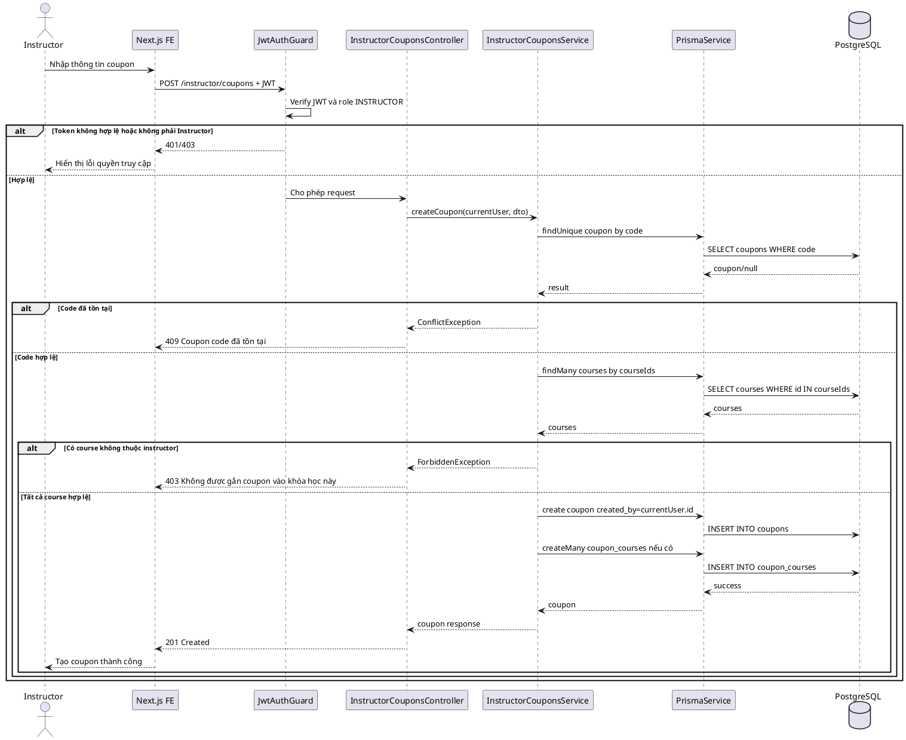
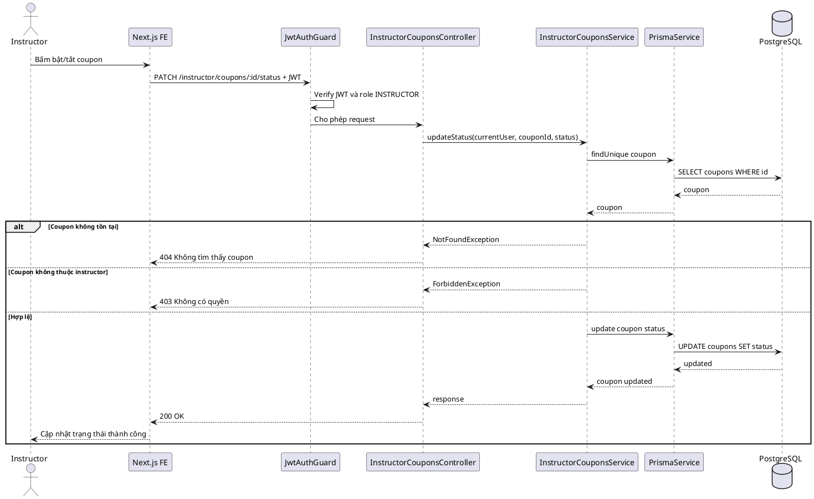
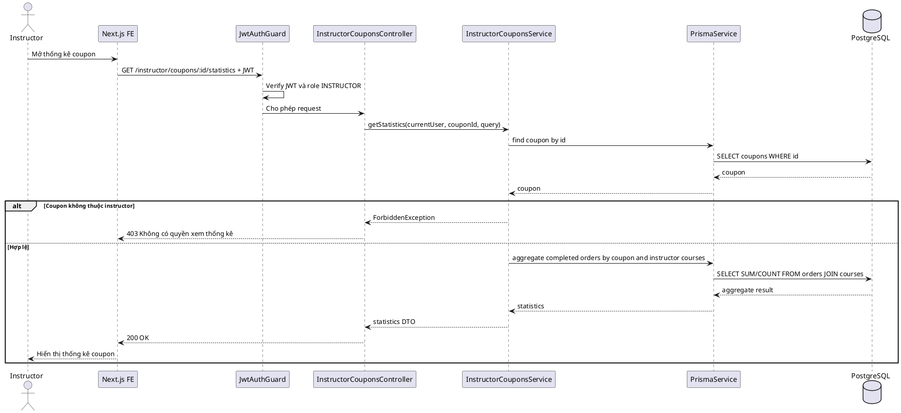

# SKILL.md — Use-case: Quản lý coupons cho giảng viên

---

## 1. Mục tiêu use-case

Use-case **Quản lý coupons cho giảng viên** cho phép giảng viên tạo, cập nhật, kích hoạt/tạm tắt và theo dõi coupon giảm giá dành cho các khóa học do chính giảng viên sở hữu.

Hệ thống sử dụng:

```txt
Frontend: Next.js
Backend: NestJS
Database: PostgreSQL
ORM: Prisma
Auth: JWT access token
Video: Mux
Storage tài liệu: S3/R2 hoặc storage tương đương
```

Trong phạm vi tài liệu này, hệ thống **không sử dụng bảng refresh_tokens**. JWT access token được dùng để xác thực request; khi đăng xuất, frontend xóa token/cookie đang lưu.

Use-case này tập trung vào phía **Instructor/Giảng viên**. Giảng viên chỉ được quản lý coupon do mình tạo và chỉ được áp dụng coupon cho khóa học thuộc quyền sở hữu của mình.

> Lưu ý quan trọng: Database hiện tại có bảng `coupons` với trường `created_by`, nhưng chưa có bảng ràng buộc coupon theo khóa học. Nếu muốn giảng viên tạo coupon an toàn, nên bổ sung bảng `coupon_courses` để giới hạn coupon chỉ áp dụng cho các khóa học của giảng viên đó. Nếu không bổ sung, coupon có thể bị hiểu là coupon toàn hệ thống.

---

## 2. Actor tham gia

| Actor | Mô tả |
|---|---|
| Instructor | Giảng viên đã được duyệt role `INSTRUCTOR` |
| LMS System | Backend xử lý xác thực, phân quyền, validate dữ liệu và lưu coupon |

Actor chính của use-case này:

```txt
Instructor
```

---

## 3. Phạm vi chức năng

Use-case **Quản lý coupons cho giảng viên** bao gồm:

```txt
Xem danh sách coupon do giảng viên tạo
Tìm kiếm coupon theo mã
Lọc coupon theo trạng thái ACTIVE/INACTIVE/EXPIRED
Tạo coupon cho khóa học của mình
Gắn coupon vào một hoặc nhiều khóa học của mình
Sửa thông tin coupon khi chưa được sử dụng hoặc theo chính sách cho phép
Bật/tắt coupon
Xem thống kê số lượt dùng coupon
Xem doanh thu/order có dùng coupon của mình
Kiểm tra coupon không áp dụng cho khóa học của giảng viên khác
```

Không bao gồm:

```txt
Tạo coupon toàn hệ thống
Quản lý coupon của giảng viên khác
Duyệt coupon giảng viên bởi admin
Hoàn tiền đơn hàng
Quản lý promotion trực tiếp theo danh mục/khóa học
```

Các chức năng không bao gồm sẽ được tách sang use-case Admin hoặc use-case Promotion riêng.

---

## 4. Tiền điều kiện và hậu điều kiện

### 4.1. Tạo coupon

| Mục | Nội dung |
|---|---|
| Tiền điều kiện | Instructor đã đăng nhập, tài khoản `ACTIVE`, role là `INSTRUCTOR`, có ít nhất một khóa học thuộc quyền sở hữu. |
| Hậu điều kiện | Coupon mới được tạo trong bảng `coupons`, `created_by` là id của instructor hiện tại; nếu có bảng `coupon_courses` thì coupon được gắn với các khóa học hợp lệ. |

### 4.2. Cập nhật coupon

| Mục | Nội dung |
|---|---|
| Tiền điều kiện | Coupon tồn tại, `coupons.created_by = currentUser.id`, coupon chưa bị dùng hoặc dữ liệu cập nhật nằm trong phạm vi cho phép. |
| Hậu điều kiện | Coupon được cập nhật và frontend hiển thị trạng thái mới. |

### 4.3. Bật/tắt coupon

| Mục | Nội dung |
|---|---|
| Tiền điều kiện | Coupon thuộc giảng viên hiện tại. |
| Hậu điều kiện | Coupon chuyển sang `ACTIVE` hoặc `INACTIVE`. |

### 4.4. Xem thống kê coupon

| Mục | Nội dung |
|---|---|
| Tiền điều kiện | Instructor đã đăng nhập, coupon thuộc quyền sở hữu. |
| Hậu điều kiện | Hệ thống trả số lượt dùng, tổng doanh thu, tổng giảm giá từ các order đã `COMPLETED`. |

---

## 5. Database liên quan

Use-case này chủ yếu sử dụng các bảng:

```txt
users
coupons
courses
orders
payments
enrollments
```

Nếu muốn giới hạn coupon theo khóa học cho giảng viên, nên bổ sung:

```txt
coupon_courses
```

### 5.1. Bảng `users`

```dbml
Table users {
  id uuid [primary key]
  full_name varchar [not null]
  email varchar [not null, unique]
  password_hash text [not null]
  avatar_url text
  role user_role [not null, default: 'STUDENT']
  status user_status [not null, default: 'ACTIVE']
  created_at timestamp
  updated_at timestamp
}
```

Ý nghĩa trong use-case:

| Trường | Ý nghĩa |
|---|---|
| `id` | Dùng làm `coupons.created_by` |
| `role` | Phải là `INSTRUCTOR` |
| `status` | Phải là `ACTIVE` mới được quản lý coupon |

### 5.2. Bảng `coupons`

```dbml
Table coupons {
  id uuid [primary key]
  code varchar [not null, unique]
  discount_type discount_type [not null]
  discount_value decimal(10,2) [not null]
  start_date timestamp
  end_date timestamp
  usage_limit integer
  used_count integer [default: 0]
  status coupon_status [not null, default: 'ACTIVE']
  created_by uuid [not null]
  created_at timestamp
  updated_at timestamp
}
```

Ý nghĩa trong use-case:

| Trường | Ý nghĩa |
|---|---|
| `code` | Mã giảm giá do giảng viên tạo |
| `discount_type` | `PERCENTAGE` hoặc `FIXED_AMOUNT` |
| `discount_value` | Giá trị giảm giá |
| `start_date`, `end_date` | Thời gian hiệu lực |
| `usage_limit`, `used_count` | Giới hạn và số lần đã dùng |
| `status` | `ACTIVE`, `INACTIVE`, `EXPIRED` |
| `created_by` | Giảng viên tạo coupon |

Quy tắc xử lý:

```txt
Khi Instructor tạo coupon:
  created_by = currentUser.id

Khi Instructor xem/sửa/xóa coupon:
  chỉ cho thao tác nếu coupons.created_by = currentUser.id

Không cho frontend gửi created_by.
Backend luôn lấy created_by từ JWT.
```

### 5.3. Bảng `courses`

```dbml
Table courses {
  id uuid [primary key]
  instructor_id uuid [not null]
  category_id uuid
  title varchar [not null]
  slug varchar [not null, unique]
  short_description text
  description text
  thumbnail_url text
  level course_level [not null, default: 'BEGINNER']
  status course_status [not null, default: 'DRAFT']
  price decimal(10,2) [not null, default: 0]
  created_at timestamp
  updated_at timestamp
}
```

Quy tắc xử lý:

```txt
Instructor chỉ được gắn coupon vào course nếu:
  courses.instructor_id = currentUser.id
```

### 5.4. Bảng `orders`

```dbml
Table orders {
  id uuid [primary key]
  student_id uuid [not null]
  course_id uuid [not null]
  coupon_id uuid
  promotion_id uuid
  base_price decimal(10,2) [not null]
  promotion_discount decimal(10,2) [default: 0]
  coupon_discount decimal(10,2) [default: 0]
  final_price decimal(10,2) [not null]
  status order_status [not null, default: 'PENDING']
  created_at timestamp
  updated_at timestamp
}
```

Dùng để thống kê coupon:

```txt
Chỉ tính doanh thu từ orders.status = COMPLETED.
Chỉ tính coupon_discount nếu orders.coupon_id = coupon.id.
Với Instructor, chỉ thống kê các order có courses.instructor_id = currentUser.id.
```

### 5.5. Bảng đề xuất `coupon_courses`

Nếu muốn quản lý coupon giảng viên đúng nghiệp vụ, nên thêm bảng trung gian:

```dbml
Table coupon_courses {
  coupon_id uuid [not null]
  course_id uuid [not null]

  indexes {
    (coupon_id, course_id) [primary key]
  }
}

Ref: coupon_courses.coupon_id > coupons.id
Ref: coupon_courses.course_id > courses.id
```

Ý nghĩa:

```txt
Một coupon có thể áp dụng cho nhiều khóa học.
Một khóa học có thể có nhiều coupon.
Instructor chỉ được thêm course của mình vào coupon_courses.
```

### 5.6. Enum liên quan

```dbml
Enum user_role {
  STUDENT
  INSTRUCTOR
  ADMIN
}

Enum user_status {
  ACTIVE
  INACTIVE
  BANNED
}

Enum discount_type {
  PERCENTAGE
  FIXED_AMOUNT
}

Enum coupon_status {
  ACTIVE
  INACTIVE
  EXPIRED
}

Enum order_status {
  PENDING
  COMPLETED
  FAILED
  CANCELLED
}
```

---

## 6. Kiến trúc xử lý

### 6.1. Tổng quan kiến trúc

```txt
Next.js Frontend
   |
   | HTTP Request + JWT access token
   v
NestJS Backend
   |
   | InstructorCouponsModule / Auth Guard / Roles Guard
   v
Prisma ORM
   |
   v
PostgreSQL Database
```

### 6.2. Các module NestJS liên quan

```txt
src/
├── auth/
│   ├── guards/jwt-auth.guard.ts
│   ├── guards/roles.guard.ts
│   └── strategies/jwt.strategy.ts
│
├── instructor-coupons/
│   ├── instructor-coupons.module.ts
│   ├── instructor-coupons.controller.ts
│   ├── instructor-coupons.service.ts
│   └── dto/
│       ├── create-instructor-coupon.dto.ts
│       ├── update-instructor-coupon.dto.ts
│       ├── assign-coupon-courses.dto.ts
│       └── query-instructor-coupons.dto.ts
│
├── courses/
│   └── courses.service.ts
│
└── prisma/
    ├── prisma.module.ts
    └── prisma.service.ts
```

### 6.3. Trách nhiệm từng thành phần

| Thành phần | Trách nhiệm |
|---|---|
| `InstructorCouponsController` | Nhận request từ giảng viên, đọc user từ JWT |
| `InstructorCouponsService` | Validate coupon, kiểm tra quyền sở hữu khóa học, thao tác coupon |
| `JwtAuthGuard` | Xác thực access token |
| `RolesGuard` | Chỉ cho role `INSTRUCTOR` |
| `PrismaService` | Truy vấn `coupons`, `courses`, `orders` |

---

## 7. API design

### 7.1. Danh sách coupon của tôi

```http
GET /instructor/coupons?status=ACTIVE&keyword=SALE&page=1&limit=10
Authorization: Bearer access_token
```

Response:

```json
{
  "items": [
    {
      "id": "uuid",
      "code": "JAVA50",
      "discountType": "PERCENTAGE",
      "discountValue": 50,
      "usageLimit": 100,
      "usedCount": 12,
      "status": "ACTIVE",
      "startDate": "2026-06-01T00:00:00.000Z",
      "endDate": "2026-06-30T23:59:59.000Z"
    }
  ],
  "pagination": {
    "page": 1,
    "limit": 10,
    "total": 1
  }
}
```

### 7.2. Tạo coupon

```http
POST /instructor/coupons
Authorization: Bearer access_token
```

Request body:

```json
{
  "code": "JAVA50",
  "discountType": "PERCENTAGE",
  "discountValue": 50,
  "startDate": "2026-06-01T00:00:00.000Z",
  "endDate": "2026-06-30T23:59:59.000Z",
  "usageLimit": 100,
  "courseIds": ["course_uuid_1", "course_uuid_2"]
}
```

Response:

```json
{
  "message": "Tạo coupon thành công",
  "coupon": {
    "id": "uuid",
    "code": "JAVA50",
    "status": "ACTIVE"
  }
}
```

### 7.3. Cập nhật coupon

```http
PATCH /instructor/coupons/:id
Authorization: Bearer access_token
```

Request body:

```json
{
  "discountValue": 40,
  "endDate": "2026-07-15T23:59:59.000Z",
  "usageLimit": 150
}
```

### 7.4. Bật/tắt coupon

```http
PATCH /instructor/coupons/:id/status
Authorization: Bearer access_token
```

Request body:

```json
{
  "status": "INACTIVE"
}
```

### 7.5. Gắn coupon vào khóa học

```http
PUT /instructor/coupons/:id/courses
Authorization: Bearer access_token
```

Request body:

```json
{
  "courseIds": ["course_uuid_1", "course_uuid_2"]
}
```

### 7.6. Xem thống kê coupon

```http
GET /instructor/coupons/:id/statistics?from=2026-06-01&to=2026-06-30
Authorization: Bearer access_token
```

Response:

```json
{
  "couponId": "uuid",
  "code": "JAVA50",
  "usedCount": 12,
  "completedOrders": 12,
  "totalCouponDiscount": 1200000,
  "totalRevenueAfterDiscount": 4800000
}
```

---

## 8. Data flow

### 8.1. Data flow — Tạo coupon

```txt
Instructor mở màn hình /instructor/coupons
→ Frontend gửi POST /instructor/coupons kèm JWT
→ JwtAuthGuard xác thực token
→ RolesGuard kiểm tra role INSTRUCTOR
→ Controller đọc currentUser từ request
→ Service kiểm tra user.status = ACTIVE
→ Service kiểm tra code chưa trùng
→ Service validate discount_type, discount_value, start_date, end_date
→ Nếu có courseIds, kiểm tra tất cả courses.instructor_id = currentUser.id
→ Prisma tạo coupon với created_by = currentUser.id
→ Nếu có bảng coupon_courses, Prisma tạo các bản ghi gắn coupon với course
→ Backend trả response thành công
→ Frontend cập nhật danh sách coupon
```

### 8.2. Data flow — Cập nhật coupon

```txt
Instructor chọn coupon cần sửa
→ Frontend gửi PATCH /instructor/coupons/:id
→ Backend kiểm tra coupon tồn tại
→ Backend kiểm tra coupons.created_by = currentUser.id
→ Backend kiểm tra coupon có đang được order COMPLETED sử dụng chưa
→ Nếu được phép sửa, backend cập nhật coupon
→ Frontend hiển thị thông báo thành công
```

### 8.3. Data flow — Thống kê coupon

```txt
Instructor mở chi tiết coupon
→ Frontend gửi GET /instructor/coupons/:id/statistics
→ Backend kiểm tra coupon thuộc instructor hiện tại
→ Backend truy vấn orders có coupon_id = coupon.id và status = COMPLETED
→ Backend join courses để chỉ tính course thuộc instructor hiện tại
→ Backend tính tổng số order, tổng giảm giá, doanh thu sau giảm
→ Backend trả dữ liệu thống kê
```

---

## 9. Sequence diagram

### 9.1. Sequence — Tạo coupon cho khóa học của giảng viên



### 9.2. Sequence — Bật/tắt coupon



### 9.3. Sequence — Xem thống kê coupon



---

## 10. Activity flow

### 10.1. Activity flow — Tạo coupon
```txt
Bắt đầu
→ Instructor mở trang coupon
→ Nhập thông tin coupon
→ Chọn khóa học áp dụng
→ Kiểm tra tất cả khóa học có thuộc instructor không?
   ├── Không
   │   → Báo lỗi không có quyền
   │   → Kết thúc
   └── Có
       → Kiểm tra coupon code đã tồn tại chưa?
          ├── Có
          │   → Báo lỗi trùng mã
          │   → Kết thúc
          └── Không
              → Tạo coupon
              → Gắn coupon với khóa học
              → Hiển thị thành công
Kết thúc
```

## 11. Kiểm tra phân quyền

### 11.1. JWT payload

```json
{
  "sub": "user_id",
  "email": "instructor@example.com",
  "role": "INSTRUCTOR",
  "status": "ACTIVE"
}
```

### 11.2. Quyền truy cập API

| API | Instructor | Admin | User |
|---|---:|---:|---:|
| `GET /instructor/coupons` | Có | Không dùng API này | Không |
| `POST /instructor/coupons` | Có | Không dùng API này | Không |
| `PATCH /instructor/coupons/:id` | Chỉ coupon của mình | Không dùng API này | Không |
| `PATCH /instructor/coupons/:id/status` | Chỉ coupon của mình | Không dùng API này | Không |
| `PUT /instructor/coupons/:id/courses` | Chỉ course của mình | Không dùng API này | Không |
| `GET /instructor/coupons/:id/statistics` | Chỉ coupon của mình | Không dùng API này | Không |

Quy tắc quan trọng:

```txt
Không lấy created_by từ body.
Không cho Instructor sửa coupon của Instructor khác.
Không cho Instructor gắn coupon vào course của Instructor khác.
Không cho Instructor tạo coupon toàn hệ thống nếu chưa có cơ chế scope.
```

---

## 12. Validation rules

### 12.1. CreateInstructorCouponDto

```ts
export class CreateInstructorCouponDto {
  @IsString()
  @MaxLength(50)
  code: string;

  @IsEnum(DiscountType)
  discountType: 'PERCENTAGE' | 'FIXED_AMOUNT';

  @IsNumber()
  discountValue: number;

  @IsOptional()
  @IsDateString()
  startDate?: string;

  @IsOptional()
  @IsDateString()
  endDate?: string;

  @IsOptional()
  @IsInt()
  usageLimit?: number;

  @IsArray()
  @IsUUID('4', { each: true })
  courseIds: string[];
}
```

Validation nghiệp vụ:

```txt
code bắt buộc, uppercase, không khoảng trắng.
code phải unique.
discountValue > 0.
Nếu discountType = PERCENTAGE thì discountValue <= 100.
Nếu discountType = FIXED_AMOUNT thì discountValue không được âm.
endDate phải lớn hơn startDate.
usageLimit nếu có phải > 0.
courseIds không được rỗng nếu dùng coupon theo khóa học.
Tất cả courseIds phải thuộc currentUser.
```

---

## 13. Error handling

| Mã lỗi | Trường hợp | Response gợi ý |
|---|---|---|
| `401 Unauthorized` | Chưa đăng nhập | `Bạn cần đăng nhập` |
| `403 Forbidden` | Không phải Instructor | `Bạn không có quyền quản lý coupon` |
| `403 Forbidden` | Coupon/course không thuộc Instructor | `Bạn không có quyền thao tác dữ liệu này` |
| `404 Not Found` | Coupon không tồn tại | `Không tìm thấy coupon` |
| `409 Conflict` | Code trùng | `Mã coupon đã tồn tại` |
| `400 Bad Request` | Discount không hợp lệ | `Giá trị giảm giá không hợp lệ` |
| `400 Bad Request` | Ngày hết hạn nhỏ hơn ngày bắt đầu | `Thời gian coupon không hợp lệ` |

---

## 14. Bảo mật

```txt
Luôn lấy instructorId từ JWT.
Không cho frontend gửi created_by.
Không trả dữ liệu order của học viên khác ngoài phạm vi khóa học của instructor.
Không cho sửa coupon đã được dùng nếu chính sách không cho phép.
Nếu coupon đã dùng, nên chỉ cho sửa end_date, usage_limit, status; không sửa code/discount_value.
Không cho discount vượt giá khóa học.
Ghi log khi thay đổi trạng thái coupon nếu cần audit.
```

---

## 15. Prototype user flow

### 15.1. Flow — Instructor tạo coupon

```txt
1. Instructor vào /instructor/coupons.
2. Bấm Tạo coupon.
3. Nhập mã coupon, loại giảm, giá trị giảm, thời gian hiệu lực, giới hạn lượt dùng.
4. Chọn các khóa học của mình được áp dụng coupon.
5. Bấm Lưu.
6. Backend validate quyền sở hữu khóa học.
7. Backend tạo coupon và gắn course.
8. Frontend hiển thị coupon trong danh sách.
```

### 15.2. Flow — Instructor xem hiệu quả coupon

```txt
1. Instructor mở chi tiết coupon.
2. Chọn khoảng thời gian cần thống kê.
3. Backend thống kê order completed có dùng coupon.
4. Frontend hiển thị số lượt dùng, tổng giảm giá, tổng doanh thu sau giảm.
```

---

## 16. Gợi ý màn hình giao diện

### 16.1. Trang danh sách coupon

```txt
+------------------------------------------------+
| Coupons của tôi                                |
+------------------------------------------------+
| [Tạo coupon] [Search code...] [Status filter]  |
+------------------------------------------------+
| Code   | Loại | Giá trị | Đã dùng | Status     |
| JAVA50 | %    | 50      | 12/100  | ACTIVE     |
+------------------------------------------------+
```

### 16.2. Form tạo coupon

```txt
+-----------------------------------------------+
| Tạo coupon                                    |
+-----------------------------------------------+
| Mã coupon:        [JAVA50]                    |
| Loại giảm:        [PERCENTAGE]                |
| Giá trị giảm:     [50]                        |
| Ngày bắt đầu:     [2026-06-01]                |
| Ngày kết thúc:    [2026-06-30]                |
| Giới hạn lượt:    [100]                       |
| Khóa học áp dụng: [x] Java Basic              |
|                  [x] Java Backend             |
| [Lưu] [Hủy]                                    |
+-----------------------------------------------+
```

---

## 17. Test cases cơ bản

| STT | Test case | Kết quả mong đợi |
|---:|---|---|
| 1 | User thường tạo coupon | Trả `403 Forbidden` |
| 2 | Instructor tạo coupon hợp lệ | Coupon được tạo với `created_by = instructorId` |
| 3 | Instructor tạo code trùng | Trả `409 Conflict` |
| 4 | Instructor chọn course của người khác | Trả `403 Forbidden` |
| 5 | Discount percentage > 100 | Trả `400 Bad Request` |
| 6 | End date nhỏ hơn start date | Trả lỗi validation |
| 7 | Instructor sửa coupon của người khác | Trả `403 Forbidden` |
| 8 | Instructor tắt coupon của mình | Status chuyển `INACTIVE` |
| 9 | Coupon hết usage_limit | Không áp dụng khi checkout |
| 10 | Xem thống kê coupon của mình | Trả đúng số order completed |

---

## 18. Checklist triển khai backend

```txt
Tạo InstructorCouponsModule.
Tạo DTO create/update/query.
Tạo API danh sách coupon của instructor.
Tạo API tạo coupon.
Tạo API cập nhật coupon.
Tạo API bật/tắt coupon.
Tạo API gắn coupon vào course.
Tạo API thống kê coupon.
Kiểm tra role INSTRUCTOR.
Kiểm tra user.status ACTIVE.
Kiểm tra coupon.created_by = currentUser.id.
Kiểm tra courses.instructor_id = currentUser.id khi gắn coupon.
Không tin created_by từ frontend.
Viết unit test validate discount.
Viết integration test tạo coupon và áp dụng checkout.
```

---

## 19. Checklist triển khai frontend

```txt
Tạo trang /instructor/coupons.
Tạo form create/update coupon.
Tạo filter theo status.
Tạo search theo code.
Tạo chọn course áp dụng coupon.
Hiển thị used_count/usage_limit.
Hiển thị trạng thái ACTIVE/INACTIVE/EXPIRED.
Tạo màn hình thống kê coupon.
Disable nút submit khi đang xử lý.
Hiển thị lỗi rõ ràng khi code trùng hoặc discount không hợp lệ.
```

---

## 20. Kết luận

Use-case **Quản lý coupons cho giảng viên** giúp giảng viên chủ động tạo mã giảm giá cho các khóa học của mình.

Với database hiện tại, có thể quản lý quyền sở hữu coupon bằng:

```txt
coupons.created_by = currentUser.id
```

Tuy nhiên để tránh coupon của giảng viên áp dụng nhầm toàn hệ thống, nên bổ sung bảng:

```txt
coupon_courses
```

Nguyên tắc quan trọng nhất:

```txt
Instructor chỉ được quản lý coupon của mình và chỉ được áp dụng coupon cho khóa học do mình sở hữu.
```
