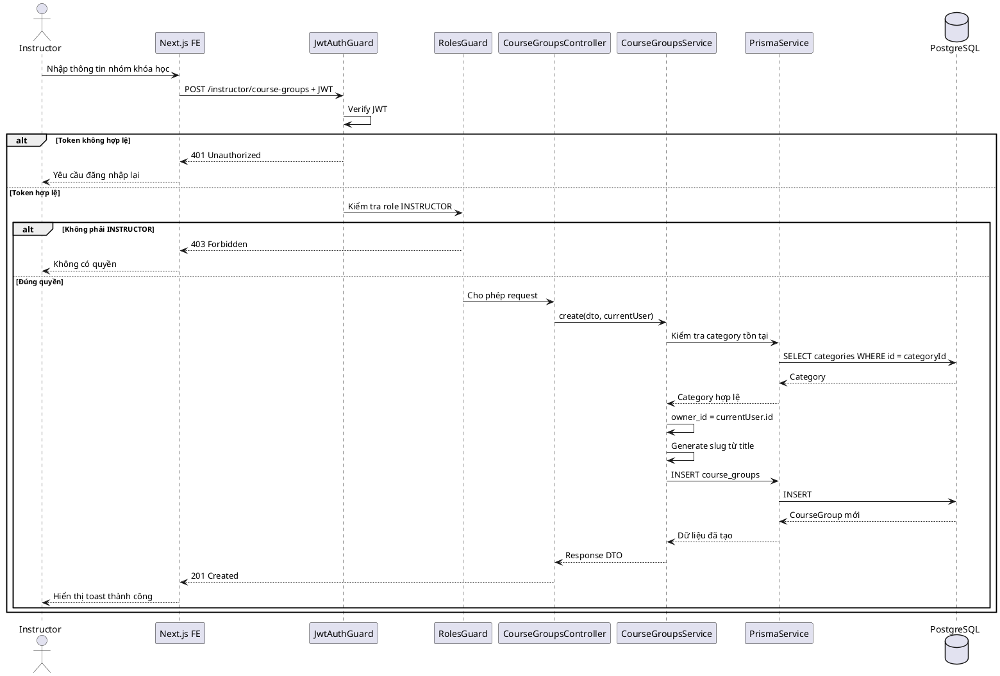
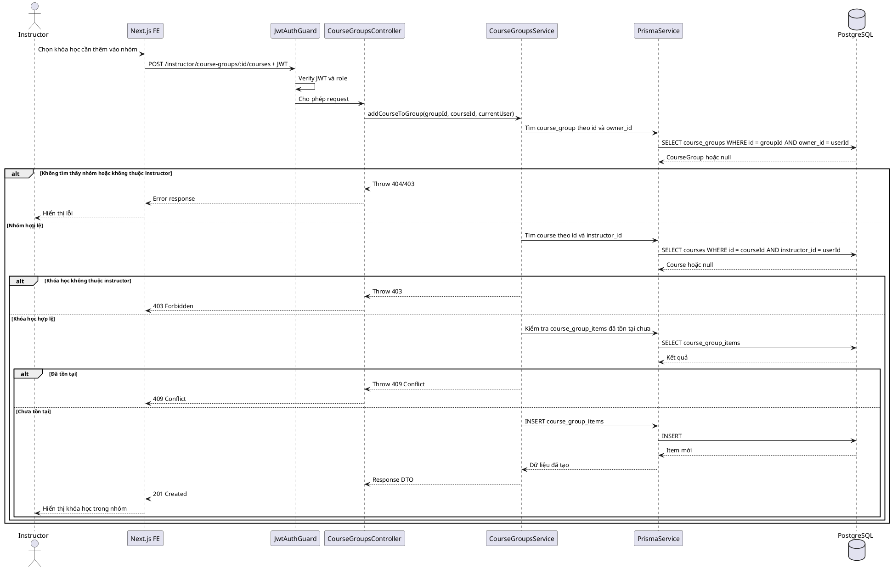

# SKILL.md — Use-case: Quản lý nhóm khóa học

## 1. Mục tiêu use-case

Use-case **Quản lý nhóm khóa học** cho phép giảng viên tạo, sửa, xóa và sắp xếp các nhóm khóa học/lộ trình học do chính mình sở hữu. Giảng viên có thể gom các khóa học của mình vào một nhóm theo một mục tiêu học tập cụ thể, ví dụ: TOEIC 450, TOEIC 650, Java Backend cơ bản đến nâng cao.

Hệ thống sử dụng:

```txt
Frontend: Next.js
Backend: NestJS
Database: PostgreSQL
ORM: Prisma
Auth: JWT access token
Video: Mux
Storage tài liệu: S3/R2 hoặc storage tương đương
```

Trong phạm vi tài liệu này, hệ thống **không sử dụng bảng refresh_tokens**. JWT access token được dùng để xác thực request; khi đăng xuất, frontend xóa token/cookie đang lưu.

---

## 2. Actor tham gia

| Actor | Mô tả |
|---|---|
| Instructor | Giảng viên đã được duyệt role và tài khoản còn hoạt động |
| LMS System | Backend xử lý xác thực, nghiệp vụ và dữ liệu |

Actor chính của use-case này:

```txt
Instructor
```

---

## 3. Phạm vi chức năng

Use-case **Quản lý nhóm khóa học** bao gồm:

```txt
Xem danh sách nhóm khóa học của mình
Tạo nhóm khóa học
Sửa thông tin nhóm khóa học
Xóa nhóm khóa học
Xem chi tiết nhóm khóa học
Thêm khóa học vào nhóm
Xóa khóa học khỏi nhóm
Sắp xếp thứ tự khóa học trong nhóm
Sắp xếp thứ tự nhóm khóa học trong danh mục
Kiểm tra quyền sở hữu nhóm khóa học
Kiểm tra quyền sở hữu khóa học trước khi thêm vào nhóm
```

Không bao gồm:

```txt
Admin quản lý nhóm khóa học toàn hệ thống
Admin duyệt nhóm khóa học
Thanh toán/mở khóa khóa học
Học viên đăng ký khóa học
Quản lý nội dung bài học, video, tài liệu, quiz
```

Các chức năng không bao gồm sẽ được tách sang use-case khác để báo cáo rõ ràng và dễ triển khai theo module.

---

## 4. Tiền điều kiện và hậu điều kiện

### 4.1. Tạo nhóm khóa học

| Mục | Nội dung |
|---|---|
| Tiền điều kiện | Actor đã đăng nhập; tài khoản có role `INSTRUCTOR`; tài khoản ở trạng thái `ACTIVE`; danh mục được chọn phải tồn tại. |
| Hậu điều kiện | Tạo bản ghi mới trong bảng `course_groups`; `owner_id` được lấy từ JWT của giảng viên; frontend hiển thị nhóm mới trong danh sách. |

### 4.2. Cập nhật nhóm khóa học

| Mục | Nội dung |
|---|---|
| Tiền điều kiện | Actor đã đăng nhập; tài khoản có role `INSTRUCTOR`; nhóm khóa học tồn tại; `course_groups.owner_id` phải bằng `user.id` trong JWT. |
| Hậu điều kiện | Cập nhật thông tin nhóm khóa học; frontend hiển thị dữ liệu mới. |

### 4.3. Xóa nhóm khóa học

| Mục | Nội dung |
|---|---|
| Tiền điều kiện | Actor đã đăng nhập; tài khoản có role `INSTRUCTOR`; nhóm khóa học tồn tại; `course_groups.owner_id` phải bằng `user.id` trong JWT. |
| Hậu điều kiện | Xóa nhóm khóa học và các bản ghi liên quan trong `course_group_items`; frontend xóa nhóm khỏi danh sách. |

### 4.4. Thêm khóa học vào nhóm

| Mục | Nội dung |
|---|---|
| Tiền điều kiện | Nhóm khóa học thuộc về giảng viên; khóa học tồn tại; `courses.instructor_id` phải bằng `user.id` trong JWT; khóa học chưa tồn tại trong nhóm. |
| Hậu điều kiện | Tạo bản ghi trong `course_group_items`; khóa học xuất hiện trong danh sách khóa học của nhóm. |

### 4.5. Sắp xếp thứ tự khóa học trong nhóm

| Mục | Nội dung |
|---|---|
| Tiền điều kiện | Nhóm khóa học thuộc về giảng viên; các khóa học trong request phải thuộc nhóm đó. |
| Hậu điều kiện | Cập nhật `order_index` trong `course_group_items`; frontend hiển thị thứ tự lộ trình mới. |

---

## 5. Database liên quan

Use-case này chủ yếu sử dụng các bảng: `users`, `categories`, `courses`, `course_groups`, `course_group_items`.

### Bảng `users`

```dbml
Table users {
  id uuid [primary key]
  full_name varchar [not null]
  email varchar [not null, unique]
  password_hash text [not null]
  avatar_url text
  role user_role [not null, default: 'STUDENT']
  status user_status [not null, default: 'ACTIVE']
  created_at timestamp
  updated_at timestamp
}
```

Quan hệ chính:
- users 1 - N courses thông qua `courses.instructor_id`
- users 1 - N course_groups thông qua `course_groups.owner_id`
- users 1 - N enrollments thông qua `enrollments.student_id`
- users 1 - N quiz_attempts thông qua `quiz_attempts.student_id`

### Bảng `categories`

```dbml
Table categories {
  id uuid [primary key]
  name varchar [not null]
  slug varchar [not null, unique]
  description text
  created_at timestamp
  updated_at timestamp
}
```

Quan hệ chính:
- categories 1 - N courses
- categories 1 - N course_groups

Ý nghĩa:
- Danh mục do admin quản lý.
- Giảng viên chỉ chọn danh mục có sẵn khi tạo nhóm khóa học.
- Giảng viên không được tự tạo/sửa/xóa danh mục trong use-case này.

### Bảng `courses`

```dbml
Table courses {
  id uuid [primary key]
  instructor_id uuid [not null]
  category_id uuid
  title varchar [not null]
  slug varchar [not null, unique]
  short_description text
  description text
  thumbnail_url text
  level course_level [not null, default: 'BEGINNER']
  status course_status [not null, default: 'DRAFT']
  price decimal(10,2) [not null, default: 0]
  created_at timestamp
  updated_at timestamp
}
```

Quan hệ chính:
- users 1 - N courses thông qua `courses.instructor_id`
- categories 1 - N courses
- courses 1 - N course_group_items
- courses 1 - N course_sections
- courses 1 - N enrollments
- courses 1 - N quizzes

Ý nghĩa trong use-case:
- Giảng viên chỉ được thêm khóa học của chính mình vào nhóm.
- Điều kiện kiểm tra bắt buộc: `courses.instructor_id = currentUser.id`.

### Bảng `course_groups`

```dbml
Table course_groups {
  id uuid [primary key]
  owner_id uuid [not null]
  category_id uuid [not null]
  title varchar [not null]
  slug varchar [not null, unique]
  description text
  order_index integer [not null, default: 0]
  created_at timestamp
  updated_at timestamp
}
```

Quan hệ chính:
- users 1 - N course_groups thông qua `course_groups.owner_id`
- categories 1 - N course_groups thông qua `course_groups.category_id`
- course_groups 1 - N course_group_items

Ý nghĩa nghiệp vụ:
- `owner_id` là user id của giảng viên sở hữu nhóm khóa học.
- Khi giảng viên tạo nhóm, backend tự gán `owner_id = currentUser.id`.
- Không cho frontend truyền `owner_id` trong body request.
- Admin có thể có module riêng để quản lý tất cả nhóm, nhưng không nằm trong use-case này.

### Bảng `course_group_items`

```dbml
Table course_group_items {
  course_group_id uuid [not null]
  course_id uuid [not null]
  order_index integer [not null, default: 0]

  indexes {
    (course_group_id, course_id) [primary key]
  }
}
```

Quan hệ chính:
- course_groups 1 - N course_group_items
- courses 1 - N course_group_items

Ý nghĩa nghiệp vụ:
- Dùng để gom nhiều khóa học vào một nhóm/lộ trình.
- `order_index` thể hiện thứ tự học trong nhóm.
- Primary key `(course_group_id, course_id)` ngăn một khóa học bị thêm trùng vào cùng một nhóm.

### Enum liên quan

```dbml
Enum user_role {
  STUDENT
  INSTRUCTOR
  ADMIN
}

Enum user_status {
  ACTIVE
  INACTIVE
  BANNED
}

Enum course_status {
  DRAFT
  PUBLISHED
  HIDDEN
  ARCHIVED
}
```

### Ý nghĩa nghiệp vụ dữ liệu

- `users`: xác định actor, role và trạng thái tài khoản.
- `categories`: danh mục mà nhóm khóa học thuộc về.
- `courses`: nguồn khóa học để giảng viên thêm vào nhóm.
- `course_groups`: thông tin nhóm khóa học/lộ trình học.
- `course_group_items`: danh sách khóa học nằm trong nhóm và thứ tự học.

---

## 6. Kiến trúc xử lý

### 6.1. Tổng quan kiến trúc

```txt
Next.js Frontend
   |
   | HTTP Request + JWT
   v
NestJS Backend
   |
   | CourseGroupsModule / Guards / Services
   v
Prisma ORM
   |
   v
PostgreSQL Database
```

### 6.2. Các module NestJS liên quan

```txt
src/
├── auth/
│   ├── guards/jwt-auth.guard.ts
│   ├── guards/roles.guard.ts
│   └── decorators/roles.decorator.ts
├── course-groups/
│   ├── course-groups.module.ts
│   ├── course-groups.controller.ts
│   ├── course-groups.service.ts
│   └── dto/
│       ├── create-course-group.dto.ts
│       ├── update-course-group.dto.ts
│       ├── add-course-to-group.dto.ts
│       ├── reorder-course-group-items.dto.ts
│       └── query-course-group.dto.ts
├── courses/
│   └── courses.service.ts
└── prisma/
    ├── prisma.module.ts
    └── prisma.service.ts
```

### 6.3. Trách nhiệm từng thành phần

| Thành phần | Trách nhiệm |
|---|---|
| `course-groups.controller.ts` | Nhận request, đọc user từ JWT, gọi service và trả response |
| `course-groups.service.ts` | Xử lý nghiệp vụ quản lý nhóm khóa học |
| `JwtAuthGuard` | Xác thực access token |
| `RolesGuard` | Kiểm tra role `INSTRUCTOR` |
| `PrismaService` | Thao tác dữ liệu PostgreSQL |
| `DTO` | Validate dữ liệu đầu vào |

---

## 7. API design

### 7.1. Xem danh sách nhóm khóa học của tôi

```http
GET /instructor/course-groups
Authorization: Bearer access_token
```

Query gợi ý:

```txt
?page=1&limit=10&search=toeic&categoryId=uuid
```

Response thành công:

```json
{
  "message": "Lấy danh sách nhóm khóa học thành công",
  "data": [
    {
      "id": "uuid",
      "title": "Lộ trình TOEIC 450",
      "slug": "lo-trinh-toeic-450",
      "description": "Lộ trình dành cho người mới bắt đầu",
      "category": {
        "id": "uuid",
        "name": "Tiếng Anh"
      },
      "orderIndex": 0,
      "totalCourses": 3,
      "createdAt": "2026-06-19T10:00:00.000Z",
      "updatedAt": "2026-06-19T10:00:00.000Z"
    }
  ],
  "meta": {
    "page": 1,
    "limit": 10,
    "total": 1
  }
}
```

### 7.2. Xem chi tiết nhóm khóa học

```http
GET /instructor/course-groups/:id
Authorization: Bearer access_token
```

Response thành công:

```json
{
  "message": "Lấy chi tiết nhóm khóa học thành công",
  "data": {
    "id": "uuid",
    "title": "Lộ trình TOEIC 450",
    "slug": "lo-trinh-toeic-450",
    "description": "Lộ trình dành cho người mới bắt đầu",
    "category": {
      "id": "uuid",
      "name": "Tiếng Anh"
    },
    "items": [
      {
        "courseId": "uuid",
        "title": "TOEIC Listening Basic",
        "slug": "toeic-listening-basic",
        "thumbnailUrl": "https://cdn.example.com/thumb.jpg",
        "level": "BEGINNER",
        "status": "PUBLISHED",
        "price": 299000,
        "orderIndex": 0
      }
    ]
  }
}
```

### 7.3. Tạo nhóm khóa học

```http
POST /instructor/course-groups
Authorization: Bearer access_token
```

Request gợi ý:

```json
{
  "categoryId": "uuid",
  "title": "Lộ trình TOEIC 450",
  "description": "Lộ trình dành cho người mới bắt đầu",
  "orderIndex": 0
}
```

Lưu ý:

```txt
Không truyền ownerId từ frontend.
Backend lấy ownerId từ JWT: owner_id = currentUser.id.
Slug có thể được backend tự sinh từ title.
```

Response thành công:

```json
{
  "message": "Tạo nhóm khóa học thành công",
  "data": {
    "id": "uuid",
    "title": "Lộ trình TOEIC 450",
    "slug": "lo-trinh-toeic-450"
  }
}
```

### 7.4. Cập nhật nhóm khóa học

```http
PATCH /instructor/course-groups/:id
Authorization: Bearer access_token
```

Request gợi ý:

```json
{
  "categoryId": "uuid",
  "title": "Lộ trình TOEIC 450 cho người mới bắt đầu",
  "description": "Mô tả mới",
  "orderIndex": 1
}
```

Response thành công:

```json
{
  "message": "Cập nhật nhóm khóa học thành công",
  "data": {
    "id": "uuid"
  }
}
```

### 7.5. Xóa nhóm khóa học

```http
DELETE /instructor/course-groups/:id
Authorization: Bearer access_token
```

Response thành công:

```json
{
  "message": "Xóa nhóm khóa học thành công",
  "data": {
    "id": "uuid"
  }
}
```

Gợi ý xử lý:

```txt
Nên dùng transaction:
1. Xóa course_group_items của nhóm.
2. Xóa course_groups.
```

### 7.6. Thêm khóa học vào nhóm

```http
POST /instructor/course-groups/:id/courses
Authorization: Bearer access_token
```

Request gợi ý:

```json
{
  "courseId": "uuid",
  "orderIndex": 0
}
```

Response thành công:

```json
{
  "message": "Thêm khóa học vào nhóm thành công",
  "data": {
    "courseGroupId": "uuid",
    "courseId": "uuid",
    "orderIndex": 0
  }
}
```

### 7.7. Xóa khóa học khỏi nhóm

```http
DELETE /instructor/course-groups/:id/courses/:courseId
Authorization: Bearer access_token
```

Response thành công:

```json
{
  "message": "Xóa khóa học khỏi nhóm thành công",
  "data": {
    "courseGroupId": "uuid",
    "courseId": "uuid"
  }
}
```

### 7.8. Sắp xếp thứ tự khóa học trong nhóm

```http
PATCH /instructor/course-groups/:id/courses/reorder
Authorization: Bearer access_token
```

Request gợi ý:

```json
{
  "items": [
    {
      "courseId": "uuid-1",
      "orderIndex": 0
    },
    {
      "courseId": "uuid-2",
      "orderIndex": 1
    }
  ]
}
```

Response thành công:

```json
{
  "message": "Sắp xếp khóa học trong nhóm thành công",
  "data": {
    "courseGroupId": "uuid"
  }
}
```

### 7.9. Xem danh sách khóa học có thể thêm vào nhóm

```http
GET /instructor/course-groups/:id/available-courses
Authorization: Bearer access_token
```

Query gợi ý:

```txt
?search=toeic&page=1&limit=10
```

Response thành công:

```json
{
  "message": "Lấy danh sách khóa học có thể thêm thành công",
  "data": [
    {
      "id": "uuid",
      "title": "TOEIC Reading Basic",
      "slug": "toeic-reading-basic",
      "status": "PUBLISHED",
      "level": "BEGINNER"
    }
  ]
}
```

---

## 8. Data flow

### 8.1. Data flow — Tạo nhóm khóa học

```txt
Instructor mở màn hình /instructor/course-groups
→ Next.js kiểm tra trạng thái đăng nhập
→ Instructor bấm Tạo nhóm khóa học
→ Frontend hiển thị form tạo nhóm
→ Instructor nhập title, categoryId, description, orderIndex
→ Frontend gửi POST /instructor/course-groups kèm JWT
→ NestJS JwtAuthGuard xác thực access token
→ RolesGuard kiểm tra role INSTRUCTOR
→ CourseGroupsController nhận request
→ CourseGroupsService validate DTO
→ Service kiểm tra categoryId tồn tại
→ Service tạo slug từ title nếu frontend không gửi slug
→ Service gán owner_id = currentUser.id
→ Prisma insert vào bảng course_groups
→ PostgreSQL trả kết quả
→ Controller trả response về frontend
→ Frontend hiển thị toast thành công và cập nhật danh sách
```

### 8.2. Data flow — Cập nhật nhóm khóa học

```txt
Instructor chọn một nhóm khóa học của mình
→ Frontend gọi GET /instructor/course-groups/:id
→ Backend kiểm tra nhóm tồn tại và owner_id = currentUser.id
→ Frontend hiển thị form chỉnh sửa
→ Instructor cập nhật thông tin
→ Frontend gửi PATCH /instructor/course-groups/:id
→ Backend xác thực JWT và role
→ Service kiểm tra ownership nhóm
→ Service kiểm tra categoryId nếu có thay đổi
→ Service cập nhật course_groups
→ PostgreSQL trả kết quả
→ Frontend cập nhật UI
```

### 8.3. Data flow — Thêm khóa học vào nhóm

```txt
Instructor mở chi tiết nhóm khóa học
→ Frontend gọi GET /instructor/course-groups/:id/available-courses
→ Backend chỉ trả các courses có instructor_id = currentUser.id
→ Instructor chọn khóa học cần thêm
→ Frontend gửi POST /instructor/course-groups/:id/courses
→ Backend kiểm tra nhóm thuộc về instructor
→ Backend kiểm tra khóa học thuộc về instructor
→ Backend kiểm tra khóa học chưa tồn tại trong nhóm
→ Service insert vào course_group_items
→ Frontend hiển thị khóa học trong lộ trình
```

### 8.4. Data flow — Sắp xếp khóa học trong nhóm

```txt
Instructor kéo thả thứ tự khóa học trong nhóm
→ Frontend tạo mảng items gồm courseId và orderIndex mới
→ Frontend gửi PATCH /instructor/course-groups/:id/courses/reorder
→ Backend kiểm tra nhóm thuộc về instructor
→ Backend kiểm tra toàn bộ courseId trong request đang thuộc nhóm
→ Service dùng transaction cập nhật order_index
→ PostgreSQL trả kết quả
→ Frontend hiển thị thứ tự mới
```

### 8.99. Quy tắc xử lý dữ liệu chung

```txt
Luôn lấy userId và role từ JWT, không lấy role từ body request.
Không cho frontend truyền owner_id khi tạo hoặc sửa nhóm.
Instructor chỉ được thao tác nhóm khóa học có owner_id = currentUser.id.
Instructor chỉ được thêm khóa học có instructor_id = currentUser.id vào nhóm.
Không cho thêm trùng course_id vào cùng course_group_id.
Luôn kiểm tra bản ghi tồn tại trước khi cập nhật/xóa.
Sử dụng transaction khi xóa nhóm hoặc sắp xếp nhiều item.
Không trả dữ liệu nhạy cảm như password_hash về frontend.
Chuẩn hóa response DTO để frontend dễ xử lý loading/error/success.
```

---

## 9. Sequence diagram

### 9.1. Sequence — Tạo nhóm khóa học



### 9.2. Sequence — Thêm khóa học vào nhóm



---

## 10. Activity flow

### 10.1. Activity flow — Tạo nhóm khóa học

```txt
Bắt đầu
→ Instructor chọn chức năng Tạo nhóm khóa học
→ Hệ thống kiểm tra đăng nhập
   ├── Chưa đăng nhập → chuyển đến /login
   └── Đã đăng nhập
       → Kiểm tra role
          ├── Không phải INSTRUCTOR → báo lỗi 403
          └── Là INSTRUCTOR
              → Validate form
                 ├── Thiếu title/categoryId → báo lỗi 400
                 └── Hợp lệ
                     → Kiểm tra category tồn tại
                        ├── Không tồn tại → báo lỗi 404
                        └── Tồn tại
                            → Tạo slug
                            → Gán owner_id từ JWT
                            → Insert course_groups
                            → Trả response
                            → Frontend cập nhật giao diện
Kết thúc
```

### 10.2. Activity flow — Thêm khóa học vào nhóm

```txt
Bắt đầu
→ Instructor mở chi tiết nhóm khóa học
→ Instructor chọn Thêm khóa học
→ Hệ thống kiểm tra nhóm có owner_id = currentUser.id
   ├── Không đúng owner → báo lỗi 403 hoặc 404
   └── Đúng owner
       → Kiểm tra khóa học có instructor_id = currentUser.id
          ├── Không đúng owner → báo lỗi 403
          └── Đúng owner
              → Kiểm tra khóa học đã tồn tại trong nhóm chưa
                 ├── Đã tồn tại → báo lỗi 409
                 └── Chưa tồn tại
                     → Insert course_group_items
                     → Trả response
                     → Frontend cập nhật danh sách khóa học trong nhóm
Kết thúc
```

### 10.3. Activity flow — Sắp xếp khóa học trong nhóm

```txt
Bắt đầu
→ Instructor kéo thả thứ tự khóa học
→ Frontend gửi danh sách courseId + orderIndex mới
→ Backend kiểm tra nhóm thuộc về instructor
   ├── Không đúng owner → báo lỗi 403 hoặc 404
   └── Đúng owner
       → Kiểm tra tất cả courseId đang thuộc nhóm
          ├── Có courseId không thuộc nhóm → báo lỗi 400
          └── Tất cả hợp lệ
              → Bắt đầu transaction
              → Cập nhật order_index từng item
              → Commit transaction
              → Trả response
              → Frontend hiển thị thứ tự mới
Kết thúc
```

---

## 11. Kiểm tra phân quyền

### 11.1. JWT payload

```json
{
  "sub": "user_id",
  "email": "teacher@example.com",
  "role": "INSTRUCTOR"
}
```

### 11.2. Quyền truy cập API

| API | Quyền truy cập | Ghi chú |
|---|---|---|
| `GET /instructor/course-groups` | INSTRUCTOR | Chỉ trả nhóm có `owner_id = currentUser.id` |
| `GET /instructor/course-groups/:id` | INSTRUCTOR | Chỉ xem nhóm của mình |
| `POST /instructor/course-groups` | INSTRUCTOR | Backend tự gán `owner_id` |
| `PATCH /instructor/course-groups/:id` | INSTRUCTOR | Chỉ sửa nhóm của mình |
| `DELETE /instructor/course-groups/:id` | INSTRUCTOR | Chỉ xóa nhóm của mình |
| `POST /instructor/course-groups/:id/courses` | INSTRUCTOR | Chỉ thêm khóa học của mình |
| `DELETE /instructor/course-groups/:id/courses/:courseId` | INSTRUCTOR | Chỉ xóa item trong nhóm của mình |
| `PATCH /instructor/course-groups/:id/courses/reorder` | INSTRUCTOR | Chỉ sắp xếp item trong nhóm của mình |

### 11.3. Quy tắc quan trọng

```txt
Không tin tưởng owner_id gửi từ frontend.
Không cho giảng viên thao tác nhóm khóa học của giảng viên khác.
Không cho giảng viên thêm khóa học của giảng viên khác vào nhóm của mình.
Không cho user role STUDENT truy cập các API instructor.
Không trả password_hash hoặc dữ liệu nhạy cảm về frontend.
Nếu không muốn lộ sự tồn tại của nhóm người khác, có thể trả 404 thay vì 403 khi owner_id không khớp.
```

---

## 12. Validation rules

### 12.1. DTO tạo nhóm khóa học

```txt
categoryId: bắt buộc, UUID hợp lệ, phải tồn tại trong categories
title: bắt buộc, string, trim, độ dài 3 - 255 ký tự
description: không bắt buộc, string, tối đa 5000 ký tự
orderIndex: không bắt buộc, integer >= 0
```

Không cho phép client gửi:

```txt
ownerId
createdAt
updatedAt
```

### 12.2. DTO cập nhật nhóm khóa học

```txt
categoryId: không bắt buộc, UUID hợp lệ nếu gửi lên
title: không bắt buộc, string, trim, độ dài 3 - 255 ký tự
description: không bắt buộc, string, tối đa 5000 ký tự
orderIndex: không bắt buộc, integer >= 0
```

### 12.3. DTO thêm khóa học vào nhóm

```txt
courseId: bắt buộc, UUID hợp lệ
orderIndex: không bắt buộc, integer >= 0
```

Rule nghiệp vụ:

```txt
course_group phải tồn tại và owner_id = currentUser.id.
course phải tồn tại và instructor_id = currentUser.id.
Không được thêm trùng course_id vào cùng course_group_id.
```

### 12.4. DTO sắp xếp khóa học trong nhóm

```txt
items: bắt buộc, array, ít nhất 1 phần tử
items[].courseId: bắt buộc, UUID hợp lệ
items[].orderIndex: bắt buộc, integer >= 0
```

Rule nghiệp vụ:

```txt
Không cho trùng courseId trong items.
Không cho trùng orderIndex nếu muốn thứ tự rõ ràng.
Tất cả courseId phải đang nằm trong course_group_items của group đó.
```

### 12.5. Slug

```txt
Slug nên được backend tự sinh từ title.
Slug phải unique theo schema hiện tại.
Nếu slug đã tồn tại, backend tự thêm hậu tố: -1, -2, -3.
Không nên cho frontend tự quyết định slug nếu muốn tránh trùng dữ liệu.
```

Ví dụ:

```txt
Title: Lộ trình TOEIC 450
Slug: lo-trinh-toeic-450
Nếu trùng: lo-trinh-toeic-450-1
```

---

## 13. Error handling

| Trường hợp | HTTP Status | Message gợi ý |
|---|---|---|
| Chưa đăng nhập | 401 | Vui lòng đăng nhập để tiếp tục |
| Token không hợp lệ hoặc hết hạn | 401 | Phiên đăng nhập đã hết hạn |
| Không phải giảng viên | 403 | Bạn không có quyền truy cập chức năng này |
| Nhóm khóa học không thuộc giảng viên | 403 hoặc 404 | Không tìm thấy nhóm khóa học |
| Category không tồn tại | 404 | Không tìm thấy danh mục |
| Course không tồn tại | 404 | Không tìm thấy khóa học |
| Course không thuộc giảng viên | 403 | Bạn không có quyền thêm khóa học này |
| Course đã tồn tại trong nhóm | 409 | Khóa học đã có trong nhóm này |
| Slug bị trùng | 409 hoặc tự xử lý | Slug đã tồn tại |
| Dữ liệu không hợp lệ | 400 | Dữ liệu đầu vào không hợp lệ |
| Lỗi hệ thống | 500 | Có lỗi xảy ra, vui lòng thử lại sau |

---

## 14. Bảo mật

Các yêu cầu bảo mật tối thiểu:

```txt
Luôn xác thực bằng JwtAuthGuard với API private.
Kiểm tra role bằng RolesGuard.
Chỉ cho phép role INSTRUCTOR vào route /instructor/course-groups.
Luôn lấy userId từ JWT, không lấy ownerId từ body.
Bắt buộc kiểm tra course_groups.owner_id trước khi sửa/xóa/thêm item.
Bắt buộc kiểm tra courses.instructor_id trước khi thêm khóa học vào nhóm.
Không trả password_hash hoặc thông tin nhạy cảm về frontend.
Validate toàn bộ DTO bằng class-validator hoặc cơ chế tương đương.
Rate limit API tạo/sửa/xóa nếu cần.
Ghi log lỗi ở backend nhưng không trả stack trace cho frontend.
Dùng transaction với thao tác nhiều bảng hoặc nhiều dòng.
```

---

## 15. Prototype user flow

### 15.1. Flow — Xem danh sách nhóm khóa học

```txt
/instructor/course-groups
→ Frontend kiểm tra token
→ Gọi GET /instructor/course-groups
→ Backend trả danh sách nhóm có owner_id = currentUser.id
→ UI hiển thị table/card nhóm khóa học
→ Instructor có thể search/filter theo danh mục
```

### 15.2. Flow — Tạo nhóm khóa học

```txt
/instructor/course-groups
→ Instructor bấm Tạo nhóm khóa học
→ Form hiển thị các trường: title, category, description, orderIndex
→ Instructor nhập dữ liệu
→ Bấm Lưu
→ Frontend gọi POST /instructor/course-groups
→ Backend validate và tạo nhóm
→ UI hiển thị toast thành công
→ Chuyển sang trang chi tiết nhóm hoặc reload danh sách
```

### 15.3. Flow — Quản lý khóa học trong nhóm

```txt
/instructor/course-groups/:id
→ UI hiển thị thông tin nhóm và danh sách khóa học trong nhóm
→ Instructor bấm Thêm khóa học
→ UI hiển thị danh sách khóa học của instructor chưa nằm trong nhóm
→ Instructor chọn khóa học
→ Frontend gọi POST /instructor/course-groups/:id/courses
→ Backend kiểm tra quyền sở hữu nhóm và khóa học
→ UI thêm khóa học vào danh sách
```

### 15.4. Flow — Sắp xếp lộ trình học

```txt
/instructor/course-groups/:id
→ Instructor kéo thả khóa học theo thứ tự mong muốn
→ Frontend cập nhật thứ tự tạm thời
→ Bấm Lưu thứ tự
→ Frontend gọi PATCH /instructor/course-groups/:id/courses/reorder
→ Backend cập nhật order_index
→ UI hiển thị toast thành công
```

---

## 16. Prototype UI gợi ý

### 16.1. Màn hình danh sách nhóm khóa học

```txt
+----------------------------------------------------------------+
| Instructor Dashboard                                            |
+----------------------------------------------------------------+
| Sidebar | Quản lý nhóm khóa học                                |
|         | [Search________] [Category ▼] [Tạo nhóm khóa học]     |
|         |------------------------------------------------------|
|         | Tên nhóm              | Danh mục | Số khóa | Action   |
|         | Lộ trình TOEIC 450    | Tiếng Anh| 3       | Sửa/Xóa  |
|         | Java Backend Roadmap  | Lập trình| 5       | Sửa/Xóa  |
|         |------------------------------------------------------|
|         | Pagination                                           |
+----------------------------------------------------------------+
```

### 16.2. Màn hình tạo/sửa nhóm khóa học

```txt
+----------------------------------------------------------------+
| Tạo nhóm khóa học                                               |
+----------------------------------------------------------------+
| Tên nhóm *                                                      |
| [Lộ trình TOEIC 450________________________]                    |
| Danh mục *                                                      |
| [Tiếng Anh ▼]                                                   |
| Mô tả                                                          |
| [Textarea mô tả lộ trình____________________]                   |
| Thứ tự hiển thị                                                 |
| [0____]                                                         |
|                                                                |
| [Hủy] [Lưu]                                                     |
+----------------------------------------------------------------+
```

### 16.3. Màn hình chi tiết nhóm khóa học

```txt
+----------------------------------------------------------------+
| Lộ trình TOEIC 450                                              |
| Danh mục: Tiếng Anh                                             |
| [Sửa thông tin] [Thêm khóa học]                                 |
+----------------------------------------------------------------+
| Thứ tự | Khóa học                  | Trạng thái | Action       |
| 1      | TOEIC Listening Basic      | PUBLISHED  | Xóa/Kéo thả  |
| 2      | TOEIC Reading Basic        | PUBLISHED  | Xóa/Kéo thả  |
| 3      | TOEIC Practice Test        | DRAFT      | Xóa/Kéo thả  |
+----------------------------------------------------------------+
| [Lưu thứ tự]                                                    |
+----------------------------------------------------------------+
```

### 16.4. Trạng thái UI cần có

```txt
Loading: hiển thị skeleton hoặc spinner
Empty: hiển thị thông báo chưa có nhóm khóa học
Error: hiển thị message từ backend
Success: hiển thị toast thành công
Forbidden: điều hướng hoặc báo không đủ quyền
Conflict: báo khóa học đã tồn tại trong nhóm
```

---

## 17. Test cases cơ bản

| Mã test | Nội dung | Kết quả mong đợi |
|---|---|---|
| TC01 | Truy cập API khi chưa đăng nhập | Trả 401 Unauthorized |
| TC02 | Truy cập với role STUDENT | Trả 403 Forbidden |
| TC03 | Instructor lấy danh sách nhóm của mình | Chỉ trả nhóm có `owner_id = currentUser.id` |
| TC04 | Tạo nhóm thiếu title | Trả 400 Bad Request |
| TC05 | Tạo nhóm với categoryId không tồn tại | Trả 404 Not Found |
| TC06 | Tạo nhóm hợp lệ | Trả 201 Created và tạo bản ghi `course_groups` |
| TC07 | Cập nhật nhóm của mình | Trả 200 OK và dữ liệu được cập nhật |
| TC08 | Cập nhật nhóm của instructor khác | Trả 403 hoặc 404 |
| TC09 | Xóa nhóm của mình | Xóa nhóm và các item liên quan |
| TC10 | Xóa nhóm của instructor khác | Trả 403 hoặc 404 |
| TC11 | Thêm khóa học của mình vào nhóm của mình | Tạo bản ghi `course_group_items` |
| TC12 | Thêm khóa học của instructor khác | Trả 403 Forbidden |
| TC13 | Thêm khóa học trùng vào cùng nhóm | Trả 409 Conflict |
| TC14 | Xóa khóa học khỏi nhóm của mình | Xóa bản ghi `course_group_items` |
| TC15 | Sắp xếp khóa học trong nhóm hợp lệ | Cập nhật đúng `order_index` |
| TC16 | Sắp xếp với courseId không thuộc nhóm | Trả 400 Bad Request |
| TC17 | Gửi ID không đúng định dạng UUID | Trả 400 Bad Request |
| TC18 | Search nhóm khóa học theo keyword | Trả dữ liệu phù hợp |
| TC19 | Filter nhóm theo categoryId | Trả dữ liệu phù hợp |
| TC20 | Kiểm tra response không có password_hash | Không trả dữ liệu nhạy cảm |

---

## 18. Checklist triển khai backend

- [ ] Tạo `CourseGroupsModule`
- [ ] Tạo `CourseGroupsController`
- [ ] Tạo `CourseGroupsService`
- [ ] Tạo DTO: `CreateCourseGroupDto`
- [ ] Tạo DTO: `UpdateCourseGroupDto`
- [ ] Tạo DTO: `AddCourseToGroupDto`
- [ ] Tạo DTO: `ReorderCourseGroupItemsDto`
- [ ] Tạo DTO: `QueryCourseGroupDto`
- [ ] Khai báo route `/instructor/course-groups`
- [ ] Bảo vệ route bằng `JwtAuthGuard`
- [ ] Bảo vệ route bằng `RolesGuard` với role `INSTRUCTOR`
- [ ] Viết query lấy danh sách nhóm theo `owner_id`
- [ ] Viết logic tạo slug từ title
- [ ] Viết logic tạo nhóm với `owner_id = currentUser.id`
- [ ] Viết logic kiểm tra ownership nhóm
- [ ] Viết logic kiểm tra ownership khóa học
- [ ] Viết logic thêm/xóa khóa học khỏi nhóm
- [ ] Viết logic sắp xếp `course_group_items.order_index`
- [ ] Dùng transaction khi cần cập nhật nhiều dòng
- [ ] Xử lý exception 400/401/403/404/409/500
- [ ] Viết unit test service
- [ ] Viết e2e test cho API chính
- [ ] Kiểm tra response không lộ dữ liệu nhạy cảm

---

## 19. Checklist triển khai frontend

- [ ] Tạo route `/instructor/course-groups`
- [ ] Tạo trang danh sách nhóm khóa học
- [ ] Tạo form tạo/sửa nhóm khóa học
- [ ] Tạo trang chi tiết nhóm khóa học
- [ ] Tạo modal chọn khóa học để thêm vào nhóm
- [ ] Tạo UI xóa khóa học khỏi nhóm
- [ ] Tạo UI kéo thả/sắp xếp thứ tự khóa học
- [ ] Gọi API bằng fetch/axios
- [ ] Xử lý loading state
- [ ] Xử lý empty state
- [ ] Xử lý error state
- [ ] Hiển thị toast thành công/thất bại
- [ ] Kiểm tra điều hướng theo role
- [ ] Test responsive
- [ ] Test với dữ liệu thật từ backend

---

## 20. Gợi ý Prisma query

### 20.1. Lấy danh sách nhóm khóa học của instructor

```ts
const groups = await prisma.course_groups.findMany({
  where: {
    owner_id: currentUser.id,
    title: search
      ? {
          contains: search,
          mode: 'insensitive',
        }
      : undefined,
    category_id: categoryId || undefined,
  },
  include: {
    categories: true,
    course_group_items: true,
  },
  orderBy: {
    order_index: 'asc',
  },
});
```

### 20.2. Kiểm tra nhóm thuộc về instructor

```ts
const group = await prisma.course_groups.findFirst({
  where: {
    id: groupId,
    owner_id: currentUser.id,
  },
});

if (!group) {
  throw new NotFoundException('Không tìm thấy nhóm khóa học');
}
```

### 20.3. Kiểm tra khóa học thuộc về instructor

```ts
const course = await prisma.courses.findFirst({
  where: {
    id: courseId,
    instructor_id: currentUser.id,
  },
});

if (!course) {
  throw new ForbiddenException('Bạn không có quyền thêm khóa học này');
}
```

### 20.4. Thêm khóa học vào nhóm

```ts
await prisma.course_group_items.create({
  data: {
    course_group_id: groupId,
    course_id: courseId,
    order_index: orderIndex ?? 0,
  },
});
```

### 20.5. Sắp xếp khóa học trong nhóm

```ts
await prisma.$transaction(
  items.map((item) =>
    prisma.course_group_items.update({
      where: {
        course_group_id_course_id: {
          course_group_id: groupId,
          course_id: item.courseId,
        },
      },
      data: {
        order_index: item.orderIndex,
      },
    }),
  ),
);
```

Tên model và tên relation trong Prisma có thể khác tùy cách bạn sinh schema Prisma từ DBML. Khi triển khai thật, hãy đổi `course_groups`, `course_group_items`, `categories`, `courses` theo đúng tên model trong `schema.prisma`.

---

## 21. Kết luận

Use-case **Quản lý nhóm khóa học** giúp giảng viên gom các khóa học của mình thành một lộ trình học theo mục tiêu cụ thể. Với database hiện tại, chỉ cần dùng `course_groups.owner_id` để xác định nhóm thuộc giảng viên nào và dùng `courses.instructor_id` để kiểm tra khóa học thuộc giảng viên nào. Khi triển khai, điểm quan trọng nhất là phân quyền: giảng viên chỉ được quản lý nhóm của mình và chỉ được thêm khóa học của mình vào nhóm.
