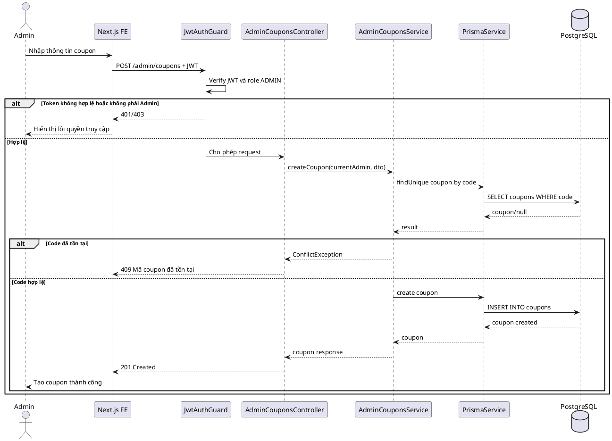
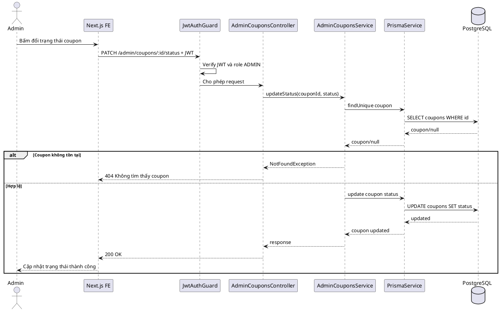
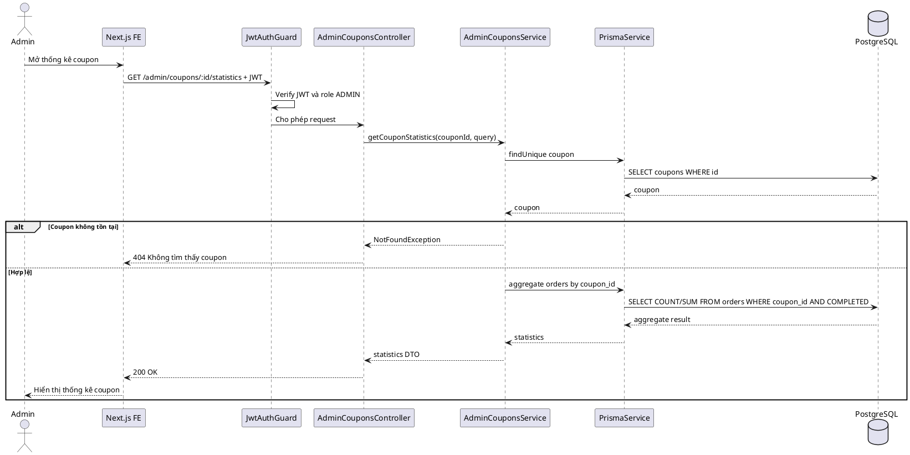
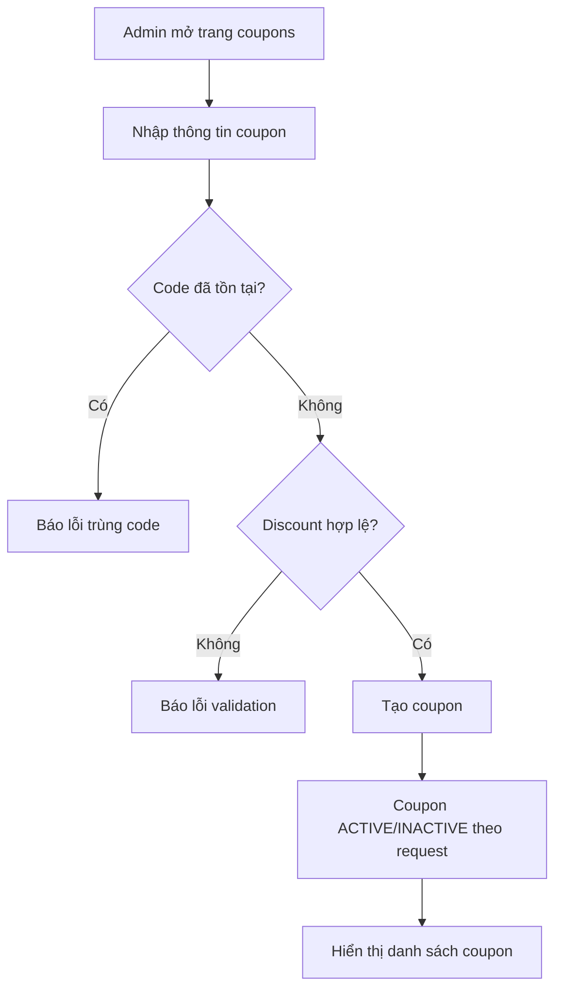

# SKILL.md — Use-case: Quản lý coupons cho admin

---

## 1. Mục tiêu use-case

Use-case **Quản lý coupons cho admin** cho phép admin tạo, sửa, kích hoạt/tạm tắt, theo dõi và quản lý mã giảm giá toàn hệ thống trong LMS.

Hệ thống sử dụng:

```txt
Frontend: Next.js
Backend: NestJS
Database: PostgreSQL
ORM: Prisma
Auth: JWT access token
Video: Mux
Storage tài liệu: S3/R2 hoặc storage tương đương
```

Trong phạm vi tài liệu này, hệ thống **không sử dụng bảng refresh_tokens**. JWT access token được dùng để xác thực request; khi đăng xuất, frontend xóa token/cookie đang lưu.

Use-case này tập trung vào coupon cấp hệ thống. Admin có thể tạo coupon global, xem coupon do admin hoặc giảng viên tạo, kiểm tra lượt sử dụng và thống kê hiệu quả coupon trong các đơn hàng đã thanh toán.

---

## 2. Actor tham gia

| Actor | Mô tả |
|---|---|
| Admin | Quản trị viên hệ thống |
| LMS System | Backend xử lý xác thực, phân quyền, validate coupon, thống kê order |

Actor chính của use-case này:

```txt
Admin
```

---

## 3. Phạm vi chức năng

Use-case **Quản lý coupons cho admin** bao gồm:

```txt
Xem danh sách tất cả coupons
Tìm kiếm coupon theo code
Lọc coupon theo status ACTIVE/INACTIVE/EXPIRED
Lọc coupon theo người tạo created_by
Tạo coupon toàn hệ thống
Sửa coupon
Bật/tắt coupon
Xem chi tiết coupon
Xem danh sách order đã dùng coupon
Thống kê lượt dùng coupon
Thống kê tổng tiền giảm từ coupon
Thống kê doanh thu sau khi áp dụng coupon
Kiểm tra coupon hết hạn hoặc vượt usage_limit
```

Không bao gồm:

```txt
Tạo promotion trực tiếp theo course/category
Hoàn tiền thủ công
Đối soát payment gateway chuyên sâu
Chia sẻ doanh thu cho giảng viên
```

Các chức năng không bao gồm sẽ được tách sang use-case Promotion, Payment hoặc Revenue riêng.

---

## 4. Tiền điều kiện và hậu điều kiện

### 4.1. Tạo coupon

| Mục | Nội dung |
|---|---|
| Tiền điều kiện | Admin đã đăng nhập, tài khoản `ACTIVE`, role là `ADMIN`. |
| Hậu điều kiện | Coupon mới được tạo trong bảng `coupons`, `created_by` là id của admin hiện tại. |

### 4.2. Cập nhật coupon

| Mục | Nội dung |
|---|---|
| Tiền điều kiện | Coupon tồn tại; admin có quyền quản lý coupon. |
| Hậu điều kiện | Coupon được cập nhật, dữ liệu mới được lưu và hiển thị trên dashboard admin. |

### 4.3. Bật/tắt coupon

| Mục | Nội dung |
|---|---|
| Tiền điều kiện | Coupon tồn tại. |
| Hậu điều kiện | Coupon chuyển trạng thái `ACTIVE`, `INACTIVE` hoặc `EXPIRED` tùy thao tác/chính sách. |

### 4.4. Xem thống kê coupon

| Mục | Nội dung |
|---|---|
| Tiền điều kiện | Coupon tồn tại; admin đã đăng nhập. |
| Hậu điều kiện | Hệ thống trả số lượt dùng, tổng tiền giảm, doanh thu và danh sách đơn hàng có dùng coupon. |

---

## 5. Database liên quan

Use-case này chủ yếu sử dụng các bảng:

```txt
users
coupons
orders
payments
courses
enrollments
```

### 5.1. Bảng `users`

```dbml
Table users {
  id uuid [primary key]
  full_name varchar [not null]
  email varchar [not null, unique]
  password_hash text [not null]
  avatar_url text
  role user_role [not null, default: 'STUDENT']
  status user_status [not null, default: 'ACTIVE']
  created_at timestamp
  updated_at timestamp
}
```

Ý nghĩa trong use-case:

| Trường | Ý nghĩa |
|---|---|
| `id` | Dùng làm `coupons.created_by` |
| `role` | Phải là `ADMIN` mới được quản lý coupon toàn hệ thống |
| `status` | Phải là `ACTIVE` |

### 5.2. Bảng `coupons`

```dbml
Table coupons {
  id uuid [primary key]
  code varchar [not null, unique]
  discount_type discount_type [not null]
  discount_value decimal(10,2) [not null]
  start_date timestamp
  end_date timestamp
  usage_limit integer
  used_count integer [default: 0]
  status coupon_status [not null, default: 'ACTIVE']
  created_by uuid [not null]
  created_at timestamp
  updated_at timestamp
}
```

Ý nghĩa trong use-case:

| Trường | Ý nghĩa |
|---|---|
| `code` | Mã giảm giá duy nhất toàn hệ thống |
| `discount_type` | `PERCENTAGE` hoặc `FIXED_AMOUNT` |
| `discount_value` | Giá trị giảm |
| `start_date`, `end_date` | Thời gian hiệu lực |
| `usage_limit`, `used_count` | Giới hạn và số lượt đã dùng |
| `status` | Trạng thái coupon |
| `created_by` | Admin hoặc người tạo coupon |

### 5.3. Bảng `orders`

```dbml
Table orders {
  id uuid [primary key]
  student_id uuid [not null]
  course_id uuid [not null]
  coupon_id uuid
  promotion_id uuid
  base_price decimal(10,2) [not null]
  promotion_discount decimal(10,2) [default: 0]
  coupon_discount decimal(10,2) [default: 0]
  final_price decimal(10,2) [not null]
  status order_status [not null, default: 'PENDING']
  created_at timestamp
  updated_at timestamp
}
```

Dùng để:

```txt
Thống kê số order dùng coupon.
Tính tổng coupon_discount.
Tính doanh thu sau giảm từ orders.final_price.
Chỉ tính doanh thu từ orders.status = COMPLETED.
```

### 5.4. Bảng `payments`

```dbml
Table payments {
  id uuid [primary key]
  order_id uuid [not null]
  payment_method varchar [not null]
  transaction_reference varchar [unique]
  amount decimal(10,2) [not null]
  status payment_status [not null, default: 'PENDING']
  paid_at timestamp
  created_at timestamp
}
```

Dùng để đối chiếu coupon thực sự tạo doanh thu khi:

```txt
orders.status = COMPLETED
payments.status = SUCCESS
```

### 5.5. Bảng `courses`

```dbml
Table courses {
  id uuid [primary key]
  instructor_id uuid [not null]
  category_id uuid
  title varchar [not null]
  slug varchar [not null, unique]
  short_description text
  description text
  thumbnail_url text
  level course_level [not null, default: 'BEGINNER']
  status course_status [not null, default: 'DRAFT']
  price decimal(10,2) [not null, default: 0]
  created_at timestamp
  updated_at timestamp
}
```

Dùng để xem coupon đã được dùng cho khóa học nào, giảng viên nào, danh mục nào.

### 5.6. Enum liên quan

```dbml
Enum user_role {
  STUDENT
  INSTRUCTOR
  ADMIN
}

Enum discount_type {
  PERCENTAGE
  FIXED_AMOUNT
}

Enum coupon_status {
  ACTIVE
  INACTIVE
  EXPIRED
}

Enum order_status {
  PENDING
  COMPLETED
  FAILED
  CANCELLED
}

Enum payment_status {
  PENDING
  SUCCESS
  FAILED
}
```

### 5.7. Index gợi ý

```sql
CREATE INDEX idx_coupons_code ON coupons(code);
CREATE INDEX idx_coupons_status ON coupons(status);
CREATE INDEX idx_coupons_created_by ON coupons(created_by);
CREATE INDEX idx_orders_coupon_id ON orders(coupon_id);
CREATE INDEX idx_orders_status ON orders(status);
CREATE INDEX idx_orders_created_at ON orders(created_at);
```

---

## 6. Kiến trúc xử lý

### 6.1. Tổng quan kiến trúc

```txt
Next.js Frontend
   |
   | HTTP Request + JWT access token
   v
NestJS Backend
   |
   | AdminCouponsModule / Guards / Services
   v
Prisma ORM
   |
   v
PostgreSQL Database
```

### 6.2. Các module NestJS liên quan

```txt
src/
├── auth/
│   ├── guards/jwt-auth.guard.ts
│   ├── guards/roles.guard.ts
│   └── strategies/jwt.strategy.ts
│
├── admin-coupons/
│   ├── admin-coupons.module.ts
│   ├── admin-coupons.controller.ts
│   ├── admin-coupons.service.ts
│   └── dto/
│       ├── create-admin-coupon.dto.ts
│       ├── update-admin-coupon.dto.ts
│       ├── query-admin-coupons.dto.ts
│       └── update-coupon-status.dto.ts
│
└── prisma/
    ├── prisma.module.ts
    └── prisma.service.ts
```

### 6.3. Trách nhiệm từng thành phần

| Thành phần | Trách nhiệm |
|---|---|
| `AdminCouponsController` | Nhận request quản lý coupon từ admin |
| `AdminCouponsService` | Xử lý nghiệp vụ coupon, thống kê order dùng coupon |
| `JwtAuthGuard` | Xác thực access token |
| `RolesGuard` | Chỉ cho role `ADMIN` |
| `PrismaService` | Truy vấn `coupons`, `orders`, `payments`, `courses` |

---

## 7. API design

### 7.1. Danh sách coupons

```http
GET /admin/coupons?status=ACTIVE&keyword=SALE&createdBy=uuid&page=1&limit=10
Authorization: Bearer access_token
```

Response:

```json
{
  "items": [
    {
      "id": "uuid",
      "code": "SALE50",
      "discountType": "FIXED_AMOUNT",
      "discountValue": 50000,
      "usageLimit": 1000,
      "usedCount": 120,
      "status": "ACTIVE",
      "createdBy": {
        "id": "uuid",
        "fullName": "Admin"
      }
    }
  ],
  "pagination": {
    "page": 1,
    "limit": 10,
    "total": 1
  }
}
```

### 7.2. Tạo coupon

```http
POST /admin/coupons
Authorization: Bearer access_token
```

Request body:

```json
{
  "code": "SALE50",
  "discountType": "FIXED_AMOUNT",
  "discountValue": 50000,
  "startDate": "2026-06-01T00:00:00.000Z",
  "endDate": "2026-06-30T23:59:59.000Z",
  "usageLimit": 1000,
  "status": "ACTIVE"
}
```

### 7.3. Chi tiết coupon

```http
GET /admin/coupons/:id
Authorization: Bearer access_token
```

### 7.4. Cập nhật coupon

```http
PATCH /admin/coupons/:id
Authorization: Bearer access_token
```

### 7.5. Cập nhật trạng thái coupon

```http
PATCH /admin/coupons/:id/status
Authorization: Bearer access_token
```

Request body:

```json
{
  "status": "INACTIVE"
}
```

### 7.6. Danh sách order dùng coupon

```http
GET /admin/coupons/:id/orders?status=COMPLETED&page=1&limit=10
Authorization: Bearer access_token
```

### 7.7. Thống kê coupon

```http
GET /admin/coupons/:id/statistics?from=2026-06-01&to=2026-06-30
Authorization: Bearer access_token
```

Response:

```json
{
  "couponId": "uuid",
  "code": "SALE50",
  "usedCount": 120,
  "completedOrders": 118,
  "totalBasePrice": 59000000,
  "totalCouponDiscount": 5900000,
  "totalFinalRevenue": 53100000
}
```

---

## 8. Data flow

### 8.1. Data flow — Admin tạo coupon

```txt
Admin mở màn hình /admin/coupons
→ Frontend gửi POST /admin/coupons kèm JWT
→ JwtAuthGuard xác thực token
→ RolesGuard kiểm tra role ADMIN
→ AdminCouponsController nhận request
→ AdminCouponsService validate code, discount, thời gian, usage_limit
→ Service kiểm tra code chưa trùng
→ Prisma tạo coupon với created_by = currentAdmin.id
→ PostgreSQL lưu coupon
→ Backend trả response thành công
→ Frontend cập nhật danh sách coupon
```

### 8.2. Data flow — Admin xem thống kê coupon

```txt
Admin mở chi tiết coupon
→ Frontend gửi GET /admin/coupons/:id/statistics
→ Backend kiểm tra coupon tồn tại
→ Backend truy vấn orders có coupon_id = coupon.id và status = COMPLETED
→ Backend join payments để đối chiếu payment SUCCESS nếu cần
→ Backend tính số order, tổng giảm giá, tổng doanh thu
→ Backend trả dữ liệu thống kê
→ Frontend hiển thị biểu đồ/bảng thống kê
```

### 8.3. Data flow — Admin tắt coupon

```txt
Admin bấm tắt coupon
→ Frontend gửi PATCH /admin/coupons/:id/status
→ Backend kiểm tra coupon tồn tại
→ Backend cập nhật status = INACTIVE
→ Coupon không còn được áp dụng ở checkout
→ Frontend hiển thị trạng thái mới
```

---

## 9. Sequence diagram

### 9.1. Sequence — Tạo coupon



### 9.2. Sequence — Cập nhật trạng thái coupon



### 9.3. Sequence — Thống kê coupon



---

## 10. Activity flow



---

## 11. Kiểm tra phân quyền

| API | Admin | Instructor | User |
|---|---:|---:|---:|
| `GET /admin/coupons` | Có | Không | Không |
| `POST /admin/coupons` | Có | Không | Không |
| `GET /admin/coupons/:id` | Có | Không | Không |
| `PATCH /admin/coupons/:id` | Có | Không | Không |
| `PATCH /admin/coupons/:id/status` | Có | Không | Không |
| `GET /admin/coupons/:id/orders` | Có | Không | Không |
| `GET /admin/coupons/:id/statistics` | Có | Không | Không |

Quy tắc:

```txt
Chỉ role ADMIN được truy cập /admin/coupons.
Không lấy role từ body.
Không trả password_hash của người tạo coupon.
Không cho user/instructor dùng API admin.
```

---

## 12. Validation rules

### 12.1. CreateAdminCouponDto

```ts
export class CreateAdminCouponDto {
  @IsString()
  @MaxLength(50)
  code: string;

  @IsEnum(DiscountType)
  discountType: 'PERCENTAGE' | 'FIXED_AMOUNT';

  @IsNumber()
  discountValue: number;

  @IsOptional()
  @IsDateString()
  startDate?: string;

  @IsOptional()
  @IsDateString()
  endDate?: string;

  @IsOptional()
  @IsInt()
  usageLimit?: number;

  @IsOptional()
  @IsEnum(CouponStatus)
  status?: 'ACTIVE' | 'INACTIVE' | 'EXPIRED';
}
```

Validation nghiệp vụ:

```txt
code phải unique.
discountValue > 0.
Nếu PERCENTAGE thì discountValue <= 100.
Nếu FIXED_AMOUNT thì discountValue không được âm.
endDate phải lớn hơn startDate.
usageLimit nếu có phải > 0.
Không tự động tăng used_count khi tạo coupon.
```

---

## 13. Error handling

| Mã lỗi | Trường hợp | Response gợi ý |
|---|---|---|
| `401 Unauthorized` | Chưa đăng nhập | `Bạn cần đăng nhập` |
| `403 Forbidden` | Không phải Admin | `Bạn không có quyền quản lý coupon` |
| `404 Not Found` | Coupon không tồn tại | `Không tìm thấy coupon` |
| `409 Conflict` | Code trùng | `Mã coupon đã tồn tại` |
| `400 Bad Request` | Discount không hợp lệ | `Giá trị giảm giá không hợp lệ` |
| `400 Bad Request` | Ngày không hợp lệ | `Thời gian coupon không hợp lệ` |

---

## 14. Bảo mật

```txt
Chỉ cho ADMIN truy cập API quản lý coupon.
Không tin created_by từ frontend.
Không cho frontend cập nhật used_count trực tiếp.
used_count chỉ tăng khi order/payment thành công.
Không cho discount làm final_price âm.
Validate dữ liệu đầu vào bằng DTO.
Ghi log nếu admin thay đổi coupon đã được dùng nhiều lần.
```

---

## 15. Prototype user flow

### 15.1. Flow — Admin tạo coupon

```txt
1. Admin vào /admin/coupons.
2. Bấm Tạo coupon.
3. Nhập code, loại giảm, giá trị giảm, thời gian, usage_limit.
4. Bấm Lưu.
5. Backend validate và tạo coupon.
6. Frontend hiển thị coupon mới.
```

### 15.2. Flow — Admin xem hiệu quả coupon

```txt
1. Admin mở chi tiết coupon.
2. Chọn tab Thống kê.
3. Backend tính order completed có dùng coupon.
4. Frontend hiển thị số lượt dùng, tổng giảm giá và doanh thu sau giảm.
```

---

## 16. Gợi ý màn hình giao diện

### 16.1. Trang danh sách coupon

```txt
+------------------------------------------------------+
| Admin Coupons                                       |
+------------------------------------------------------+
| [Tạo coupon] [Search code] [Status] [Created by]     |
+------------------------------------------------------+
| Code   | Type | Value | Used | Status | Created By   |
| SALE50 | FIX  | 50000 | 120  | ACTIVE | Admin        |
+------------------------------------------------------+
```

### 16.2. Trang chi tiết coupon

```txt
+-----------------------------------------------+
| Coupon SALE50                                 |
+-----------------------------------------------+
| Thông tin chung                               |
| Thống kê sử dụng                              |
| Danh sách order đã dùng coupon                |
| [Tắt coupon] [Sửa coupon]                     |
+-----------------------------------------------+
```

---

## 17. Test cases cơ bản

| STT | Test case | Kết quả mong đợi |
|---:|---|---|
| 1 | User thường gọi API admin coupon | Trả `403 Forbidden` |
| 2 | Admin tạo coupon hợp lệ | Coupon được tạo |
| 3 | Admin tạo code trùng | Trả `409 Conflict` |
| 4 | Percentage > 100 | Trả lỗi validation |
| 5 | Fixed amount âm | Trả lỗi validation |
| 6 | Admin tắt coupon | Status chuyển `INACTIVE` |
| 7 | Coupon INACTIVE được nhập ở checkout | Không cho áp dụng |
| 8 | Admin xem thống kê coupon | Trả đúng order completed |
| 9 | Admin xem order dùng coupon | Trả danh sách order liên quan |
| 10 | Coupon vượt usage_limit | Không cho áp dụng khi checkout |

---

## 18. Checklist triển khai backend

```txt
Tạo AdminCouponsModule.
Tạo DTO create/update/query/status.
Tạo API list coupons.
Tạo API create coupon.
Tạo API update coupon.
Tạo API update status.
Tạo API coupon detail.
Tạo API coupon orders.
Tạo API coupon statistics.
Kiểm tra role ADMIN.
Không cho frontend gửi created_by/used_count.
Tính thống kê chỉ từ orders COMPLETED.
Viết unit test validate discount.
Viết integration test coupon checkout.
```

---

## 19. Checklist triển khai frontend

```txt
Tạo trang /admin/coupons.
Tạo bảng danh sách coupon.
Tạo form tạo/sửa coupon.
Tạo filter theo status/created_by.
Tạo màn hình chi tiết coupon.
Tạo tab danh sách order dùng coupon.
Tạo tab thống kê coupon.
Hiển thị lỗi validation rõ ràng.
Disable nút submit khi đang xử lý.
```

---

## 20. Kết luận

Use-case **Quản lý coupons cho admin** dùng để kiểm soát mã giảm giá toàn hệ thống.

Coupon ảnh hưởng trực tiếp đến giá đơn hàng, nên nguyên tắc quan trọng là:

```txt
Admin quản lý coupon.
User chỉ nhập coupon khi checkout.
Backend luôn validate coupon và tính discount.
used_count chỉ tăng khi thanh toán thành công.
```
