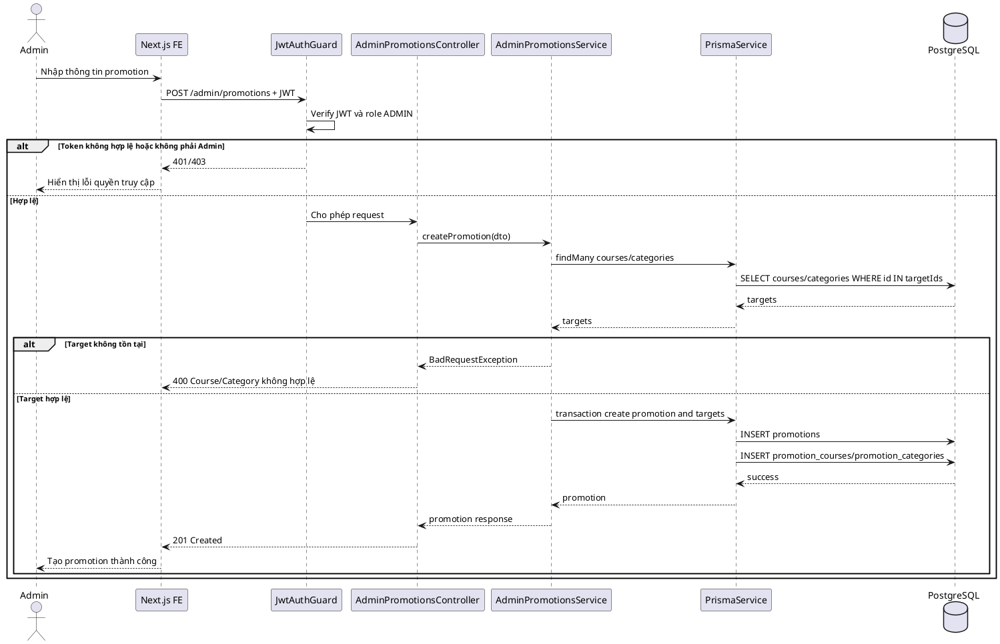
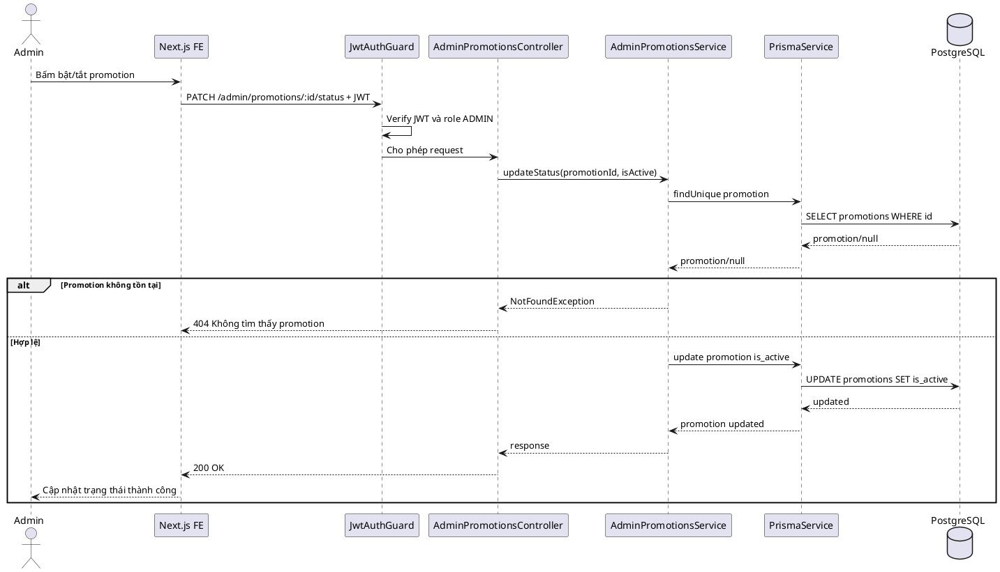
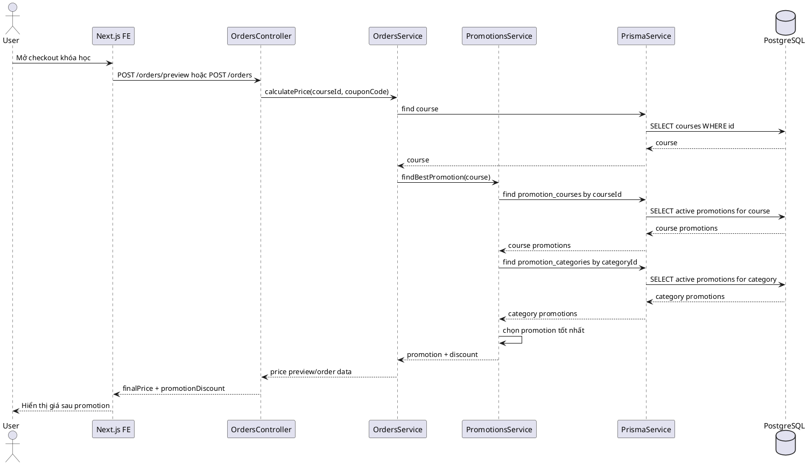
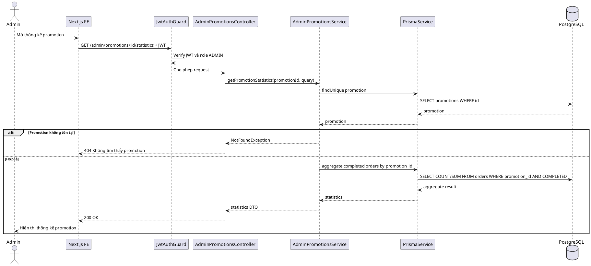
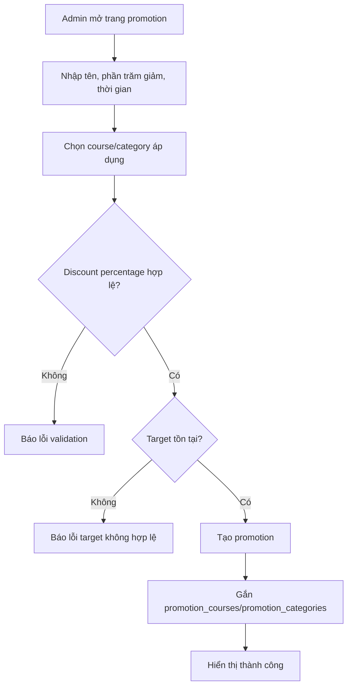
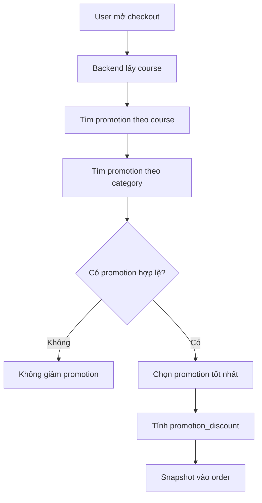

# SKILL.md — Use-case: Quản lý promotion cho admin

---

## 1. Mục tiêu use-case

Use-case **Quản lý promotion cho admin** cho phép admin tạo, sửa, bật/tắt và theo dõi các chương trình khuyến mãi trực tiếp áp dụng cho khóa học hoặc danh mục khóa học.

Hệ thống sử dụng:

```txt
Frontend: Next.js
Backend: NestJS
Database: PostgreSQL
ORM: Prisma
Auth: JWT access token
Video: Mux
Storage tài liệu: S3/R2 hoặc storage tương đương
```

Trong phạm vi tài liệu này, hệ thống **không sử dụng bảng refresh_tokens**. JWT access token được dùng để xác thực request; khi đăng xuất, frontend xóa token/cookie đang lưu.

Promotion khác coupon ở chỗ promotion được hệ thống áp dụng tự động theo course/category, còn coupon là mã người dùng nhập khi checkout.

---

## 2. Actor tham gia

| Actor | Mô tả |
|---|---|
| Admin | Quản trị viên hệ thống |
| LMS System | Backend xử lý xác thực, validate promotion, tính khuyến mãi ở checkout |

Actor chính của use-case này:

```txt
Admin
```

---

## 3. Phạm vi chức năng

Use-case **Quản lý promotion cho admin** bao gồm:

```txt
Xem danh sách promotion
Tìm kiếm promotion theo tên
Lọc promotion theo is_active và thời gian hiệu lực
Tạo promotion giảm giá phần trăm
Sửa promotion
Bật/tắt promotion
Gắn promotion vào một hoặc nhiều khóa học
Gắn promotion vào một hoặc nhiều danh mục
Xem danh sách course/category đang áp dụng promotion
Xem thống kê order/doanh thu từ promotion
Kiểm tra promotion hết hạn
Xử lý xung đột khi nhiều promotion cùng áp dụng cho một khóa học
```

Không bao gồm:

```txt
Coupon nhập bằng mã
Hoàn tiền đơn hàng
Affiliate/referral
Chia hoa hồng giảng viên
Promotion dạng mua combo/giỏ hàng nhiều khóa học
```

Các chức năng không bao gồm sẽ được tách sang use-case Coupon, Payment hoặc Revenue riêng.

---

## 4. Tiền điều kiện và hậu điều kiện

### 4.1. Tạo promotion

| Mục | Nội dung |
|---|---|
| Tiền điều kiện | Admin đã đăng nhập, tài khoản `ACTIVE`, role `ADMIN`; course/category được chọn phải tồn tại. |
| Hậu điều kiện | Promotion được tạo trong bảng `promotions`; các liên kết được tạo trong `promotion_courses` hoặc `promotion_categories`. |

### 4.2. Cập nhật promotion

| Mục | Nội dung |
|---|---|
| Tiền điều kiện | Promotion tồn tại; admin có quyền quản lý. |
| Hậu điều kiện | Promotion được cập nhật, checkout sử dụng thông tin mới cho các order tiếp theo. |

### 4.3. Bật/tắt promotion

| Mục | Nội dung |
|---|---|
| Tiền điều kiện | Promotion tồn tại. |
| Hậu điều kiện | `promotions.is_active` được cập nhật. |

### 4.4. Xem thống kê promotion

| Mục | Nội dung |
|---|---|
| Tiền điều kiện | Promotion tồn tại; admin đã đăng nhập. |
| Hậu điều kiện | Hệ thống trả số order, tổng giảm giá promotion và doanh thu từ các order đã `COMPLETED`. |

---

## 5. Database liên quan

Use-case này chủ yếu sử dụng các bảng:

```txt
users
promotions
promotion_courses
promotion_categories
courses
categories
orders
payments
```

### 5.1. Bảng `promotions`

```dbml
Table promotions {
  id uuid [primary key]
  name varchar [not null]
  discount_percentage decimal(5,2) [not null]
  start_date timestamp [not null]
  end_date timestamp [not null]
  is_active boolean [default: true]
  created_at timestamp
  updated_at timestamp
}
```

Ý nghĩa trong use-case:

| Trường | Ý nghĩa |
|---|---|
| `name` | Tên chương trình khuyến mãi |
| `discount_percentage` | Phần trăm giảm giá |
| `start_date`, `end_date` | Thời gian áp dụng |
| `is_active` | Bật/tắt promotion |

### 5.2. Bảng `promotion_courses`

```dbml
Table promotion_courses {
  promotion_id uuid [not null]
  course_id uuid [not null]

  indexes {
    (promotion_id, course_id) [primary key]
  }
}
```

Ý nghĩa:

```txt
Promotion áp dụng trực tiếp cho các khóa học cụ thể.
Nếu một course được gắn promotion trực tiếp, backend có thể ưu tiên promotion này hơn promotion theo category.
```

### 5.3. Bảng `promotion_categories`

```dbml
Table promotion_categories {
  promotion_id uuid [not null]
  category_id uuid [not null]

  indexes {
    (promotion_id, category_id) [primary key]
  }
}
```

Ý nghĩa:

```txt
Promotion áp dụng cho toàn bộ khóa học thuộc danh mục.
Ví dụ: giảm 20% toàn bộ khóa học thuộc danh mục Tiếng Anh.
```

### 5.4. Bảng `courses`

```dbml
Table courses {
  id uuid [primary key]
  instructor_id uuid [not null]
  category_id uuid
  title varchar [not null]
  slug varchar [not null, unique]
  short_description text
  description text
  thumbnail_url text
  level course_level [not null, default: 'BEGINNER']
  status course_status [not null, default: 'DRAFT']
  price decimal(10,2) [not null, default: 0]
  created_at timestamp
  updated_at timestamp
}
```

### 5.5. Bảng `categories`

```dbml
Table categories {
  id uuid [primary key]
  name varchar [not null]
  slug varchar [not null, unique]
  description text
  created_at timestamp
  updated_at timestamp
}
```

### 5.6. Bảng `orders`

```dbml
Table orders {
  id uuid [primary key]
  student_id uuid [not null]
  course_id uuid [not null]
  coupon_id uuid
  promotion_id uuid
  base_price decimal(10,2) [not null]
  promotion_discount decimal(10,2) [default: 0]
  coupon_discount decimal(10,2) [default: 0]
  final_price decimal(10,2) [not null]
  status order_status [not null, default: 'PENDING']
  created_at timestamp
  updated_at timestamp
}
```

Dùng để:

```txt
Snapshot promotion_id và promotion_discount tại thời điểm mua.
Thống kê doanh thu từ promotion.
Chỉ tính order COMPLETED khi báo cáo doanh thu.
```

### 5.7. Enum liên quan

```dbml
Enum user_role {
  STUDENT
  INSTRUCTOR
  ADMIN
}

Enum course_status {
  DRAFT
  PUBLISHED
  HIDDEN
  ARCHIVED
}

Enum order_status {
  PENDING
  COMPLETED
  FAILED
  CANCELLED
}

Enum payment_status {
  PENDING
  SUCCESS
  FAILED
}
```

### 5.8. Index gợi ý

```sql
CREATE INDEX idx_promotions_active_time ON promotions(is_active, start_date, end_date);
CREATE INDEX idx_promotion_courses_course_id ON promotion_courses(course_id);
CREATE INDEX idx_promotion_categories_category_id ON promotion_categories(category_id);
CREATE INDEX idx_orders_promotion_id ON orders(promotion_id);
CREATE INDEX idx_orders_status_created_at ON orders(status, created_at);
```

---

## 6. Kiến trúc xử lý

### 6.1. Tổng quan kiến trúc

```txt
Next.js Frontend
   |
   | HTTP Request + JWT access token
   v
NestJS Backend
   |
   | AdminPromotionsModule / Guards / Services
   v
Prisma ORM
   |
   v
PostgreSQL Database
```

### 6.2. Các module NestJS liên quan

```txt
src/
├── auth/
│   ├── guards/jwt-auth.guard.ts
│   ├── guards/roles.guard.ts
│   └── strategies/jwt.strategy.ts
│
├── admin-promotions/
│   ├── admin-promotions.module.ts
│   ├── admin-promotions.controller.ts
│   ├── admin-promotions.service.ts
│   └── dto/
│       ├── create-promotion.dto.ts
│       ├── update-promotion.dto.ts
│       ├── assign-promotion-targets.dto.ts
│       └── query-promotions.dto.ts
│
├── courses/
│   └── courses.service.ts
│
├── categories/
│   └── categories.service.ts
│
└── prisma/
    ├── prisma.module.ts
    └── prisma.service.ts
```

### 6.3. Trách nhiệm từng thành phần

| Thành phần | Trách nhiệm |
|---|---|
| `AdminPromotionsController` | Nhận request tạo/sửa/gắn promotion |
| `AdminPromotionsService` | Validate promotion, kiểm tra target, thống kê doanh thu |
| `JwtAuthGuard` | Xác thực access token |
| `RolesGuard` | Chỉ cho role `ADMIN` |
| `PrismaService` | Truy vấn `promotions`, `promotion_courses`, `promotion_categories`, `orders` |

---

## 7. API design

### 7.1. Danh sách promotions

```http
GET /admin/promotions?active=true&keyword=summer&page=1&limit=10
Authorization: Bearer access_token
```

Response:

```json
{
  "items": [
    {
      "id": "uuid",
      "name": "Summer Sale",
      "discountPercentage": 20,
      "startDate": "2026-06-01T00:00:00.000Z",
      "endDate": "2026-06-30T23:59:59.000Z",
      "isActive": true,
      "courseCount": 3,
      "categoryCount": 1
    }
  ],
  "pagination": {
    "page": 1,
    "limit": 10,
    "total": 1
  }
}
```

### 7.2. Tạo promotion

```http
POST /admin/promotions
Authorization: Bearer access_token
```

Request body:

```json
{
  "name": "Summer Sale",
  "discountPercentage": 20,
  "startDate": "2026-06-01T00:00:00.000Z",
  "endDate": "2026-06-30T23:59:59.000Z",
  "isActive": true,
  "courseIds": ["course_uuid_1"],
  "categoryIds": ["category_uuid_1"]
}
```

Response:

```json
{
  "message": "Tạo promotion thành công",
  "promotion": {
    "id": "uuid",
    "name": "Summer Sale",
    "discountPercentage": 20,
    "isActive": true
  }
}
```

### 7.3. Chi tiết promotion

```http
GET /admin/promotions/:id
Authorization: Bearer access_token
```

### 7.4. Cập nhật promotion

```http
PATCH /admin/promotions/:id
Authorization: Bearer access_token
```

### 7.5. Bật/tắt promotion

```http
PATCH /admin/promotions/:id/status
Authorization: Bearer access_token
```

Request body:

```json
{
  "isActive": false
}
```

### 7.6. Gắn target course/category

```http
PUT /admin/promotions/:id/targets
Authorization: Bearer access_token
```

Request body:

```json
{
  "courseIds": ["course_uuid_1", "course_uuid_2"],
  "categoryIds": ["category_uuid_1"]
}
```

### 7.7. Danh sách order dùng promotion

```http
GET /admin/promotions/:id/orders?status=COMPLETED&page=1&limit=10
Authorization: Bearer access_token
```

### 7.8. Thống kê promotion

```http
GET /admin/promotions/:id/statistics?from=2026-06-01&to=2026-06-30
Authorization: Bearer access_token
```

Response:

```json
{
  "promotionId": "uuid",
  "name": "Summer Sale",
  "completedOrders": 80,
  "totalBasePrice": 40000000,
  "totalPromotionDiscount": 8000000,
  "totalFinalRevenue": 32000000
}
```

---

## 8. Data flow

### 8.1. Data flow — Tạo promotion

```txt
Admin mở trang /admin/promotions
→ Frontend gửi POST /admin/promotions kèm JWT
→ JwtAuthGuard xác thực token
→ RolesGuard kiểm tra role ADMIN
→ Controller nhận request
→ Service validate name, discount_percentage, start_date, end_date
→ Service kiểm tra courseIds/categoryIds tồn tại
→ Prisma tạo promotion
→ Prisma tạo promotion_courses nếu có courseIds
→ Prisma tạo promotion_categories nếu có categoryIds
→ Backend trả response thành công
→ Frontend cập nhật danh sách promotion
```

### 8.2. Data flow — Checkout áp dụng promotion

```txt
User mở checkout khóa học
→ Backend lấy course theo courseId
→ Backend tìm promotion active theo course trực tiếp trong promotion_courses
→ Backend tìm promotion active theo category trong promotion_categories
→ Nếu có nhiều promotion hợp lệ, chọn promotion tốt nhất hoặc theo rule ưu tiên
→ Backend tính promotion_discount = base_price * discount_percentage / 100
→ Backend snapshot promotion_id và promotion_discount vào orders khi tạo order
```

### 8.3. Data flow — Thống kê promotion

```txt
Admin mở chi tiết promotion
→ Frontend gửi GET /admin/promotions/:id/statistics
→ Backend kiểm tra promotion tồn tại
→ Backend truy vấn orders có promotion_id = promotion.id và status = COMPLETED
→ Backend tính completedOrders, totalPromotionDiscount, totalFinalRevenue
→ Frontend hiển thị thống kê
```

---

## 9. Sequence diagram

### 9.1. Sequence — Tạo promotion



### 9.2. Sequence — Bật/tắt promotion



### 9.3. Sequence — Checkout tìm promotion hợp lệ



### 9.4. Sequence — Thống kê promotion



---

## 10. Activity flow

### 10.1. Activity flow — Tạo promotion



### 10.2. Activity flow — Checkout áp dụng promotion



---

## 11. Kiểm tra phân quyền

| API | Admin | Instructor | User |
|---|---:|---:|---:|
| `GET /admin/promotions` | Có | Không | Không |
| `POST /admin/promotions` | Có | Không | Không |
| `GET /admin/promotions/:id` | Có | Không | Không |
| `PATCH /admin/promotions/:id` | Có | Không | Không |
| `PATCH /admin/promotions/:id/status` | Có | Không | Không |
| `PUT /admin/promotions/:id/targets` | Có | Không | Không |
| `GET /admin/promotions/:id/statistics` | Có | Không | Không |

Quy tắc:

```txt
Chỉ Admin được tạo/sửa/xóa/bật/tắt promotion.
Instructor không được tự tạo promotion trực tiếp vì promotion ảnh hưởng hiển thị và giá toàn hệ thống.
User chỉ được hưởng promotion khi checkout nếu promotion hợp lệ.
```

---

## 12. Validation rules

### 12.1. CreatePromotionDto

```ts
export class CreatePromotionDto {
  @IsString()
  @MaxLength(255)
  name: string;

  @IsNumber()
  @Min(0.01)
  @Max(100)
  discountPercentage: number;

  @IsDateString()
  startDate: string;

  @IsDateString()
  endDate: string;

  @IsOptional()
  @IsBoolean()
  isActive?: boolean;

  @IsOptional()
  @IsArray()
  @IsUUID('4', { each: true })
  courseIds?: string[];

  @IsOptional()
  @IsArray()
  @IsUUID('4', { each: true })
  categoryIds?: string[];
}
```

Validation nghiệp vụ:

```txt
name bắt buộc.
discountPercentage > 0 và <= 100.
startDate < endDate.
Ít nhất một trong courseIds hoặc categoryIds nên có nếu không muốn tạo promotion rỗng.
Tất cả courseIds phải tồn tại.
Tất cả categoryIds phải tồn tại.
Không nên tạo nhiều promotion active trùng target và trùng thời gian nếu hệ thống không có rule ưu tiên.
```

### 12.2. AssignPromotionTargetsDto

```ts
export class AssignPromotionTargetsDto {
  @IsOptional()
  @IsArray()
  @IsUUID('4', { each: true })
  courseIds?: string[];

  @IsOptional()
  @IsArray()
  @IsUUID('4', { each: true })
  categoryIds?: string[];
}
```

---

## 13. Error handling

| Mã lỗi | Trường hợp | Response gợi ý |
|---|---|---|
| `401 Unauthorized` | Chưa đăng nhập | `Bạn cần đăng nhập` |
| `403 Forbidden` | Không phải Admin | `Bạn không có quyền quản lý promotion` |
| `404 Not Found` | Promotion không tồn tại | `Không tìm thấy promotion` |
| `400 Bad Request` | Discount percentage không hợp lệ | `Phần trăm giảm giá không hợp lệ` |
| `400 Bad Request` | Thời gian không hợp lệ | `Thời gian promotion không hợp lệ` |
| `400 Bad Request` | Course/category không tồn tại | `Đối tượng áp dụng không hợp lệ` |
| `409 Conflict` | Trùng promotion active cùng target/thời gian | `Promotion đang bị trùng phạm vi áp dụng` |

---

## 14. Bảo mật

```txt
Chỉ Admin được gọi API /admin/promotions.
Không cho frontend gửi promotion_discount khi tạo order.
Backend luôn tính promotion_discount từ database.
Không áp dụng promotion nếu is_active = false.
Không áp dụng promotion ngoài khoảng start_date/end_date.
Không cho discount làm final_price âm.
Khi tạo order, snapshot promotion_id và promotion_discount để tránh thay đổi lịch sử.
```

---

## 15. Rule chọn promotion khi checkout

Nếu một khóa học có nhiều promotion hợp lệ, có thể chọn một trong các rule sau:

```txt
Rule đơn giản cho MVP:
  Chọn promotion có discount_percentage cao nhất.

Rule ưu tiên:
  Promotion áp dụng trực tiếp theo course ưu tiên hơn promotion theo category.
  Nếu có nhiều promotion theo cùng cấp, chọn discount cao nhất.
```

Gợi ý triển khai MVP:

```txt
1. Tìm promotion theo course.
2. Nếu có, chọn discount_percentage cao nhất.
3. Nếu không có promotion theo course, tìm promotion theo category.
4. Chọn discount_percentage cao nhất.
```

---

## 16. Prototype user flow

### 16.1. Flow — Admin tạo promotion

```txt
1. Admin vào /admin/promotions.
2. Bấm Tạo promotion.
3. Nhập tên, phần trăm giảm, ngày bắt đầu, ngày kết thúc.
4. Chọn áp dụng cho course hoặc category.
5. Bấm Lưu.
6. Backend tạo promotion và target.
7. Frontend hiển thị promotion mới.
```

### 16.2. Flow — User được áp dụng promotion khi mua khóa học

```txt
1. User mở trang checkout khóa học.
2. Backend kiểm tra promotion đang active.
3. Backend tính promotion_discount.
4. Frontend hiển thị giá sau promotion.
5. Khi User tạo order, backend snapshot promotion vào order.
```

---

## 17. Gợi ý màn hình giao diện

### 17.1. Trang danh sách promotion

```txt
+------------------------------------------------------+
| Admin Promotions                                    |
+------------------------------------------------------+
| [Tạo promotion] [Search] [Active filter]             |
+------------------------------------------------------+
| Name        | Discount | Time range        | Active  |
| Summer Sale | 20%      | 01/06 - 30/06    | true    |
+------------------------------------------------------+
```

### 17.2. Form tạo promotion

```txt
+------------------------------------------------+
| Tạo promotion                                  |
+------------------------------------------------+
| Tên:              [Summer Sale]                |
| Giảm giá:         [20] %                       |
| Bắt đầu:          [2026-06-01]                 |
| Kết thúc:         [2026-06-30]                 |
| Active:           [x]                          |
| Course áp dụng:   [Chọn khóa học]              |
| Category áp dụng: [Chọn danh mục]              |
| [Lưu] [Hủy]                                    |
+------------------------------------------------+
```

---

## 18. Test cases cơ bản

| STT | Test case | Kết quả mong đợi |
|---:|---|---|
| 1 | User thường gọi API admin promotion | Trả `403 Forbidden` |
| 2 | Admin tạo promotion hợp lệ | Promotion và targets được tạo |
| 3 | Discount percentage > 100 | Trả lỗi validation |
| 4 | End date nhỏ hơn start date | Trả lỗi validation |
| 5 | Course/category không tồn tại | Trả `400 Bad Request` |
| 6 | Admin tắt promotion | `is_active = false` |
| 7 | Promotion inactive khi checkout | Không được áp dụng |
| 8 | Promotion hết hạn khi checkout | Không được áp dụng |
| 9 | Course có promotion trực tiếp | Tính đúng promotion_discount |
| 10 | Category có promotion | Course thuộc category được giảm giá |
| 11 | Nhiều promotion hợp lệ | Chọn promotion theo rule của hệ thống |
| 12 | Admin xem thống kê promotion | Trả đúng order completed |

---

## 19. Checklist triển khai backend

```txt
Tạo AdminPromotionsModule.
Tạo DTO create/update/assign/query.
Tạo API list promotions.
Tạo API create promotion.
Tạo API update promotion.
Tạo API update status.
Tạo API assign targets.
Tạo API promotion detail.
Tạo API promotion orders.
Tạo API promotion statistics.
Kiểm tra role ADMIN.
Validate discount_percentage.
Validate target course/category tồn tại.
Xử lý conflict promotion nếu cần.
Tạo service findBestPromotion cho checkout.
Snapshot promotion vào orders khi tạo order.
Viết unit test cho rule chọn promotion.
Viết integration test checkout có promotion.
```

---

## 20. Checklist triển khai frontend

```txt
Tạo trang /admin/promotions.
Tạo bảng danh sách promotion.
Tạo form tạo/sửa promotion.
Tạo chọn course/category áp dụng.
Tạo filter active/inactive.
Tạo màn hình chi tiết promotion.
Tạo tab order dùng promotion.
Tạo tab thống kê promotion.
Hiển thị lỗi validation rõ ràng.
Disable nút submit khi đang xử lý.
```

---

## 21. Kết luận

Use-case **Quản lý promotion cho admin** dùng để quản lý khuyến mãi trực tiếp, tự động áp dụng khi User mua khóa học.

Nguyên tắc quan trọng:

```txt
Promotion do Admin quản lý.
Promotion áp dụng tự động theo course/category.
Backend luôn tính promotion_discount.
Order phải snapshot promotion_id và promotion_discount tại thời điểm mua.
```
