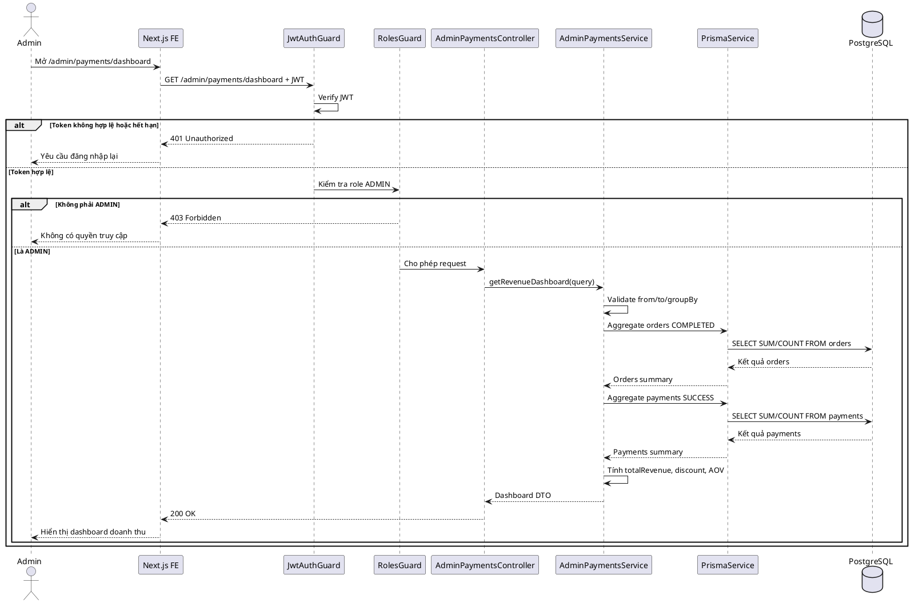
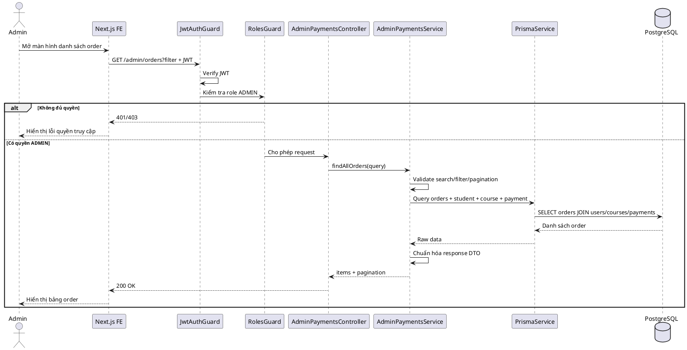
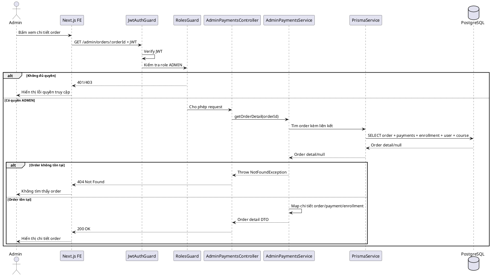
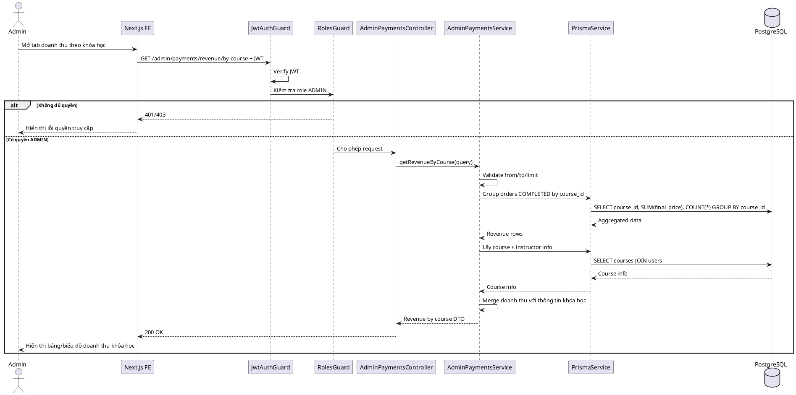
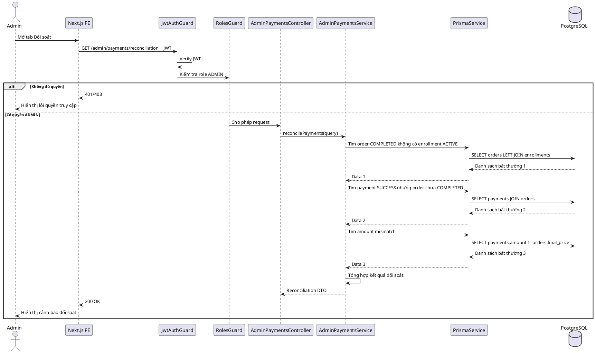
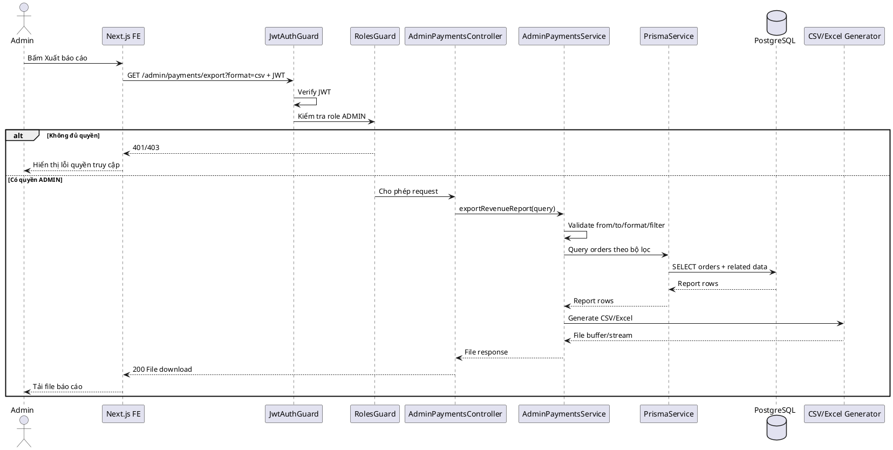
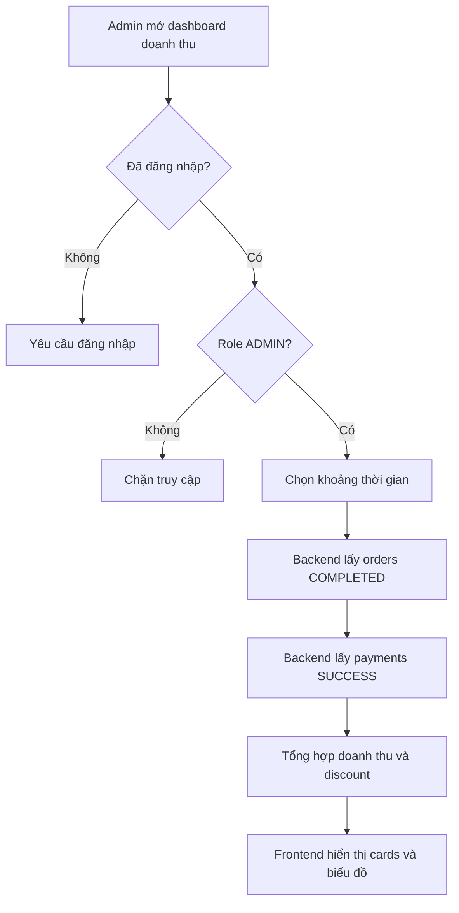
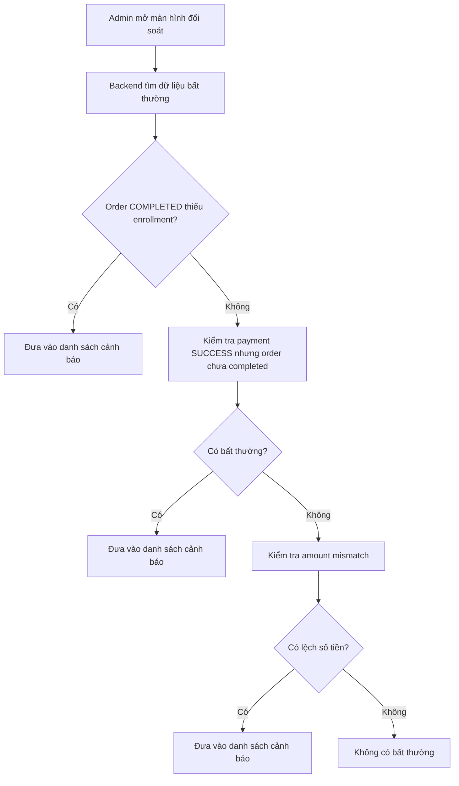
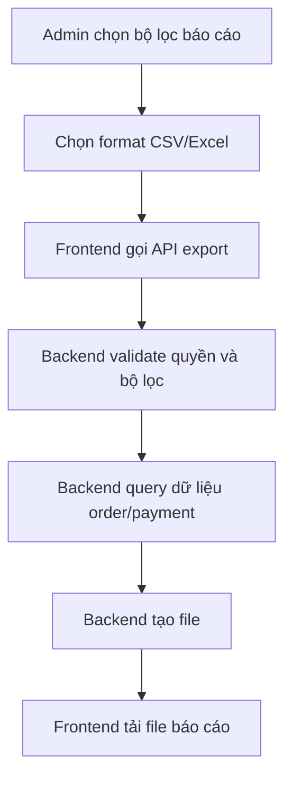

# SKILL.md — Use-case: Quản lý thanh toán và thống kê doanh thu

---

## 1. Mục tiêu use-case

Use-case **Quản lý thanh toán và thống kê doanh thu** cho phép admin theo dõi toàn bộ hoạt động thanh toán trong hệ thống LMS, xem danh sách đơn hàng, chi tiết giao dịch, thống kê doanh thu theo thời gian, khóa học, danh mục, giảng viên, phương thức thanh toán, coupon/promotion và trạng thái thanh toán.

Hệ thống sử dụng:

```txt
Frontend: Next.js
Backend: NestJS
Database: PostgreSQL
ORM: Prisma
Auth: JWT access token
Payment Gateway: VNPay/Momo/Stripe hoặc cổng thanh toán tương đương
Video: Mux
Storage tài liệu: S3/R2 hoặc storage tương đương
```

Trong phạm vi tài liệu này, hệ thống **không sử dụng bảng refresh_tokens**. JWT access token được dùng để xác thực request; khi đăng xuất, frontend xóa token/cookie đang lưu.

Use-case này tập trung vào phía **Admin** để quản lý dữ liệu thanh toán, đơn hàng và thống kê doanh thu. Các thao tác thanh toán của User/Học viên như tạo order, tạo payment, nhập coupon và nhận quyền học sau khi thanh toán thành công thuộc use-case **User — Thanh toán khóa học**.

---

## 2. Actor tham gia

| Actor | Mô tả |
|---|---|
| Admin | Quản trị viên hệ thống, có quyền xem và quản lý dữ liệu thanh toán toàn hệ thống |
| LMS System | Backend xử lý xác thực, phân quyền, truy vấn dữ liệu và tổng hợp thống kê |
| Payment Gateway | Cổng thanh toán bên ngoài gửi trạng thái giao dịch/webhook vào hệ thống |

Actor chính của use-case này:

```txt
Admin
```

Actor phụ:

```txt
LMS System
Payment Gateway
```

---

## 3. Phạm vi chức năng

Use-case **Quản lý thanh toán và thống kê doanh thu** bao gồm:

```txt
Xem dashboard doanh thu tổng quan
Xem tổng doanh thu theo khoảng thời gian
Xem số order theo trạng thái PENDING/COMPLETED/FAILED/CANCELLED
Xem số payment theo trạng thái PENDING/SUCCESS/FAILED
Xem danh sách order toàn hệ thống
Tìm kiếm order theo mã order, tên học viên, email học viên, tên khóa học
Lọc order theo trạng thái, phương thức thanh toán, thời gian, khóa học, giảng viên, danh mục
Xem chi tiết order và payment liên quan
Xem doanh thu theo ngày/tháng/năm
Xem doanh thu theo khóa học
Xem doanh thu theo giảng viên
Xem doanh thu theo danh mục khóa học
Xem doanh thu theo phương thức thanh toán
Xem ảnh hưởng của coupon/promotion đến doanh thu
Xem top khóa học bán chạy
Xem top giảng viên có doanh thu cao
Xem các giao dịch thất bại hoặc đang chờ xử lý
Đối soát trạng thái payment với order và enrollment
Xuất báo cáo CSV/Excel nếu cần
```

Không bao gồm:

```txt
User tạo order thanh toán
User tạo payment và redirect cổng thanh toán
Webhook mở quyền học cho User
Admin tự ý cập nhật payment SUCCESS nếu không có xác minh từ cổng thanh toán
Hoàn tiền thủ công nâng cao
Chia doanh thu tự động cho giảng viên
Xuất hóa đơn VAT
Kế toán/BI chuyên sâu ngoài LMS
```

Các chức năng không bao gồm sẽ được tách sang use-case riêng nếu hệ thống mở rộng.

---

## 4. Tiền điều kiện và hậu điều kiện

### 4.1. Xem dashboard doanh thu

| Mục | Nội dung |
|---|---|
| Tiền điều kiện | Admin đã đăng nhập; tài khoản có trạng thái `ACTIVE`; có quyền `ADMIN` |
| Hậu điều kiện | Hệ thống hiển thị tổng doanh thu, số đơn hàng, số thanh toán thành công/thất bại và biểu đồ doanh thu |

### 4.2. Lọc thống kê doanh thu theo thời gian

| Mục | Nội dung |
|---|---|
| Tiền điều kiện | Admin đã đăng nhập; khoảng thời gian lọc hợp lệ |
| Hậu điều kiện | Hệ thống trả về thống kê doanh thu tương ứng với khoảng thời gian đã chọn |

### 4.3. Xem danh sách order toàn hệ thống

| Mục | Nội dung |
|---|---|
| Tiền điều kiện | Admin đã đăng nhập; có quyền truy cập màn hình quản lý thanh toán |
| Hậu điều kiện | Hệ thống hiển thị danh sách order có phân trang, tìm kiếm và lọc |

### 4.4. Xem chi tiết order/payment

| Mục | Nội dung |
|---|---|
| Tiền điều kiện | Admin đã đăng nhập; order tồn tại trong database |
| Hậu điều kiện | Hệ thống hiển thị thông tin order, payment, học viên, khóa học, coupon/promotion và enrollment liên quan |

### 4.5. Xem giao dịch thất bại

| Mục | Nội dung |
|---|---|
| Tiền điều kiện | Admin đã đăng nhập; hệ thống có payment/order thất bại hoặc bị hủy |
| Hậu điều kiện | Admin xem được nguyên nhân/ghi chú nếu có và trạng thái hiện tại của giao dịch |

### 4.6. Xuất báo cáo doanh thu

| Mục | Nội dung |
|---|---|
| Tiền điều kiện | Admin đã đăng nhập; bộ lọc báo cáo hợp lệ |
| Hậu điều kiện | Hệ thống tạo file báo cáo CSV/Excel chứa dữ liệu doanh thu theo bộ lọc |

---

## 5. Database liên quan

Use-case này chủ yếu sử dụng các bảng:

```txt
users
courses
categories
coupons
promotions
promotion_courses
promotion_categories
orders
payments
enrollments
```

### 5.1. Bảng `users`

```dbml
Table users {
  id uuid [primary key]
  full_name varchar [not null]
  email varchar [not null, unique]
  password_hash text [not null]
  avatar_url text
  role user_role [not null, default: 'STUDENT']
  status user_status [not null, default: 'ACTIVE']
  created_at timestamp
  updated_at timestamp
}
```

Ý nghĩa trong use-case:

| Trường | Ý nghĩa |
|---|---|
| `id` | Dùng để liên kết với `orders.student_id`, `enrollments.student_id`, `courses.instructor_id` |
| `full_name` | Hiển thị tên học viên hoặc giảng viên |
| `email` | Tìm kiếm order theo email học viên |
| `role` | Phân biệt học viên, giảng viên, admin |
| `status` | Kiểm tra trạng thái tài khoản khi cần đối soát |

Quan hệ chính:

```txt
users 1 - N orders thông qua orders.student_id
users 1 - N enrollments thông qua enrollments.student_id
users 1 - N courses thông qua courses.instructor_id
```

---

### 5.2. Bảng `courses`

```dbml
Table courses {
  id uuid [primary key]
  instructor_id uuid [not null]
  category_id uuid
  title varchar [not null]
  slug varchar [not null, unique]
  short_description text
  description text
  thumbnail_url text
  level course_level [not null, default: 'BEGINNER']
  status course_status [not null, default: 'DRAFT']
  price decimal(10,2) [not null, default: 0]
  created_at timestamp
  updated_at timestamp
}
```

Ý nghĩa trong use-case:

| Trường | Ý nghĩa |
|---|---|
| `id` | Khóa học được mua trong order |
| `instructor_id` | Tính doanh thu theo giảng viên |
| `category_id` | Tính doanh thu theo danh mục |
| `title` | Hiển thị tên khóa học trong danh sách order |
| `price` | Giá gốc hiện tại của khóa học; doanh thu thực tế vẫn lấy từ `orders.final_price` |
| `status` | Phân tích doanh thu theo trạng thái khóa học nếu cần |

Quan hệ chính:

```txt
courses 1 - N orders thông qua orders.course_id
courses 1 - N enrollments thông qua enrollments.course_id
users 1 - N courses thông qua courses.instructor_id
categories 1 - N courses thông qua courses.category_id
```

---

### 5.3. Bảng `categories`

```dbml
Table categories {
  id uuid [primary key]
  name varchar [not null]
  slug varchar [not null, unique]
  description text
  created_at timestamp
  updated_at timestamp
}
```

Ý nghĩa trong use-case:

| Trường | Ý nghĩa |
|---|---|
| `id` | Liên kết với `courses.category_id` để thống kê doanh thu theo danh mục |
| `name` | Hiển thị tên danh mục trong báo cáo |
| `slug` | Dùng khi điều hướng sang trang danh mục nếu cần |

---

### 5.4. Bảng `coupons`

```dbml
Table coupons {
  id uuid [primary key]
  code varchar [not null, unique]
  discount_type discount_type [not null]
  discount_value decimal(10,2) [not null]
  start_date timestamp
  end_date timestamp
  usage_limit integer
  used_count integer [default: 0]
  status coupon_status [not null, default: 'ACTIVE']
  created_by uuid [not null]
  created_at timestamp
  updated_at timestamp
}
```

Ý nghĩa trong use-case:

| Trường | Ý nghĩa |
|---|---|
| `code` | Tìm kiếm/thống kê order theo mã coupon |
| `discount_type` | Phân tích loại giảm giá |
| `discount_value` | Giá trị giảm cấu hình |
| `used_count` | Số lần coupon đã được sử dụng thành công |
| `status` | Trạng thái coupon |

Lưu ý:

```txt
Trong báo cáo doanh thu, số tiền giảm thực tế nên lấy từ orders.coupon_discount.
Không nên tự tính lại theo coupons.discount_value vì coupon có thể thay đổi sau thời điểm mua.
```

---

### 5.5. Bảng `promotions`

```dbml
Table promotions {
  id uuid [primary key]
  name varchar [not null]
  discount_percentage decimal(5,2) [not null]
  start_date timestamp [not null]
  end_date timestamp [not null]
  is_active boolean [default: true]
  created_at timestamp
  updated_at timestamp
}
```

Promotion áp dụng cho khóa học hoặc danh mục qua:

```dbml
Table promotion_courses {
  promotion_id uuid [not null]
  course_id uuid [not null]

  indexes {
    (promotion_id, course_id) [primary key]
  }
}

Table promotion_categories {
  promotion_id uuid [not null]
  category_id uuid [not null]

  indexes {
    (promotion_id, category_id) [primary key]
  }
}
```

Ý nghĩa trong use-case:

| Bảng | Ý nghĩa |
|---|---|
| `promotions` | Chương trình khuyến mãi đã áp dụng |
| `promotion_courses` | Promotion áp dụng cho khóa học cụ thể |
| `promotion_categories` | Promotion áp dụng cho toàn danh mục |

Lưu ý:

```txt
Trong báo cáo doanh thu, số tiền giảm thực tế nên lấy từ orders.promotion_discount.
Không nên tính lại theo promotions.discount_percentage vì promotion có thể thay đổi sau thời điểm mua.
```

---

### 5.6. Bảng `orders`

```dbml
Table orders {
  id uuid [primary key]
  student_id uuid [not null]
  course_id uuid [not null]
  coupon_id uuid
  promotion_id uuid
  base_price decimal(10,2) [not null]
  promotion_discount decimal(10,2) [default: 0]
  coupon_discount decimal(10,2) [default: 0]
  final_price decimal(10,2) [not null]
  status order_status [not null, default: 'PENDING']
  created_at timestamp
  updated_at timestamp
}
```

Ý nghĩa trong use-case:

| Trường | Ý nghĩa |
|---|---|
| `student_id` | Học viên mua khóa học |
| `course_id` | Khóa học được mua |
| `coupon_id` | Coupon áp dụng nếu có |
| `promotion_id` | Promotion áp dụng nếu có |
| `base_price` | Giá gốc snapshot tại thời điểm mua |
| `promotion_discount` | Số tiền giảm từ promotion tại thời điểm mua |
| `coupon_discount` | Số tiền giảm từ coupon tại thời điểm mua |
| `final_price` | Số tiền cuối cùng cần thanh toán; dùng để tính doanh thu |
| `status` | Trạng thái order: `PENDING`, `COMPLETED`, `FAILED`, `CANCELLED` |

Quy tắc thống kê:

```txt
Doanh thu thực nhận của LMS trong MVP = SUM(orders.final_price) với orders.status = COMPLETED.
Tổng giá gốc = SUM(orders.base_price) với orders.status = COMPLETED.
Tổng giảm promotion = SUM(orders.promotion_discount) với orders.status = COMPLETED.
Tổng giảm coupon = SUM(orders.coupon_discount) với orders.status = COMPLETED.
Không tính order PENDING/FAILED/CANCELLED vào doanh thu thực nhận.
```

---

### 5.7. Bảng `payments`

```dbml
Table payments {
  id uuid [primary key]
  order_id uuid [not null]
  payment_method varchar [not null]
  transaction_reference varchar [unique]
  amount decimal(10,2) [not null]
  status payment_status [not null, default: 'PENDING']
  paid_at timestamp
  created_at timestamp
}
```

Ý nghĩa trong use-case:

| Trường | Ý nghĩa |
|---|---|
| `order_id` | Payment thuộc order nào |
| `payment_method` | Phương thức/cổng thanh toán: VNPAY, MOMO, STRIPE, BANK_TRANSFER |
| `transaction_reference` | Mã giao dịch từ cổng thanh toán |
| `amount` | Số tiền thanh toán |
| `status` | Trạng thái payment: `PENDING`, `SUCCESS`, `FAILED` |
| `paid_at` | Thời điểm thanh toán thành công |

Quy tắc thống kê:

```txt
Doanh thu theo ngày nên ưu tiên dùng payments.paid_at nếu có payment SUCCESS.
Nếu khóa học miễn phí không có payment, có thể dùng orders.updated_at hoặc enrollments.enrolled_at.
payment.amount phải khớp orders.final_price đối với order trả phí.
```

---

### 5.8. Bảng `enrollments`

```dbml
Table enrollments {
  id uuid [primary key]
  student_id uuid [not null]
  course_id uuid [not null]
  order_id uuid
  status enrollment_status [not null, default: 'PENDING_PAYMENT']
  enrolled_at timestamp
  completed_at timestamp

  indexes {
    (student_id, course_id) [unique]
  }
}
```

Ý nghĩa trong use-case:

| Trường | Ý nghĩa |
|---|---|
| `student_id` | Học viên được mở quyền học |
| `course_id` | Khóa học được mở quyền học |
| `order_id` | Order dẫn đến enrollment |
| `status` | Trạng thái quyền học |
| `enrolled_at` | Thời điểm bắt đầu có quyền học |

Quy tắc đối soát:

```txt
Nếu order COMPLETED nhưng enrollment chưa ACTIVE/COMPLETED thì cần kiểm tra lỗi mở quyền học.
Nếu enrollment ACTIVE nhưng order chưa COMPLETED thì cần kiểm tra dữ liệu bất thường.
```

---

### 5.9. Enum liên quan

```dbml
Enum user_role {
  STUDENT
  INSTRUCTOR
  ADMIN
}

Enum user_status {
  ACTIVE
  INACTIVE
  BANNED
}

Enum course_status {
  DRAFT
  PUBLISHED
  HIDDEN
  ARCHIVED
}

Enum discount_type {
  PERCENTAGE
  FIXED_AMOUNT
}

Enum coupon_status {
  ACTIVE
  INACTIVE
  EXPIRED
}

Enum order_status {
  PENDING
  COMPLETED
  FAILED
  CANCELLED
}

Enum payment_status {
  PENDING
  SUCCESS
  FAILED
}

Enum enrollment_status {
  PENDING_PAYMENT
  ACTIVE
  COMPLETED
  CANCELLED
}
```

---

### 5.10. Quan hệ dữ liệu

```txt
users 1 - N orders thông qua orders.student_id
users 1 - N enrollments thông qua enrollments.student_id
users 1 - N courses thông qua courses.instructor_id
categories 1 - N courses thông qua courses.category_id
courses 1 - N orders thông qua orders.course_id
courses 1 - N enrollments thông qua enrollments.course_id
orders 1 - N payments thông qua payments.order_id
orders 1 - 0..1 enrollments thông qua enrollments.order_id
coupons 1 - N orders thông qua orders.coupon_id
promotions 1 - N orders thông qua orders.promotion_id
```

---

### 5.11. Index gợi ý

```sql
CREATE INDEX idx_orders_student_id ON orders(student_id);
CREATE INDEX idx_orders_course_id ON orders(course_id);
CREATE INDEX idx_orders_status ON orders(status);
CREATE INDEX idx_orders_created_at ON orders(created_at);
CREATE INDEX idx_orders_promotion_id ON orders(promotion_id);
CREATE INDEX idx_orders_coupon_id ON orders(coupon_id);

CREATE INDEX idx_payments_order_id ON payments(order_id);
CREATE INDEX idx_payments_status ON payments(status);
CREATE INDEX idx_payments_payment_method ON payments(payment_method);
CREATE INDEX idx_payments_paid_at ON payments(paid_at);
CREATE UNIQUE INDEX idx_payments_transaction_reference ON payments(transaction_reference);

CREATE INDEX idx_enrollments_student_id ON enrollments(student_id);
CREATE INDEX idx_enrollments_course_id ON enrollments(course_id);
CREATE INDEX idx_enrollments_order_id ON enrollments(order_id);
CREATE UNIQUE INDEX idx_enrollments_student_course ON enrollments(student_id, course_id);

CREATE INDEX idx_courses_instructor_id ON courses(instructor_id);
CREATE INDEX idx_courses_category_id ON courses(category_id);
```

---

## 6. Kiến trúc xử lý

### 6.1. Tổng quan kiến trúc

```txt
Next.js Frontend
   |
   | HTTP Request + JWT access token
   v
NestJS Backend
   |
   | AdminPaymentsModule / AdminRevenueModule / Guards / Services
   v
Prisma ORM
   |
   v
PostgreSQL Database

NestJS Backend
   |
   | Optional: verify transaction from Payment Gateway
   v
Payment Gateway
```

### 6.2. Các module NestJS liên quan

```txt
src/
├── auth/
│   ├── guards/
│   │   ├── jwt-auth.guard.ts
│   │   └── roles.guard.ts
│   └── strategies/
│       └── jwt.strategy.ts
│
├── admin-payments/
│   ├── admin-payments.module.ts
│   ├── admin-payments.controller.ts
│   ├── admin-payments.service.ts
│   └── dto/
│       ├── query-admin-orders.dto.ts
│       ├── query-admin-revenue.dto.ts
│       ├── query-admin-payments.dto.ts
│       └── export-revenue-report.dto.ts
│
├── orders/
│   └── orders.service.ts
│
├── payments/
│   └── payments.service.ts
│
├── enrollments/
│   └── enrollments.service.ts
│
├── courses/
│   └── courses.service.ts
│
└── prisma/
    ├── prisma.module.ts
    └── prisma.service.ts
```

### 6.3. Trách nhiệm từng thành phần

| Thành phần | Trách nhiệm |
|---|---|
| `AdminPaymentsController` | Nhận request của admin, đọc query filter, gọi service và trả response |
| `AdminPaymentsService` | Truy vấn order/payment, tổng hợp doanh thu, lọc dữ liệu, xuất báo cáo |
| `OrdersService` | Cung cấp logic đọc order nếu muốn tái sử dụng |
| `PaymentsService` | Cung cấp logic đọc payment, kiểm tra trạng thái payment |
| `JwtAuthGuard` | Xác thực access token |
| `RolesGuard` | Chỉ cho role `ADMIN` truy cập các API admin |
| `PrismaService` | Thao tác dữ liệu PostgreSQL |
| `DTO` | Validate query, pagination, date range, status |

---

## 7. API design

### 7.1. Dashboard doanh thu tổng quan

```http
GET /admin/payments/dashboard?from=2026-06-01&to=2026-06-30
Authorization: Bearer admin_access_token
```

Query params:

| Tham số | Bắt buộc | Ý nghĩa |
|---|---:|---|
| `from` | Không | Ngày bắt đầu lọc |
| `to` | Không | Ngày kết thúc lọc |
| `groupBy` | Không | `day`, `month`, `year` |

Response:

```json
{
  "message": "Lấy dashboard doanh thu thành công",
  "data": {
    "totalRevenue": 12500000,
    "grossRevenue": 18000000,
    "promotionDiscount": 3500000,
    "couponDiscount": 2000000,
    "completedOrders": 120,
    "pendingOrders": 15,
    "failedOrders": 8,
    "cancelledOrders": 4,
    "successfulPayments": 120,
    "failedPayments": 8,
    "averageOrderValue": 104166.67,
    "conversionToEnrollment": 120
  }
}
```

---

### 7.2. Biểu đồ doanh thu theo thời gian

```http
GET /admin/payments/revenue/timeline?from=2026-06-01&to=2026-06-30&groupBy=day
Authorization: Bearer admin_access_token
```

Response:

```json
{
  "message": "Lấy biểu đồ doanh thu thành công",
  "data": [
    {
      "period": "2026-06-01",
      "revenue": 1200000,
      "grossRevenue": 1500000,
      "discount": 300000,
      "orders": 12
    },
    {
      "period": "2026-06-02",
      "revenue": 900000,
      "grossRevenue": 1200000,
      "discount": 300000,
      "orders": 9
    }
  ]
}
```

---

### 7.3. Danh sách order toàn hệ thống

```http
GET /admin/orders?status=COMPLETED&page=1&limit=20&search=nguyen&paymentMethod=VNPAY
Authorization: Bearer admin_access_token
```

Query params:

| Tham số | Bắt buộc | Ý nghĩa |
|---|---:|---|
| `status` | Không | Lọc theo trạng thái order |
| `paymentStatus` | Không | Lọc theo trạng thái payment |
| `paymentMethod` | Không | Lọc theo phương thức thanh toán |
| `courseId` | Không | Lọc theo khóa học |
| `instructorId` | Không | Lọc theo giảng viên |
| `categoryId` | Không | Lọc theo danh mục |
| `from` | Không | Ngày bắt đầu |
| `to` | Không | Ngày kết thúc |
| `search` | Không | Tìm theo tên/email học viên, tên khóa học, mã order |
| `page` | Không | Trang hiện tại |
| `limit` | Không | Số item/trang |

Response:

```json
{
  "message": "Lấy danh sách order thành công",
  "data": {
    "items": [
      {
        "id": "uuid",
        "student": {
          "id": "uuid",
          "fullName": "Nguyễn Văn A",
          "email": "vana@example.com"
        },
        "course": {
          "id": "uuid",
          "title": "NestJS PostgreSQL thực chiến"
        },
        "basePrice": 499000,
        "promotionDiscount": 99800,
        "couponDiscount": 50000,
        "finalPrice": 349200,
        "status": "COMPLETED",
        "paymentStatus": "SUCCESS",
        "paymentMethod": "VNPAY",
        "createdAt": "2026-06-19T10:00:00.000Z"
      }
    ],
    "pagination": {
      "page": 1,
      "limit": 20,
      "total": 120
    }
  }
}
```

---

### 7.4. Chi tiết order

```http
GET /admin/orders/:orderId
Authorization: Bearer admin_access_token
```

Response:

```json
{
  "message": "Lấy chi tiết order thành công",
  "data": {
    "id": "uuid",
    "student": {
      "id": "uuid",
      "fullName": "Nguyễn Văn A",
      "email": "vana@example.com"
    },
    "course": {
      "id": "uuid",
      "title": "NestJS PostgreSQL thực chiến",
      "instructor": {
        "id": "uuid",
        "fullName": "Trần Văn B"
      },
      "category": {
        "id": "uuid",
        "name": "Lập trình"
      }
    },
    "coupon": {
      "id": "uuid",
      "code": "SALE50"
    },
    "promotion": {
      "id": "uuid",
      "name": "Summer Sale"
    },
    "basePrice": 499000,
    "promotionDiscount": 99800,
    "couponDiscount": 50000,
    "finalPrice": 349200,
    "status": "COMPLETED",
    "payments": [
      {
        "id": "uuid",
        "paymentMethod": "VNPAY",
        "transactionReference": "VNPAY_123456",
        "amount": 349200,
        "status": "SUCCESS",
        "paidAt": "2026-06-19T10:00:00.000Z"
      }
    ],
    "enrollment": {
      "id": "uuid",
      "status": "ACTIVE",
      "enrolledAt": "2026-06-19T10:01:00.000Z"
    }
  }
}
```

---

### 7.5. Danh sách payment toàn hệ thống

```http
GET /admin/payments?status=SUCCESS&paymentMethod=VNPAY&page=1&limit=20
Authorization: Bearer admin_access_token
```

Response:

```json
{
  "message": "Lấy danh sách payment thành công",
  "data": {
    "items": [
      {
        "id": "uuid",
        "orderId": "uuid",
        "transactionReference": "VNPAY_123456",
        "paymentMethod": "VNPAY",
        "amount": 349200,
        "status": "SUCCESS",
        "paidAt": "2026-06-19T10:00:00.000Z"
      }
    ],
    "pagination": {
      "page": 1,
      "limit": 20,
      "total": 120
    }
  }
}
```

---

### 7.6. Thống kê doanh thu theo khóa học

```http
GET /admin/payments/revenue/by-course?from=2026-06-01&to=2026-06-30&limit=10
Authorization: Bearer admin_access_token
```

Response:

```json
{
  "message": "Lấy doanh thu theo khóa học thành công",
  "data": [
    {
      "courseId": "uuid",
      "courseTitle": "NestJS PostgreSQL thực chiến",
      "instructorName": "Trần Văn B",
      "orders": 50,
      "revenue": 17460000,
      "grossRevenue": 24950000,
      "discount": 7490000
    }
  ]
}
```

---

### 7.7. Thống kê doanh thu theo giảng viên

```http
GET /admin/payments/revenue/by-instructor?from=2026-06-01&to=2026-06-30
Authorization: Bearer admin_access_token
```

Response:

```json
{
  "message": "Lấy doanh thu theo giảng viên thành công",
  "data": [
    {
      "instructorId": "uuid",
      "instructorName": "Trần Văn B",
      "courses": 8,
      "orders": 120,
      "revenue": 42000000
    }
  ]
}
```

---

### 7.8. Thống kê doanh thu theo danh mục

```http
GET /admin/payments/revenue/by-category?from=2026-06-01&to=2026-06-30
Authorization: Bearer admin_access_token
```

Response:

```json
{
  "message": "Lấy doanh thu theo danh mục thành công",
  "data": [
    {
      "categoryId": "uuid",
      "categoryName": "Lập trình",
      "orders": 200,
      "revenue": 65000000
    }
  ]
}
```

---

### 7.9. Thống kê coupon/promotion

```http
GET /admin/payments/discounts?from=2026-06-01&to=2026-06-30
Authorization: Bearer admin_access_token
```

Response:

```json
{
  "message": "Lấy thống kê giảm giá thành công",
  "data": {
    "totalPromotionDiscount": 3500000,
    "totalCouponDiscount": 2000000,
    "topCoupons": [
      {
        "couponId": "uuid",
        "code": "SALE50",
        "usedOrders": 30,
        "discountAmount": 1500000,
        "revenueAfterDiscount": 9000000
      }
    ],
    "topPromotions": [
      {
        "promotionId": "uuid",
        "name": "Summer Sale",
        "usedOrders": 80,
        "discountAmount": 3500000,
        "revenueAfterDiscount": 22000000
      }
    ]
  }
}
```

---

### 7.10. Đối soát order/payment/enrollment

```http
GET /admin/payments/reconciliation?from=2026-06-01&to=2026-06-30
Authorization: Bearer admin_access_token
```

Mục đích:

```txt
Tìm dữ liệu bất thường giữa orders, payments và enrollments.
```

Response:

```json
{
  "message": "Đối soát thanh toán thành công",
  "data": {
    "completedOrderWithoutActiveEnrollment": [
      {
        "orderId": "uuid",
        "studentEmail": "vana@example.com",
        "courseTitle": "NestJS PostgreSQL thực chiến",
        "orderStatus": "COMPLETED",
        "enrollmentStatus": null
      }
    ],
    "activeEnrollmentWithoutCompletedOrder": [],
    "paymentSuccessButOrderNotCompleted": [],
    "amountMismatch": []
  }
}
```

---

### 7.11. Xuất báo cáo doanh thu

```http
GET /admin/payments/export?from=2026-06-01&to=2026-06-30&format=csv
Authorization: Bearer admin_access_token
```

Response:

```txt
File CSV/Excel chứa danh sách order và số liệu doanh thu theo bộ lọc.
```

---

## 8. Data flow

### 8.1. Data flow — Xem dashboard doanh thu

```txt
Admin mở trang /admin/payments/dashboard
→ Frontend kiểm tra token đăng nhập
→ Frontend gọi GET /admin/payments/dashboard
→ JwtAuthGuard xác thực JWT
→ RolesGuard kiểm tra role ADMIN
→ AdminPaymentsController nhận query from/to/groupBy
→ AdminPaymentsService validate khoảng thời gian
→ Service truy vấn orders COMPLETED trong khoảng thời gian
→ Service truy vấn payments SUCCESS trong khoảng thời gian
→ Service tổng hợp doanh thu, discount, số đơn, số payment
→ Prisma trả dữ liệu từ PostgreSQL
→ Service chuẩn hóa response DTO
→ Controller trả response
→ Frontend hiển thị card doanh thu và biểu đồ
```

---

### 8.2. Data flow — Xem danh sách order

```txt
Admin mở màn hình /admin/orders
→ Frontend gọi GET /admin/orders kèm filter/search/pagination
→ Backend xác thực JWT và role ADMIN
→ Controller nhận query
→ Service build điều kiện lọc theo status, thời gian, course, instructor, category, payment_method
→ Prisma truy vấn orders join users, courses, payments
→ PostgreSQL trả danh sách order và tổng số bản ghi
→ Service map dữ liệu sang response DTO
→ Frontend hiển thị bảng order
```

---

### 8.3. Data flow — Xem chi tiết order

```txt
Admin bấm vào một order
→ Frontend gọi GET /admin/orders/:orderId
→ Backend xác thực JWT và role ADMIN
→ Service tìm order theo id
→ Service include student, course, instructor, category, coupon, promotion, payments, enrollment
→ Nếu không tồn tại thì trả 404
→ Nếu tồn tại thì trả chi tiết order
→ Frontend hiển thị modal/trang chi tiết thanh toán
```

---

### 8.4. Data flow — Thống kê doanh thu theo khóa học

```txt
Admin mở tab Doanh thu theo khóa học
→ Frontend gọi GET /admin/payments/revenue/by-course
→ Backend xác thực admin
→ Service lọc orders.status = COMPLETED theo thời gian
→ Service group by course_id
→ Service join courses và users instructor
→ Service tính SUM(final_price), SUM(base_price), SUM(discount), COUNT(order)
→ Backend trả danh sách khóa học có doanh thu
→ Frontend hiển thị bảng/top chart
```

---

### 8.5. Data flow — Đối soát thanh toán

```txt
Admin mở tab Đối soát
→ Frontend gọi GET /admin/payments/reconciliation
→ Backend xác thực admin
→ Service tìm order COMPLETED nhưng không có enrollment ACTIVE/COMPLETED
→ Service tìm payment SUCCESS nhưng order chưa COMPLETED
→ Service tìm payment.amount khác order.final_price
→ Service tìm enrollment ACTIVE nhưng order chưa COMPLETED nếu enrollment có order_id
→ Backend trả danh sách dữ liệu bất thường
→ Frontend hiển thị cảnh báo để admin kiểm tra
```

---

### 8.99. Quy tắc xử lý dữ liệu chung

```txt
Luôn lấy userId và role từ JWT, không lấy role từ body request.
Chỉ role ADMIN được truy cập API /admin/payments và /admin/orders.
Không trả password_hash hoặc thông tin nhạy cảm của gateway về frontend.
Không cho Admin sửa payment SUCCESS thủ công trong MVP.
Doanh thu chỉ tính từ orders.status = COMPLETED.
Payment thành công nên kiểm tra payments.status = SUCCESS.
Enrollment là nguồn quyết định quyền học của User.
Khi thống kê doanh thu, dùng snapshot trong orders, không tính lại từ courses.price/coupons/promotions hiện tại.
```

---

## 9. Sequence diagram

### 9.1. Sequence — Admin xem dashboard doanh thu



---

### 9.2. Sequence — Admin xem danh sách order



---

### 9.3. Sequence — Admin xem chi tiết order



---

### 9.4. Sequence — Admin xem doanh thu theo khóa học



---

### 9.5. Sequence — Admin đối soát thanh toán



---

### 9.6. Sequence — Admin xuất báo cáo doanh thu



---

## 10. Activity flow

### 10.1. Activity flow — Xem dashboard doanh thu



---

### 10.2. Activity flow — Đối soát thanh toán



---

### 10.3. Activity flow — Xuất báo cáo doanh thu



---

## 11. Kiểm tra phân quyền

### 11.1. JWT payload

JWT payload nên chứa tối thiểu:

```json
{
  "sub": "user_id",
  "email": "admin@example.com",
  "role": "ADMIN",
  "status": "ACTIVE"
}
```

Backend sử dụng:

```txt
sub: xác định admin đang thao tác
role: kiểm tra quyền ADMIN
status: kiểm tra tài khoản còn ACTIVE
```

---

### 11.2. Quyền truy cập API

| API | User | Instructor | Admin | Ghi chú |
|---|---:|---:|---:|---|
| `GET /admin/payments/dashboard` | Không | Không | Có | Dashboard doanh thu |
| `GET /admin/payments/revenue/timeline` | Không | Không | Có | Biểu đồ doanh thu |
| `GET /admin/orders` | Không | Không | Có | Danh sách order toàn hệ thống |
| `GET /admin/orders/:orderId` | Không | Không | Có | Chi tiết order |
| `GET /admin/payments` | Không | Không | Có | Danh sách payment |
| `GET /admin/payments/revenue/by-course` | Không | Không | Có | Doanh thu theo khóa học |
| `GET /admin/payments/revenue/by-instructor` | Không | Không | Có | Doanh thu theo giảng viên |
| `GET /admin/payments/revenue/by-category` | Không | Không | Có | Doanh thu theo danh mục |
| `GET /admin/payments/discounts` | Không | Không | Có | Thống kê coupon/promotion |
| `GET /admin/payments/reconciliation` | Không | Không | Có | Đối soát dữ liệu |
| `GET /admin/payments/export` | Không | Không | Có | Xuất báo cáo |

---

### 11.3. Quy tắc quan trọng

```txt
Admin chỉ xem và thống kê dữ liệu thanh toán.
Admin không tự cập nhật payment.status = SUCCESS nếu không có xác minh gateway.
Admin không được xem hoặc log secret key của payment gateway.
Admin không được thay đổi final_price của order đã tạo.
Các API admin phải dùng JwtAuthGuard và RolesGuard.
```

---

## 12. Validation rules

### 12.1. QueryAdminRevenueDto

```ts
export class QueryAdminRevenueDto {
  @IsOptional()
  @IsDateString()
  from?: string;

  @IsOptional()
  @IsDateString()
  to?: string;

  @IsOptional()
  @IsIn(['day', 'month', 'year'])
  groupBy?: 'day' | 'month' | 'year';
}
```

Validation nghiệp vụ:

```txt
from/to nếu có phải đúng định dạng ngày.
from không được lớn hơn to.
Khoảng thời gian quá lớn có thể giới hạn theo chính sách hệ thống.
groupBy mặc định là day nếu lọc trong tháng, month nếu lọc trong năm.
```

---

### 12.2. QueryAdminOrdersDto

```ts
export class QueryAdminOrdersDto {
  @IsOptional()
  @IsIn(['PENDING', 'COMPLETED', 'FAILED', 'CANCELLED'])
  status?: string;

  @IsOptional()
  @IsIn(['PENDING', 'SUCCESS', 'FAILED'])
  paymentStatus?: string;

  @IsOptional()
  @IsString()
  paymentMethod?: string;

  @IsOptional()
  @IsUUID()
  courseId?: string;

  @IsOptional()
  @IsUUID()
  instructorId?: string;

  @IsOptional()
  @IsUUID()
  categoryId?: string;

  @IsOptional()
  @IsDateString()
  from?: string;

  @IsOptional()
  @IsDateString()
  to?: string;

  @IsOptional()
  @IsString()
  search?: string;

  @IsOptional()
  @Type(() => Number)
  @IsInt()
  @Min(1)
  page?: number = 1;

  @IsOptional()
  @Type(() => Number)
  @IsInt()
  @Min(1)
  @Max(100)
  limit?: number = 20;
}
```

Validation nghiệp vụ:

```txt
page tối thiểu là 1.
limit tối đa nên là 100 để tránh query quá nặng.
search nên trim và giới hạn độ dài.
status/paymentStatus phải thuộc enum hợp lệ.
```

---

### 12.3. ExportRevenueReportDto

```ts
export class ExportRevenueReportDto extends QueryAdminOrdersDto {
  @IsOptional()
  @IsIn(['csv', 'xlsx'])
  format?: 'csv' | 'xlsx' = 'csv';
}
```

Validation nghiệp vụ:

```txt
Chỉ cho export dữ liệu trong khoảng thời gian hợp lệ.
Nếu dữ liệu quá nhiều, nên xử lý background job ở phiên bản sau.
Trong MVP, có thể giới hạn export tối đa 10.000 dòng.
```

---

### 12.4. Ràng buộc dữ liệu cần lưu ý

```txt
orders.final_price không được âm.
payments.amount phải bằng orders.final_price đối với order trả phí.
orders.status = COMPLETED nên có payment SUCCESS hoặc final_price = 0.
enrollments.order_id nên trỏ về order đã COMPLETED.
Không tính order PENDING/FAILED/CANCELLED vào doanh thu thực nhận.
```

---

## 13. Error handling

| Mã lỗi | Trường hợp | Response gợi ý |
|---|---|---|
| `401 Unauthorized` | Admin chưa đăng nhập hoặc token hết hạn | `Bạn cần đăng nhập để truy cập trang quản trị` |
| `403 Forbidden` | Không phải role ADMIN | `Bạn không có quyền truy cập chức năng này` |
| `404 Not Found` | Order/payment không tồn tại | `Không tìm thấy dữ liệu thanh toán` |
| `400 Bad Request` | from/to không hợp lệ | `Khoảng thời gian lọc không hợp lệ` |
| `400 Bad Request` | status không hợp lệ | `Trạng thái lọc không hợp lệ` |
| `400 Bad Request` | limit vượt quá giới hạn | `Số lượng bản ghi vượt quá giới hạn cho phép` |
| `500 Internal Server Error` | Lỗi truy vấn thống kê hoặc export | `Không thể tải dữ liệu thanh toán, vui lòng thử lại` |

Response lỗi chuẩn:

```json
{
  "statusCode": 403,
  "message": "Bạn không có quyền truy cập chức năng này",
  "error": "Forbidden"
}
```

---

## 14. Bảo mật

Các nguyên tắc bảo mật bắt buộc:

```txt
Tất cả API admin phải dùng JwtAuthGuard.
Tất cả API admin phải kiểm tra role ADMIN bằng RolesGuard.
Không trả password_hash của user.
Không trả secret key hoặc raw signature secret của payment gateway.
Không cho admin sửa trạng thái payment SUCCESS thủ công trong MVP.
Không cho frontend truyền final_price để thống kê.
Không log thông tin nhạy cảm của gateway.
Không export dữ liệu quá lớn nếu chưa có cơ chế queue/background job.
Ẩn bớt thông tin cá nhân học viên nếu báo cáo được chia sẻ ra ngoài.
```

Nguyên tắc thống kê doanh thu:

```txt
Doanh thu thực nhận = tổng final_price của orders COMPLETED.
Không tính order PENDING, FAILED, CANCELLED vào doanh thu thực nhận.
Nếu cần đối soát ngân hàng, dùng payments.status = SUCCESS và transaction_reference.
Nếu payment SUCCESS nhưng order chưa COMPLETED, đưa vào danh sách đối soát.
```

---

## 15. Prototype admin flow

### 15.1. Flow — Xem dashboard doanh thu

```txt
1. Admin đăng nhập.
2. Admin mở /admin/payments/dashboard.
3. Frontend gọi API dashboard.
4. Backend trả tổng doanh thu, số order, số payment, tổng discount.
5. Frontend hiển thị các card:
   - Tổng doanh thu
   - Số đơn thành công
   - Số đơn thất bại
   - Tổng giảm giá
   - Giá trị đơn hàng trung bình
6. Admin chọn khoảng thời gian để lọc lại.
```

---

### 15.2. Flow — Xem danh sách đơn hàng

```txt
1. Admin mở tab Đơn hàng.
2. Frontend gọi GET /admin/orders.
3. Admin tìm kiếm theo email học viên hoặc tên khóa học.
4. Admin lọc theo status/payment method/thời gian.
5. Frontend hiển thị bảng order.
6. Admin bấm vào một order để xem chi tiết.
```

---

### 15.3. Flow — Xem thống kê doanh thu theo khóa học

```txt
1. Admin mở tab Doanh thu theo khóa học.
2. Admin chọn khoảng thời gian.
3. Backend group order COMPLETED theo course_id.
4. Frontend hiển thị top khóa học có doanh thu cao nhất.
5. Admin có thể bấm vào khóa học để xem danh sách order liên quan.
```

---

### 15.4. Flow — Đối soát thanh toán

```txt
1. Admin mở tab Đối soát.
2. Backend kiểm tra các trường hợp bất thường:
   - Order COMPLETED nhưng không có enrollment ACTIVE/COMPLETED.
   - Payment SUCCESS nhưng order chưa COMPLETED.
   - Payment amount không khớp order final_price.
   - Enrollment ACTIVE nhưng order không COMPLETED.
3. Frontend hiển thị danh sách cảnh báo.
4. Admin kiểm tra log hoặc liên hệ kỹ thuật xử lý.
```

---

### 15.5. Flow — Xuất báo cáo

```txt
1. Admin chọn khoảng thời gian báo cáo.
2. Admin chọn format CSV hoặc Excel.
3. Frontend gọi API export.
4. Backend query dữ liệu theo bộ lọc.
5. Backend tạo file báo cáo.
6. Frontend tải file về máy.
```

---

## 16. Gợi ý màn hình giao diện

### 16.1. Trang dashboard doanh thu

Thông tin nên hiển thị:

```txt
Card: Tổng doanh thu
Card: Tổng giá gốc
Card: Tổng giảm giá
Card: Số order thành công
Card: Số payment thất bại
Card: Giá trị đơn hàng trung bình
Biểu đồ doanh thu theo ngày/tháng
Biểu đồ doanh thu theo payment method
Top khóa học bán chạy
Top giảng viên có doanh thu cao
```

---

### 16.2. Trang danh sách order

```txt
+--------------------------------------------------------------------------------+
| Quản lý đơn hàng                                                               |
+--------------------------------------------------------------------------------+
| Search: [email, tên học viên, tên khóa học, order id]                          |
| Status: [All/Completed/Pending/Failed/Cancelled]                               |
| Payment: [All/VNPAY/MOMO/STRIPE]   Date: [from] - [to]                         |
+--------------------------------------------------------------------------------+
| Order ID | Học viên | Khóa học | Số tiền | Payment | Status | Ngày tạo | Xem   |
+--------------------------------------------------------------------------------+
```

---

### 16.3. Trang chi tiết order

Thông tin nên hiển thị:

```txt
Thông tin học viên
Thông tin khóa học
Thông tin giảng viên
Thông tin danh mục
Giá gốc
Giảm promotion
Giảm coupon
Số tiền cuối cùng
Trạng thái order
Danh sách payment
Mã giao dịch
Trạng thái enrollment
Timeline xử lý nếu có
```

---

### 16.4. Trang đối soát

Thông tin nên hiển thị:

```txt
Order COMPLETED thiếu enrollment
Payment SUCCESS nhưng order chưa COMPLETED
Payment amount lệch order final_price
Enrollment ACTIVE nhưng order chưa completed
Nút xem chi tiết từng dòng bất thường
```

---

## 17. Test cases cơ bản

| STT | Test case | Kết quả mong đợi |
|---:|---|---|
| 1 | User thường truy cập `/admin/payments/dashboard` | Trả `403 Forbidden` |
| 2 | Instructor truy cập dashboard doanh thu admin | Trả `403 Forbidden` |
| 3 | Admin truy cập dashboard với token hợp lệ | Trả dữ liệu thống kê |
| 4 | Admin lọc doanh thu theo khoảng thời gian hợp lệ | Trả dữ liệu đúng khoảng thời gian |
| 5 | Admin gửi `from > to` | Trả `400 Bad Request` |
| 6 | Dashboard chỉ tính order `COMPLETED` | Không tính PENDING/FAILED/CANCELLED |
| 7 | Tính tổng coupon discount | Bằng tổng `orders.coupon_discount` của order completed |
| 8 | Tính tổng promotion discount | Bằng tổng `orders.promotion_discount` của order completed |
| 9 | Admin xem danh sách order có phân trang | Trả đúng `items` và `pagination` |
| 10 | Admin tìm kiếm theo email học viên | Trả order của học viên tương ứng |
| 11 | Admin lọc theo payment method | Trả payment/order đúng method |
| 12 | Admin xem chi tiết order tồn tại | Trả đầy đủ order, payment, enrollment |
| 13 | Admin xem order không tồn tại | Trả `404 Not Found` |
| 14 | Thống kê doanh thu theo khóa học | Group đúng theo `course_id` |
| 15 | Thống kê doanh thu theo giảng viên | Group đúng theo `courses.instructor_id` |
| 16 | Thống kê doanh thu theo danh mục | Group đúng theo `courses.category_id` |
| 17 | Đối soát order COMPLETED thiếu enrollment | Trả trong danh sách cảnh báo |
| 18 | Đối soát payment SUCCESS nhưng order PENDING | Trả trong danh sách cảnh báo |
| 19 | Đối soát payment amount lệch final_price | Trả trong danh sách cảnh báo |
| 20 | Export CSV trong khoảng thời gian hợp lệ | Tải được file báo cáo |

---

## 18. Checklist triển khai backend

```txt
Tạo AdminPaymentsModule.
Tạo AdminPaymentsController.
Tạo AdminPaymentsService.
Tạo DTO: QueryAdminRevenueDto, QueryAdminOrdersDto, QueryAdminPaymentsDto, ExportRevenueReportDto.
Tạo API dashboard doanh thu.
Tạo API timeline doanh thu.
Tạo API danh sách order admin.
Tạo API chi tiết order admin.
Tạo API danh sách payment admin.
Tạo API doanh thu theo khóa học.
Tạo API doanh thu theo giảng viên.
Tạo API doanh thu theo danh mục.
Tạo API thống kê coupon/promotion.
Tạo API đối soát order/payment/enrollment.
Tạo API export báo cáo CSV/Excel.
Gắn JwtAuthGuard cho tất cả API admin.
Gắn RolesGuard ADMIN cho tất cả API admin.
Validate from/to/page/limit/status.
Không trả password_hash.
Không trả dữ liệu secret gateway.
Tối ưu query bằng index.
Viết unit test cho service tính doanh thu.
Viết integration test cho API dashboard và export.
```

---

## 19. Checklist triển khai frontend

```txt
Tạo trang /admin/payments/dashboard.
Tạo card tổng doanh thu, số đơn, số payment, discount.
Tạo bộ lọc thời gian.
Tạo biểu đồ doanh thu theo ngày/tháng.
Tạo trang /admin/orders.
Tạo bảng danh sách order có search/filter/pagination.
Tạo trang hoặc modal chi tiết order.
Tạo tab doanh thu theo khóa học.
Tạo tab doanh thu theo giảng viên.
Tạo tab doanh thu theo danh mục.
Tạo tab coupon/promotion.
Tạo tab đối soát dữ liệu.
Tạo nút export báo cáo.
Hiển thị loading/error/empty state.
Ẩn menu này với user/instructor không phải admin.
```

---

## 20. Gợi ý cải tiến DB sau MVP

Database hiện tại đủ cho MVP thống kê doanh thu dựa trên order một khóa học. Nếu hệ thống mở rộng, có thể bổ sung:

### 20.1. Thêm trạng thái hoàn tiền

```dbml
Enum order_status {
  PENDING
  COMPLETED
  FAILED
  CANCELLED
  REFUNDED
}

Enum payment_status {
  PENDING
  SUCCESS
  FAILED
  REFUNDED
}

Enum enrollment_status {
  PENDING_PAYMENT
  ACTIVE
  COMPLETED
  CANCELLED
  REFUNDED
}
```

### 20.2. Thêm thời điểm vào orders

```dbml
Table orders {
  paid_at timestamp
  cancelled_at timestamp
  refunded_at timestamp
}
```

### 20.3. Thêm bảng `payment_events`

```dbml
Table payment_events {
  id uuid [primary key]
  payment_id uuid
  gateway varchar [not null]
  event_type varchar [not null]
  transaction_reference varchar
  raw_payload jsonb
  received_at timestamp
}
```

Mục đích:

```txt
Lưu lịch sử webhook.
Đối soát lỗi thanh toán.
Debug giao dịch thất bại.
Kiểm tra replay webhook.
```

### 20.4. Thêm bảng `refunds`

```dbml
Table refunds {
  id uuid [primary key]
  payment_id uuid [not null]
  order_id uuid [not null]
  amount decimal(10,2) [not null]
  reason text
  status varchar [not null]
  requested_by uuid
  processed_by uuid
  refunded_at timestamp
  created_at timestamp
  updated_at timestamp
}
```

Mục đích:

```txt
Quản lý hoàn tiền thủ công hoặc tự động.
Tách rõ doanh thu gross, net, refund.
Phục vụ báo cáo kế toán.
```

### 20.5. Thêm bảng `instructor_payouts`

Nếu sau này cần chia doanh thu cho giảng viên:

```dbml
Table instructor_payouts {
  id uuid [primary key]
  instructor_id uuid [not null]
  period_start timestamp [not null]
  period_end timestamp [not null]
  gross_revenue decimal(10,2) [not null]
  platform_fee decimal(10,2) [not null]
  payout_amount decimal(10,2) [not null]
  status varchar [not null]
  paid_at timestamp
  created_at timestamp
  updated_at timestamp
}
```

---

## 21. Kết luận

Use-case **Quản lý thanh toán và thống kê doanh thu** giúp admin kiểm soát tình hình kinh doanh của LMS.

Luồng nghiệp vụ cốt lõi:

```txt
User thanh toán thành công
→ Order COMPLETED
→ Payment SUCCESS
→ Enrollment ACTIVE
→ Admin xem doanh thu từ orders COMPLETED
→ Admin đối soát payment/order/enrollment nếu có bất thường
```

Nguyên tắc quan trọng nhất:

```txt
orders/payments dùng để quản lý nghiệp vụ thanh toán và doanh thu.
enrollments dùng để quyết định User có quyền học hay không.
Admin xem thống kê doanh thu dựa trên snapshot trong orders, không tính lại giá từ dữ liệu hiện tại.
```
