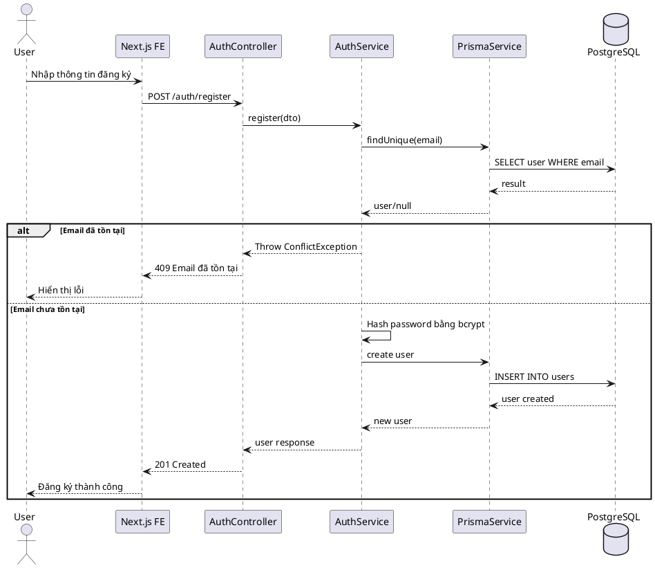
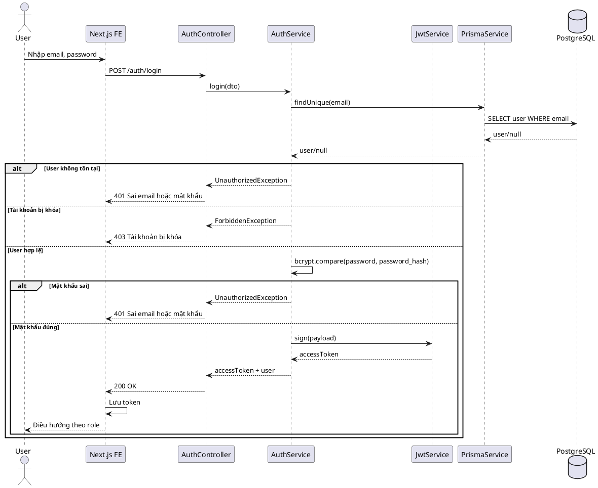
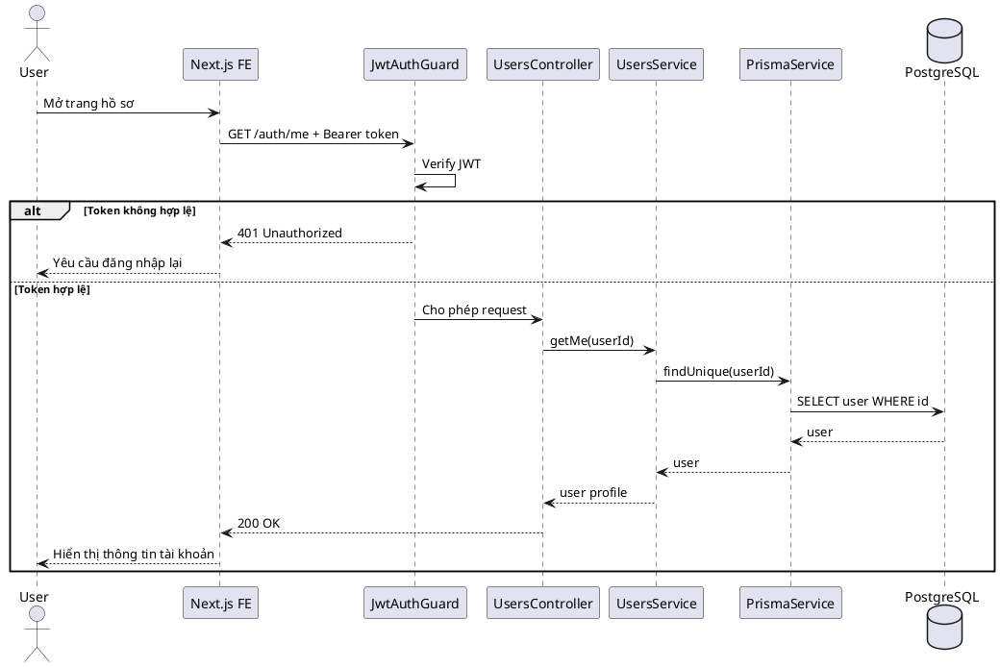
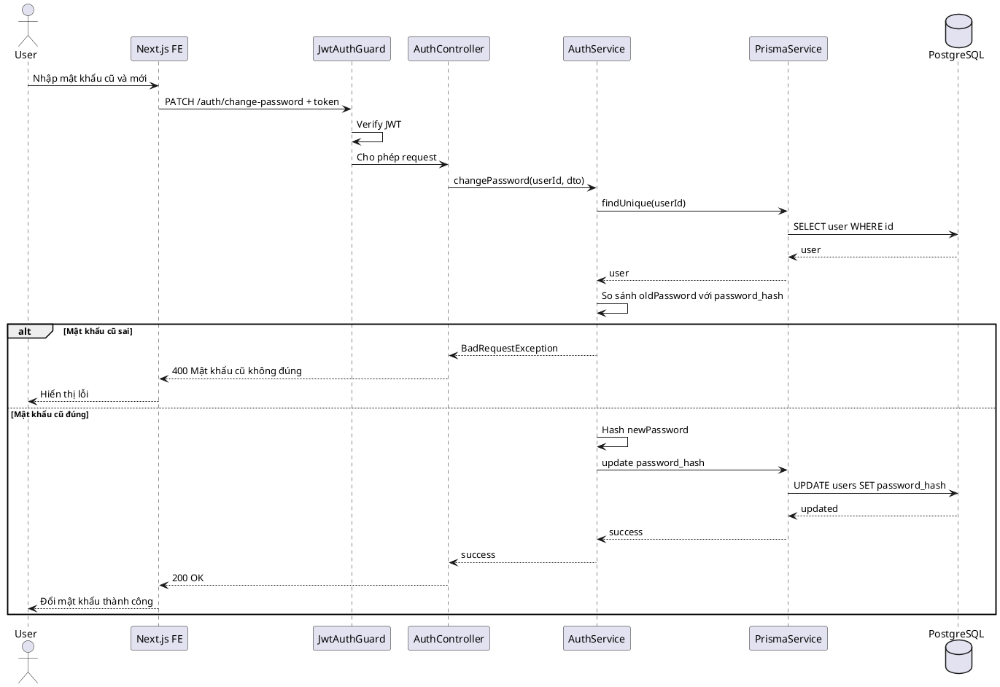

# SKILL.md — Use-case: Quản lý tài khoản

## 1. Mục tiêu use-case

Use-case **Quản lý tài khoản** cho phép người dùng trong hệ thống LMS thực hiện các thao tác cơ bản liên quan đến tài khoản cá nhân như đăng ký, đăng nhập, đăng xuất, xem thông tin tài khoản, cập nhật hồ sơ và đổi mật khẩu.

Hệ thống sử dụng:

```txt
Frontend: Next.js
Backend: NestJS
Database: PostgreSQL
ORM: Prisma
Auth: JWT
Video: Mux
```

Trong phạm vi use-case này, hệ thống **không sử dụng bảng refresh_tokens**. Khi đăng xuất, frontend sẽ xóa access token hoặc cookie đang lưu.

---

## 2. Actor tham gia

| Actor | Mô tả |
|---|---|
| User | Người dùng thông thường, mặc định là học viên sau khi đăng ký |
| Instructor | Người dùng đã được admin duyệt role giảng viên |
| Admin | Quản trị viên hệ thống |
| LMS System | Hệ thống backend xử lý xác thực, phân quyền và dữ liệu tài khoản |

---

## 3. Phạm vi chức năng

Use-case **Quản lý tài khoản** bao gồm:

```txt
Đăng ký tài khoản
Đăng nhập
Đăng xuất
Xem thông tin tài khoản
Cập nhật thông tin cá nhân
Đổi mật khẩu
Kiểm tra quyền truy cập theo role
Admin khóa hoặc mở khóa tài khoản người dùng
```

Không bao gồm:

```txt
Duyệt yêu cầu trở thành giảng viên
Quản lý khóa học
Đăng ký học khóa học
Theo dõi tiến độ học
Làm bài kiểm tra
```

Các chức năng trên thuộc các use-case khác.

---

## 4. Tiền điều kiện và hậu điều kiện

### 4.1. Đăng ký tài khoản

| Mục | Nội dung |
|---|---|
| Tiền điều kiện | Người dùng chưa có tài khoản trong hệ thống |
| Hậu điều kiện | Tài khoản mới được tạo với role mặc định là `STUDENT` |

### 4.2. Đăng nhập

| Mục | Nội dung |
|---|---|
| Tiền điều kiện | Người dùng đã có tài khoản và tài khoản không bị khóa |
| Hậu điều kiện | Người dùng nhận được JWT access token và được điều hướng theo role |

### 4.3. Cập nhật hồ sơ

| Mục | Nội dung |
|---|---|
| Tiền điều kiện | Người dùng đã đăng nhập |
| Hậu điều kiện | Thông tin tài khoản được cập nhật trong database |

### 4.4. Đổi mật khẩu

| Mục | Nội dung |
|---|---|
| Tiền điều kiện | Người dùng đã đăng nhập và nhập đúng mật khẩu hiện tại |
| Hậu điều kiện | Mật khẩu mới được hash và lưu vào database |

---

## 5. Database liên quan

Use-case này chủ yếu sử dụng bảng `users`.

```dbml
Table users {
  id uuid [primary key]
  full_name varchar [not null]
  email varchar [not null, unique]
  password_hash text [not null]
  avatar_url text
  role user_role [not null, default: 'STUDENT']
  status user_status [not null, default: 'ACTIVE']
  created_at timestamp
  updated_at timestamp
}
```

### Enum liên quan

```dbml
Enum user_role {
  STUDENT
  INSTRUCTOR
  ADMIN
}

Enum user_status {
  ACTIVE
  INACTIVE
  BANNED
}
```

### Ý nghĩa các trường chính

| Trường | Ý nghĩa |
|---|---|
| id | Mã định danh người dùng |
| full_name | Họ tên người dùng |
| email | Email đăng nhập, không được trùng |
| password_hash | Mật khẩu đã được mã hóa bằng bcrypt |
| avatar_url | Link ảnh đại diện |
| role | Quyền của người dùng trong hệ thống |
| status | Trạng thái tài khoản |
| created_at | Ngày tạo tài khoản |
| updated_at | Ngày cập nhật tài khoản |

---

## 6. Kiến trúc xử lý

### 6.1. Tổng quan kiến trúc

```txt
Next.js Frontend
   |
   | HTTP Request
   v
NestJS Backend
   |
   | AuthModule / UsersModule
   v
Prisma ORM
   |
   v
PostgreSQL Database
```

### 6.2. Các module NestJS liên quan

```txt
src/
├── auth/
│   ├── auth.module.ts
│   ├── auth.controller.ts
│   ├── auth.service.ts
│   ├── dto/
│   │   ├── register.dto.ts
│   │   ├── login.dto.ts
│   │   └── change-password.dto.ts
│   ├── guards/
│   │   ├── jwt-auth.guard.ts
│   │   └── roles.guard.ts
│   └── strategies/
│       └── jwt.strategy.ts
│
├── users/
│   ├── users.module.ts
│   ├── users.controller.ts
│   ├── users.service.ts
│   └── dto/
│       └── update-profile.dto.ts
│
└── prisma/
    ├── prisma.module.ts
    └── prisma.service.ts
```

### 6.3. Trách nhiệm từng module

| Module | Trách nhiệm |
|---|---|
| AuthModule | Đăng ký, đăng nhập, đổi mật khẩu, tạo JWT |
| UsersModule | Xem và cập nhật thông tin tài khoản |
| PrismaModule | Kết nối PostgreSQL |
| JwtAuthGuard | Kiểm tra người dùng đã đăng nhập chưa |
| RolesGuard | Kiểm tra quyền `STUDENT`, `INSTRUCTOR`, `ADMIN` |

---

## 7. API design

### 7.1. Đăng ký tài khoản

```http
POST /auth/register
```

Request body:

```json
{
  "fullName": "Nguyễn Văn A",
  "email": "vana@example.com",
  "password": "123456"
}
```

Response:

```json
{
  "message": "Đăng ký tài khoản thành công",
  "user": {
    "id": "uuid",
    "fullName": "Nguyễn Văn A",
    "email": "vana@example.com",
    "role": "STUDENT",
    "status": "ACTIVE"
  }
}
```

---

### 7.2. Đăng nhập

```http
POST /auth/login
```

Request body:

```json
{
  "email": "vana@example.com",
  "password": "123456"
}
```

Response:

```json
{
  "accessToken": "jwt_access_token",
  "user": {
    "id": "uuid",
    "fullName": "Nguyễn Văn A",
    "email": "vana@example.com",
    "role": "STUDENT"
  }
}
```

---

### 7.3. Đăng xuất

```http
POST /auth/logout
```

Vì hệ thống không dùng bảng `refresh_tokens`, đăng xuất chủ yếu thực hiện ở frontend:

```txt
Xóa access token khỏi localStorage/sessionStorage
hoặc xóa httpOnly cookie nếu dùng cookie
```

Response:

```json
{
  "message": "Đăng xuất thành công"
}
```

---

### 7.4. Lấy thông tin tài khoản hiện tại

```http
GET /auth/me
Authorization: Bearer access_token
```

Response:

```json
{
  "id": "uuid",
  "fullName": "Nguyễn Văn A",
  "email": "vana@example.com",
  "avatarUrl": null,
  "role": "STUDENT",
  "status": "ACTIVE"
}
```

---

### 7.5. Cập nhật hồ sơ cá nhân

```http
PATCH /users/me
Authorization: Bearer access_token
```

Request body:

```json
{
  "fullName": "Nguyễn Văn B",
  "avatarUrl": "https://example.com/avatar.png"
}
```

Response:

```json
{
  "message": "Cập nhật hồ sơ thành công"
}
```

---

### 7.6. Đổi mật khẩu

```http
PATCH /auth/change-password
Authorization: Bearer access_token
```

Request body:

```json
{
  "oldPassword": "123456",
  "newPassword": "123456789"
}
```

Response:

```json
{
  "message": "Đổi mật khẩu thành công"
}
```

---

### 7.7. Admin khóa hoặc mở khóa tài khoản

```http
PATCH /users/:id/status
Authorization: Bearer admin_access_token
```

Request body:

```json
{
  "status": "BANNED"
}
```

Response:

```json
{
  "message": "Cập nhật trạng thái tài khoản thành công"
}
```

---

## 8. Data flow

### 8.1. Data flow đăng ký tài khoản

```txt
User nhập thông tin đăng ký
→ Next.js gửi POST /auth/register
→ NestJS AuthController nhận request
→ AuthService kiểm tra email đã tồn tại chưa
→ AuthService hash password bằng bcrypt
→ Prisma tạo bản ghi mới trong bảng users
→ PostgreSQL lưu user mới với role STUDENT
→ Backend trả response về frontend
→ Frontend hiển thị đăng ký thành công
```

### 8.2. Data flow đăng nhập

```txt
User nhập email và password
→ Next.js gửi POST /auth/login
→ NestJS AuthController nhận request
→ AuthService tìm user theo email
→ Nếu không tồn tại, trả lỗi
→ Nếu tài khoản bị khóa, trả lỗi
→ So sánh password với password_hash
→ Nếu đúng, tạo JWT access token
→ Backend trả access token và thông tin user
→ Frontend lưu token
→ Frontend điều hướng theo role
```

### 8.3. Data flow lấy thông tin tài khoản

```txt
Frontend gửi GET /auth/me kèm JWT
→ JwtAuthGuard kiểm tra token
→ JwtStrategy giải mã token
→ Backend lấy userId từ token
→ UsersService tìm user trong database
→ Backend trả thông tin user
→ Frontend hiển thị hồ sơ tài khoản
```

### 8.4. Data flow cập nhật hồ sơ

```txt
User sửa thông tin cá nhân
→ Frontend gửi PATCH /users/me kèm JWT
→ JwtAuthGuard xác thực token
→ UsersService cập nhật full_name/avatar_url
→ Prisma update bảng users
→ PostgreSQL lưu dữ liệu mới
→ Backend trả thông báo thành công
```

### 8.5. Data flow đổi mật khẩu

```txt
User nhập mật khẩu cũ và mật khẩu mới
→ Frontend gửi PATCH /auth/change-password
→ JwtAuthGuard xác thực token
→ AuthService lấy user theo userId
→ So sánh oldPassword với password_hash
→ Nếu đúng, hash newPassword
→ Prisma cập nhật password_hash mới
→ Backend trả thông báo thành công
```

---

## 9. Sequence diagram

### 9.1. Sequence đăng ký tài khoản



---

### 9.2. Sequence đăng nhập



---

### 9.3. Sequence lấy thông tin tài khoản



---

### 9.4. Sequence đổi mật khẩu



---

## 10. Activity flow

### 10.1. Activity flow đăng nhập

```txt
Bắt đầu
→ Nhập email/password
→ Kiểm tra email tồn tại?
   ├── Không → Báo lỗi
   └── Có
       → Kiểm tra tài khoản bị khóa?
          ├── Có → Báo lỗi tài khoản bị khóa
          └── Không
              → Kiểm tra mật khẩu
                 ├── Sai → Báo lỗi
                 └── Đúng
                     → Tạo JWT
                     → Lưu token ở frontend
                     → Điều hướng theo role
→ Kết thúc
```

### 10.2. Activity flow đổi mật khẩu

```txt
Bắt đầu
→ User đã đăng nhập
→ Nhập mật khẩu cũ
→ Nhập mật khẩu mới
→ Kiểm tra mật khẩu cũ
   ├── Sai → Báo lỗi
   └── Đúng
       → Hash mật khẩu mới
       → Cập nhật database
       → Thông báo thành công
→ Kết thúc
```

---

## 11. Kiểm tra phân quyền

### 11.1. JWT payload

JWT nên chứa các thông tin tối thiểu:

```json
{
  "sub": "user_id",
  "email": "vana@example.com",
  "role": "STUDENT"
}
```

### 11.2. Điều hướng theo role

| Role | Trang điều hướng sau đăng nhập |
|---|---|
| STUDENT | `/my-learning` |
| INSTRUCTOR | `/instructor/courses` |
| ADMIN | `/admin/dashboard` |

### 11.3. Bảo vệ API

| API | Quyền truy cập |
|---|---|
| `POST /auth/register` | Public |
| `POST /auth/login` | Public |
| `GET /auth/me` | User đã đăng nhập |
| `PATCH /users/me` | User đã đăng nhập |
| `PATCH /auth/change-password` | User đã đăng nhập |
| `GET /users` | Admin |
| `PATCH /users/:id/status` | Admin |

---

## 12. Validation rules

### 12.1. Register DTO

```txt
fullName:
- Bắt buộc
- Độ dài 2 - 255 ký tự

email:
- Bắt buộc
- Đúng định dạng email
- Không được trùng trong bảng users

password:
- Bắt buộc
- Tối thiểu 6 ký tự
```

### 12.2. Login DTO

```txt
email:
- Bắt buộc
- Đúng định dạng email

password:
- Bắt buộc
```

### 12.3. Change Password DTO

```txt
oldPassword:
- Bắt buộc

newPassword:
- Bắt buộc
- Tối thiểu 6 ký tự
- Không nên giống mật khẩu cũ
```

### 12.4. Update Profile DTO

```txt
fullName:
- Không bắt buộc
- Nếu có thì độ dài 2 - 255 ký tự

avatarUrl:
- Không bắt buộc
- Nếu có thì phải là URL hợp lệ
```

---

## 13. Error handling

| Trường hợp | HTTP Status | Message |
|---|---|---|
| Email đã tồn tại | 409 | Email đã được sử dụng |
| Sai email hoặc mật khẩu | 401 | Email hoặc mật khẩu không chính xác |
| Tài khoản bị khóa | 403 | Tài khoản đã bị khóa |
| Token không hợp lệ | 401 | Token không hợp lệ hoặc đã hết hạn |
| Không đủ quyền | 403 | Bạn không có quyền thực hiện chức năng này |
| Mật khẩu cũ sai | 400 | Mật khẩu cũ không đúng |
| Dữ liệu không hợp lệ | 400 | Dữ liệu đầu vào không hợp lệ |

---

## 14. Bảo mật

Các yêu cầu bảo mật tối thiểu:

```txt
Không lưu mật khẩu dạng plain text
Hash mật khẩu bằng bcrypt
Không trả password_hash về frontend
JWT phải có thời gian hết hạn
Kiểm tra status tài khoản khi đăng nhập
Bảo vệ API bằng JwtAuthGuard
Kiểm tra role với API dành cho admin
Validate dữ liệu đầu vào
Không cho user cập nhật role của chính mình
```

Gợi ý thời gian sống access token:

```txt
JWT_EXPIRES_IN=2h
```

Nếu muốn đơn giản hơn cho MVP:

```txt
JWT_EXPIRES_IN=1d
```

---

## 15. Prototype user flow

### 15.1. Flow đăng ký

```txt
/register
→ Nhập họ tên, email, mật khẩu
→ Bấm Đăng ký
→ Hệ thống tạo tài khoản STUDENT
→ Chuyển đến /login hoặc /my-learning
```

### 15.2. Flow đăng nhập

```txt
/login
→ Nhập email/password
→ Bấm Đăng nhập
→ Backend trả JWT
→ Frontend lưu token
→ Điều hướng theo role
   ├── STUDENT → /my-learning
   ├── INSTRUCTOR → /instructor/courses
   └── ADMIN → /admin/dashboard
```

### 15.3. Flow cập nhật hồ sơ

```txt
/account/profile
→ Xem thông tin hiện tại
→ Chỉnh sửa họ tên/avatar
→ Bấm Lưu thay đổi
→ Backend cập nhật users
→ Hiển thị thông báo thành công
```

### 15.4. Flow đổi mật khẩu

```txt
/account/change-password
→ Nhập mật khẩu cũ
→ Nhập mật khẩu mới
→ Bấm Đổi mật khẩu
→ Backend kiểm tra mật khẩu cũ
→ Backend cập nhật mật khẩu mới
→ Hiển thị thông báo thành công
```

---

## 16. Gợi ý màn hình giao diện

### 16.1. Register page

```txt
+----------------------------------+
| Đăng ký tài khoản                |
+----------------------------------+
| Họ tên:      [_______________]   |
| Email:       [_______________]   |
| Mật khẩu:    [_______________]   |
|                                  |
| [Đăng ký]                        |
| Đã có tài khoản? Đăng nhập       |
+----------------------------------+
```

### 16.2. Login page

```txt
+----------------------------------+
| Đăng nhập                        |
+----------------------------------+
| Email:       [_______________]   |
| Mật khẩu:    [_______________]   |
|                                  |
| [Đăng nhập]                      |
| Chưa có tài khoản? Đăng ký       |
+----------------------------------+
```

### 16.3. Profile page

```txt
+----------------------------------+
| Hồ sơ cá nhân                    |
+----------------------------------+
| Avatar                           |
| Họ tên:  [Nguyễn Văn A]          |
| Email:   vana@example.com        |
| Role:    STUDENT                 |
| Status:  ACTIVE                  |
|                                  |
| [Lưu thay đổi]                   |
+----------------------------------+
```

---

## 17. Test cases cơ bản

| Mã test | Nội dung | Kết quả mong đợi |
|---|---|---|
| TC01 | Đăng ký với email mới | Tạo tài khoản thành công |
| TC02 | Đăng ký với email đã tồn tại | Báo lỗi email đã được sử dụng |
| TC03 | Đăng nhập đúng thông tin | Trả về access token |
| TC04 | Đăng nhập sai mật khẩu | Báo lỗi 401 |
| TC05 | Đăng nhập tài khoản bị khóa | Báo lỗi 403 |
| TC06 | Lấy thông tin tài khoản với token hợp lệ | Trả về thông tin user |
| TC07 | Lấy thông tin tài khoản với token sai | Báo lỗi 401 |
| TC08 | Đổi mật khẩu với mật khẩu cũ đúng | Đổi mật khẩu thành công |
| TC09 | Đổi mật khẩu với mật khẩu cũ sai | Báo lỗi |
| TC10 | Admin khóa tài khoản user | User không đăng nhập được |

---

## 18. Kết luận

Use-case **Quản lý tài khoản** là use-case nền tảng của hệ thống LMS. Chức năng này chịu trách nhiệm xác thực, phân quyền và quản lý thông tin người dùng. Sau khi hoàn thành use-case này, hệ thống có thể mở rộng sang các use-case khác như quản lý khóa học, quản lý bài học, quản lý quiz và quản lý yêu cầu trở thành giảng viên.
