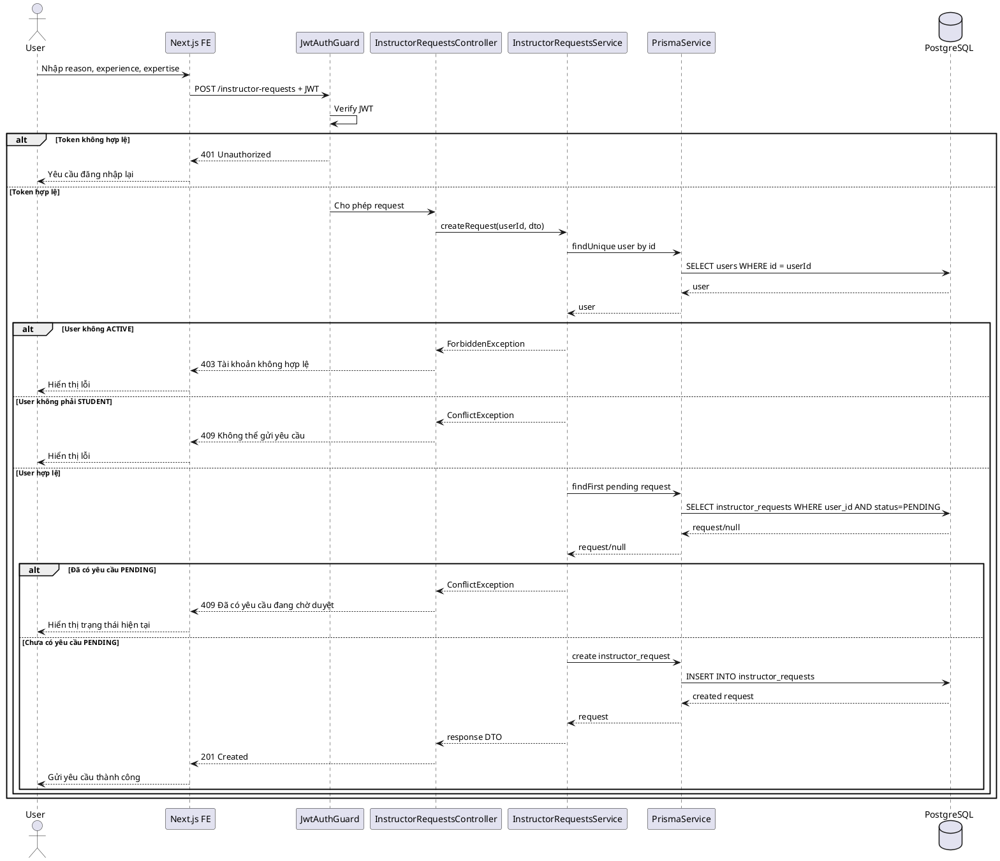
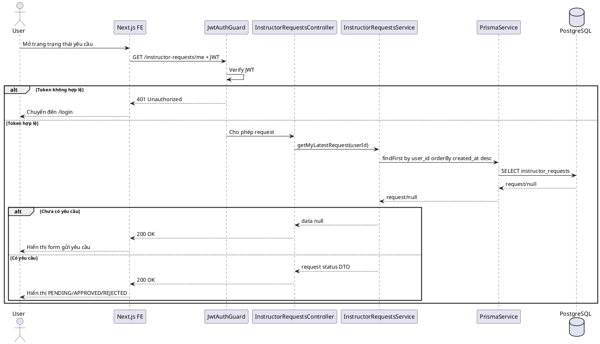
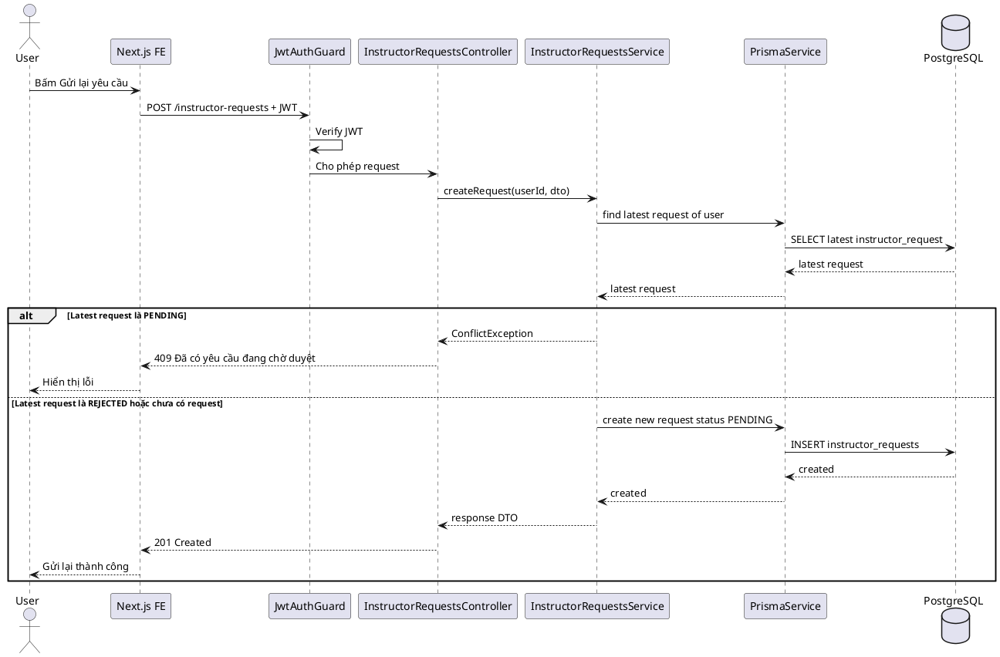
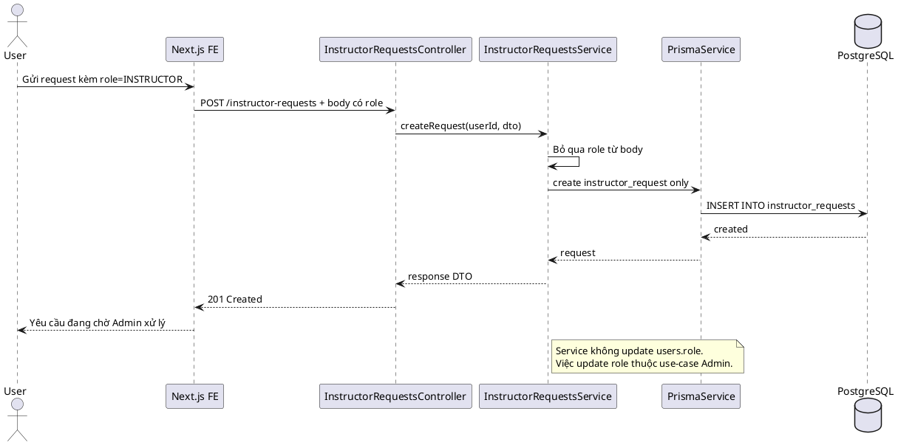

# SKILL.md — Use-case: Quản lý yêu cầu trở thành giảng viên

## 1. Mục tiêu use-case

Use-case **Quản lý yêu cầu trở thành giảng viên** ở phía **User** cho phép người dùng thông thường/học viên gửi yêu cầu nâng cấp vai trò từ `STUDENT` lên `INSTRUCTOR`, nhập thông tin chuyên môn, kinh nghiệm, lý do đăng ký, theo dõi trạng thái yêu cầu và xem phản hồi từ hệ thống.

Hệ thống sử dụng:

```txt
Frontend: Next.js
Backend: NestJS
Database: PostgreSQL
ORM: Prisma
Auth: JWT access token
Video: Mux
Storage tài liệu: S3/R2 hoặc storage tương đương nếu có upload minh chứng
```

Trong phạm vi tài liệu này, hệ thống **không sử dụng bảng refresh_tokens**. JWT access token được dùng để xác thực request; khi đăng xuất, frontend xóa token/cookie đang lưu.

Use-case này **chỉ mô tả phần User**. Các thao tác của Admin như xem danh sách yêu cầu, duyệt yêu cầu, từ chối yêu cầu và cập nhật role user sẽ thuộc file skill riêng: **Admin — Quản lý yêu cầu giảng viên**.

---

## 2. Actor tham gia

| Actor | Mô tả |
|---|---|
| User | Người dùng thông thường/học viên trong hệ thống LMS, có role `STUDENT` |
| LMS System | Backend xử lý xác thực, kiểm tra quyền, lưu yêu cầu và trả trạng thái yêu cầu |

Actor chính của use-case này:

```txt
User
```

Actor không thuộc phạm vi file này:

```txt
Admin
```

Lý do: Admin đã có use-case riêng để xử lý các yêu cầu giảng viên. File này chỉ tập trung vào phía User để tránh trùng lặp và giúp báo cáo rõ ràng hơn.

---

## 3. Phạm vi chức năng

Use-case **Quản lý yêu cầu trở thành giảng viên** phía User bao gồm:

```txt
User mở màn hình yêu cầu trở thành giảng viên
User xem điều kiện/yêu cầu trước khi gửi
User nhập lý do muốn trở thành giảng viên
User nhập kinh nghiệm giảng dạy/làm việc
User nhập chuyên môn/lĩnh vực muốn giảng dạy
User gửi yêu cầu trở thành giảng viên
User xem trạng thái yêu cầu hiện tại
User xem phản hồi/lý do từ chối nếu yêu cầu bị từ chối
User gửi lại yêu cầu nếu yêu cầu trước đó bị từ chối và hệ thống cho phép
User hủy yêu cầu đang chờ duyệt nếu hệ thống cho phép
```

Không bao gồm:

```txt
Admin xem danh sách yêu cầu
Admin lọc yêu cầu theo trạng thái
Admin xem chi tiết yêu cầu của tất cả user
Admin duyệt yêu cầu
Admin từ chối yêu cầu
Admin ghi admin_note
Admin cập nhật role user thành INSTRUCTOR
User tự cập nhật role của chính mình
User tự chuyển sang Instructor khi chưa được duyệt
Duyệt khóa học
Đăng khóa học
Quản lý khóa học của Instructor
```

Các chức năng không bao gồm sẽ được tách sang use-case khác để tránh trùng trách nhiệm giữa User và Admin.

---

## 4. Tiền điều kiện và hậu điều kiện

### 4.1. Mở màn hình yêu cầu trở thành giảng viên

| Mục | Nội dung |
|---|---|
| Tiền điều kiện | User đã đăng nhập; tài khoản có trạng thái `ACTIVE` |
| Hậu điều kiện | Frontend hiển thị form gửi yêu cầu hoặc hiển thị trạng thái yêu cầu hiện tại |

### 4.2. Gửi yêu cầu trở thành giảng viên

| Mục | Nội dung |
|---|---|
| Tiền điều kiện | User đã đăng nhập; role hiện tại là `STUDENT`; tài khoản không bị khóa; chưa có yêu cầu `PENDING` |
| Hậu điều kiện | Một bản ghi mới được tạo trong bảng `instructor_requests` với trạng thái `PENDING` |

### 4.3. Xem trạng thái yêu cầu

| Mục | Nội dung |
|---|---|
| Tiền điều kiện | User đã đăng nhập |
| Hậu điều kiện | Hệ thống trả về yêu cầu gần nhất hoặc danh sách yêu cầu của chính User |

### 4.4. Gửi lại yêu cầu sau khi bị từ chối

| Mục | Nội dung |
|---|---|
| Tiền điều kiện | User đã đăng nhập; yêu cầu gần nhất có trạng thái `REJECTED`; hệ thống cho phép gửi lại |
| Hậu điều kiện | Hệ thống tạo yêu cầu mới hoặc cập nhật yêu cầu cũ thành `PENDING` tùy thiết kế |

### 4.5. Hủy yêu cầu đang chờ duyệt

| Mục | Nội dung |
|---|---|
| Tiền điều kiện | User đã đăng nhập; yêu cầu thuộc chính User; trạng thái yêu cầu là `PENDING` |
| Hậu điều kiện | Yêu cầu được chuyển sang trạng thái hủy nếu có enum `CANCELLED`, hoặc bị xóa mềm nếu hệ thống hỗ trợ |

Ghi chú: Nếu database hiện tại chỉ có `PENDING`, `APPROVED`, `REJECTED`, chức năng hủy có thể không triển khai trong MVP.

---

## 5. Database liên quan

Use-case này chủ yếu sử dụng các bảng:

```txt
users
instructor_requests
```

### 5.1. Bảng `users`

```dbml
Table users {
  id uuid [primary key]
  full_name varchar [not null]
  email varchar [not null, unique]
  password_hash text [not null]
  avatar_url text
  role user_role [not null, default: 'STUDENT']
  status user_status [not null, default: 'ACTIVE']
  created_at timestamp
  updated_at timestamp
}
```

Ý nghĩa trong use-case:

| Trường | Ý nghĩa |
|---|---|
| `id` | Dùng làm `user_id` khi tạo yêu cầu |
| `full_name` | Hiển thị tên người gửi yêu cầu |
| `email` | Hiển thị email người gửi yêu cầu |
| `role` | Kiểm tra User có còn là `STUDENT` hay đã là `INSTRUCTOR` |
| `status` | Chỉ tài khoản `ACTIVE` mới được gửi yêu cầu |

Quy tắc xử lý với bảng `users`:

```txt
Không cho User gửi role từ frontend.
Không cho User tự cập nhật role.
Backend luôn lấy userId và role từ JWT.
Nếu user.role = INSTRUCTOR thì không cho gửi yêu cầu mới.
Nếu user.status = BANNED hoặc INACTIVE thì không cho gửi yêu cầu.
```

### 5.2. Bảng `instructor_requests`

```dbml
Table instructor_requests {
  id uuid [primary key]
  user_id uuid [not null]
  status instructor_request_status [not null, default: 'PENDING']
  reason text
  experience text
  expertise varchar
  admin_note text
  reviewed_by uuid
  reviewed_at timestamp
  created_at timestamp
  updated_at timestamp
}
```

Ý nghĩa trong use-case User:

| Trường | Ý nghĩa |
|---|---|
| `id` | Mã yêu cầu |
| `user_id` | Người gửi yêu cầu, lấy từ JWT |
| `status` | Trạng thái yêu cầu: `PENDING`, `APPROVED`, `REJECTED` |
| `reason` | Lý do User muốn trở thành giảng viên |
| `experience` | Kinh nghiệm giảng dạy/làm việc của User |
| `expertise` | Lĩnh vực chuyên môn User muốn dạy |
| `admin_note` | Phản hồi từ Admin nếu yêu cầu bị từ chối hoặc cần ghi chú |
| `reviewed_by` | Người duyệt, User chỉ xem nếu cần hiển thị thông tin phản hồi |
| `reviewed_at` | Thời điểm yêu cầu được xử lý |
| `created_at` | Thời điểm User gửi yêu cầu |
| `updated_at` | Thời điểm yêu cầu được cập nhật |

### 5.3. Enum liên quan

```dbml
Enum user_role {
  STUDENT
  INSTRUCTOR
  ADMIN
}

Enum user_status {
  ACTIVE
  INACTIVE
  BANNED
}

Enum instructor_request_status {
  PENDING
  APPROVED
  REJECTED
}
```

Nếu muốn hỗ trợ hủy yêu cầu, có thể mở rộng enum:

```dbml
Enum instructor_request_status {
  PENDING
  APPROVED
  REJECTED
  CANCELLED
}
```

Trong MVP, nếu muốn đơn giản, giữ 3 trạng thái:

```txt
PENDING: User đã gửi yêu cầu, đang chờ Admin xử lý
APPROVED: Yêu cầu đã được duyệt, user.role đã chuyển thành INSTRUCTOR
REJECTED: Yêu cầu bị từ chối, User có thể xem admin_note và gửi lại nếu được phép
```

### 5.4. Quan hệ dữ liệu

```txt
users 1 - N instructor_requests
users.id = instructor_requests.user_id
```

Quan hệ duyệt bởi Admin:

```txt
users 1 - N instructor_requests thông qua instructor_requests.reviewed_by
```

Trong file User, quan hệ `reviewed_by` chỉ dùng để hiển thị thông tin kết quả nếu cần; thao tác cập nhật `reviewed_by`, `reviewed_at`, `admin_note`, `status APPROVED/REJECTED` thuộc use-case Admin.

### 5.5. Index gợi ý

```sql
CREATE INDEX idx_instructor_requests_user_id ON instructor_requests(user_id);
CREATE INDEX idx_instructor_requests_status ON instructor_requests(status);
CREATE INDEX idx_instructor_requests_created_at ON instructor_requests(created_at);
```

Nếu hệ thống chỉ cho phép mỗi User có tối đa một yêu cầu đang chờ duyệt:

```sql
CREATE UNIQUE INDEX uniq_pending_instructor_request_per_user
ON instructor_requests(user_id)
WHERE status = 'PENDING';
```

---

## 6. Kiến trúc xử lý

### 6.1. Tổng quan kiến trúc

```txt
Next.js Frontend
   |
   | HTTP Request + JWT access token
   v
NestJS Backend
   |
   | InstructorRequestsModule / Auth Guard / Role Guard
   v
Prisma ORM
   |
   v
PostgreSQL Database
```

### 6.2. Các module NestJS liên quan

```txt
src/
├── auth/
│   ├── guards/
│   │   ├── jwt-auth.guard.ts
│   │   └── roles.guard.ts
│   └── strategies/
│       └── jwt.strategy.ts
│
├── instructor-requests/
│   ├── instructor-requests.module.ts
│   ├── instructor-requests.controller.ts
│   ├── instructor-requests.service.ts
│   └── dto/
│       ├── create-instructor-request.dto.ts
│       ├── resubmit-instructor-request.dto.ts
│       └── query-my-instructor-request.dto.ts
│
├── users/
│   ├── users.module.ts
│   └── users.service.ts
│
└── prisma/
    ├── prisma.module.ts
    └── prisma.service.ts
```

### 6.3. Trách nhiệm từng thành phần

| Thành phần | Trách nhiệm |
|---|---|
| `InstructorRequestsController` | Nhận request từ User, đọc user từ JWT, gọi service |
| `InstructorRequestsService` | Kiểm tra nghiệp vụ, tạo yêu cầu, lấy trạng thái yêu cầu của User |
| `JwtAuthGuard` | Xác thực access token |
| `RolesGuard` | Chặn những role không phù hợp nếu endpoint yêu cầu role cụ thể |
| `PrismaService` | Thao tác bảng `users`, `instructor_requests` |
| `DTO` | Validate dữ liệu đầu vào |
| `UsersService` | Lấy thông tin user hiện tại nếu cần kiểm tra role/status |

### 6.4. Nguyên tắc tách module

```txt
Endpoint của User dùng prefix: /instructor-requests
Endpoint của Admin dùng prefix: /admin/instructor-requests
Không trộn endpoint Admin vào file skill User.
Không để User gọi API duyệt hoặc từ chối yêu cầu.
```

---

## 7. API design

### 7.1. Gửi yêu cầu trở thành giảng viên

```http
POST /instructor-requests
Authorization: Bearer access_token
```

Quyền truy cập:

```txt
User đã đăng nhập
Role hiện tại nên là STUDENT
Tài khoản phải ACTIVE
```

Request body:

```json
{
  "reason": "Tôi muốn chia sẻ kiến thức lập trình web cho người mới bắt đầu.",
  "experience": "Tôi có 2 năm kinh nghiệm làm frontend với React và Next.js.",
  "expertise": "Web Development"
}
```

Response thành công:

```json
{
  "message": "Gửi yêu cầu trở thành giảng viên thành công",
  "data": {
    "id": "request_uuid",
    "status": "PENDING",
    "reason": "Tôi muốn chia sẻ kiến thức lập trình web cho người mới bắt đầu.",
    "experience": "Tôi có 2 năm kinh nghiệm làm frontend với React và Next.js.",
    "expertise": "Web Development",
    "createdAt": "2026-06-05T10:00:00.000Z"
  }
}
```

Response khi đã có yêu cầu đang chờ:

```json
{
  "statusCode": 409,
  "message": "Bạn đã có yêu cầu đang chờ duyệt"
}
```

Response khi user đã là instructor:

```json
{
  "statusCode": 409,
  "message": "Tài khoản của bạn đã là giảng viên"
}
```

---

### 7.2. Xem yêu cầu gần nhất của tôi

```http
GET /instructor-requests/me
Authorization: Bearer access_token
```

Response khi có yêu cầu:

```json
{
  "message": "Lấy trạng thái yêu cầu thành công",
  "data": {
    "id": "request_uuid",
    "status": "PENDING",
    "reason": "Tôi muốn chia sẻ kiến thức lập trình web cho người mới bắt đầu.",
    "experience": "Tôi có 2 năm kinh nghiệm làm frontend với React và Next.js.",
    "expertise": "Web Development",
    "adminNote": null,
    "reviewedAt": null,
    "createdAt": "2026-06-05T10:00:00.000Z",
    "updatedAt": "2026-06-05T10:00:00.000Z"
  }
}
```

Response khi chưa có yêu cầu:

```json
{
  "message": "Bạn chưa gửi yêu cầu trở thành giảng viên",
  "data": null
}
```

---

### 7.3. Xem lịch sử yêu cầu của tôi

```http
GET /instructor-requests/my-history?page=1&limit=10
Authorization: Bearer access_token
```

Response:

```json
{
  "message": "Lấy lịch sử yêu cầu thành công",
  "data": [
    {
      "id": "request_uuid_1",
      "status": "REJECTED",
      "expertise": "Web Development",
      "adminNote": "Vui lòng bổ sung thêm kinh nghiệm hoặc portfolio.",
      "reviewedAt": "2026-06-04T10:00:00.000Z",
      "createdAt": "2026-06-03T10:00:00.000Z"
    },
    {
      "id": "request_uuid_2",
      "status": "PENDING",
      "expertise": "Web Development",
      "adminNote": null,
      "reviewedAt": null,
      "createdAt": "2026-06-05T10:00:00.000Z"
    }
  ],
  "meta": {
    "page": 1,
    "limit": 10,
    "total": 2
  }
}
```

Ghi chú: API này không bắt buộc cho MVP. Nếu muốn đơn giản, chỉ cần `GET /instructor-requests/me`.

---

### 7.4. Gửi lại yêu cầu sau khi bị từ chối

Có 2 cách thiết kế.

Cách 1: Tạo yêu cầu mới:

```http
POST /instructor-requests
Authorization: Bearer access_token
```

Cách 2: Resubmit trên yêu cầu cũ:

```http
PATCH /instructor-requests/:id/resubmit
Authorization: Bearer access_token
```

Request body:

```json
{
  "reason": "Tôi đã bổ sung thêm portfolio và muốn gửi lại yêu cầu.",
  "experience": "Tôi có 2 năm kinh nghiệm frontend và đã làm 3 dự án thực tế.",
  "expertise": "Frontend Development"
}
```

Response:

```json
{
  "message": "Gửi lại yêu cầu thành công",
  "data": {
    "id": "request_uuid",
    "status": "PENDING",
    "updatedAt": "2026-06-05T10:30:00.000Z"
  }
}
```

Khuyến nghị cho báo cáo:

```txt
MVP nên dùng cách 1: tạo yêu cầu mới sau khi yêu cầu cũ bị REJECTED.
Cách này giữ được lịch sử xử lý rõ ràng hơn.
```

---

### 7.5. Hủy yêu cầu đang chờ duyệt nếu có hỗ trợ

```http
PATCH /instructor-requests/:id/cancel
Authorization: Bearer access_token
```

Điều kiện:

```txt
Yêu cầu phải thuộc chính User đang đăng nhập.
Yêu cầu phải có trạng thái PENDING.
Hệ thống phải có trạng thái CANCELLED hoặc cơ chế xóa mềm.
```

Response:

```json
{
  "message": "Hủy yêu cầu thành công",
  "data": {
    "id": "request_uuid",
    "status": "CANCELLED"
  }
}
```

Nếu không có `CANCELLED` trong enum, không triển khai API này trong MVP.

---

## 8. Data flow

### 8.1. Data flow — User mở màn hình yêu cầu

```txt
User truy cập /instructor-request
→ Next.js kiểm tra token đăng nhập
→ Nếu chưa đăng nhập, chuyển đến /login
→ Nếu đã đăng nhập, gọi GET /instructor-requests/me
→ NestJS JwtAuthGuard xác thực access token
→ InstructorRequestsController nhận request
→ InstructorRequestsService lấy userId từ JWT
→ Prisma tìm yêu cầu gần nhất của user trong instructor_requests
→ PostgreSQL trả kết quả
→ Backend trả trạng thái yêu cầu về frontend
→ Frontend hiển thị form gửi yêu cầu hoặc trạng thái hiện tại
```

### 8.2. Data flow — User gửi yêu cầu trở thành giảng viên

```txt
User nhập reason, experience, expertise
→ Frontend validate cơ bản: không bỏ trống, đúng độ dài
→ User bấm Gửi yêu cầu
→ Next.js gửi POST /instructor-requests kèm JWT
→ JwtAuthGuard xác thực token
→ Backend lấy userId và role từ JWT
→ Service kiểm tra user tồn tại và status ACTIVE
→ Service kiểm tra user.role có phải STUDENT không
→ Service kiểm tra user chưa có yêu cầu PENDING
→ Service validate nội dung nghiệp vụ
→ Prisma tạo bản ghi instructor_requests
→ PostgreSQL lưu yêu cầu với status PENDING
→ Backend trả response thành công
→ Frontend hiển thị thông báo: Yêu cầu đã được gửi và đang chờ duyệt
```

### 8.3. Data flow — User xem trạng thái yêu cầu

```txt
User mở /instructor-request/status
→ Next.js gửi GET /instructor-requests/me
→ Backend xác thực JWT
→ Service lấy userId từ token
→ Prisma tìm yêu cầu mới nhất của user
→ Nếu không có yêu cầu, trả data null
→ Nếu có yêu cầu PENDING, trả trạng thái đang chờ duyệt
→ Nếu có yêu cầu APPROVED, trả trạng thái đã được duyệt
→ Nếu có yêu cầu REJECTED, trả trạng thái bị từ chối và admin_note nếu có
→ Frontend hiển thị trạng thái phù hợp
```

### 8.4. Data flow — User gửi lại yêu cầu sau khi bị từ chối

```txt
User xem yêu cầu bị REJECTED
→ Frontend hiển thị admin_note và nút Gửi lại yêu cầu
→ User chỉnh sửa reason, experience, expertise
→ Frontend gửi POST /instructor-requests hoặc PATCH /resubmit
→ Backend xác thực JWT
→ Service kiểm tra yêu cầu gần nhất không phải PENDING
→ Service kiểm tra user vẫn là STUDENT
→ Service tạo yêu cầu mới status PENDING
→ Backend trả response thành công
→ Frontend cập nhật trạng thái thành PENDING
```

### 8.5. Data flow — User không được tự đổi role

```txt
User gửi request có kèm role = INSTRUCTOR trong body
→ Backend bỏ qua role từ body hoặc reject request
→ Backend chỉ lấy role từ JWT/database
→ Service chỉ tạo instructor_request
→ Không cập nhật users.role
→ Việc cập nhật users.role chỉ xảy ra trong use-case Admin khi duyệt yêu cầu
```

### 8.99. Quy tắc xử lý dữ liệu chung

```txt
Luôn lấy userId và role từ JWT, không lấy role từ body request.
Không cho User xem yêu cầu của User khác.
Không cho User tạo yêu cầu nếu đã có PENDING request.
Không cho User tạo yêu cầu nếu role hiện tại đã là INSTRUCTOR.
Không cho User tự cập nhật status APPROVED/REJECTED.
Không cho User tự cập nhật admin_note, reviewed_by, reviewed_at.
Không trả password_hash về frontend.
Chuẩn hóa response DTO để frontend dễ xử lý loading/error/success.
```

---

## 9. Sequence diagram

### 9.1. Sequence — User gửi yêu cầu trở thành giảng viên



### 9.2. Sequence — User xem trạng thái yêu cầu



### 9.3. Sequence — User gửi lại yêu cầu sau khi bị từ chối



### 9.4. Sequence — User bị chặn khi tự đổi role



---

## 10. Activity flow

### 10.1. Activity flow — Gửi yêu cầu

```txt
Bắt đầu
→ User mở trang /instructor-request
→ Hệ thống kiểm tra đăng nhập
   ├── Chưa đăng nhập → chuyển đến /login
   └── Đã đăng nhập
       → Kiểm tra tài khoản ACTIVE?
          ├── Không → báo lỗi tài khoản không hợp lệ
          └── Có
              → Kiểm tra role hiện tại
                 ├── INSTRUCTOR → báo đã là giảng viên
                 ├── ADMIN → không cần gửi yêu cầu
                 └── STUDENT
                     → Kiểm tra có yêu cầu PENDING chưa?
                        ├── Có → hiển thị trạng thái đang chờ duyệt
                        └── Không
                            → Hiển thị form
                            → User nhập reason, experience, expertise
                            → Validate dữ liệu
                               ├── Không hợp lệ → hiển thị lỗi
                               └── Hợp lệ
                                   → Tạo yêu cầu PENDING
                                   → Thông báo gửi thành công
Kết thúc
```

### 10.2. Activity flow — Xem trạng thái yêu cầu

```txt
Bắt đầu
→ User mở trang trạng thái yêu cầu
→ Hệ thống kiểm tra đăng nhập
   ├── Chưa đăng nhập → chuyển đến /login
   └── Đã đăng nhập
       → Lấy yêu cầu gần nhất của User
          ├── Không có yêu cầu → hiển thị form gửi yêu cầu
          └── Có yêu cầu
              → Kiểm tra status
                 ├── PENDING → hiển thị đang chờ duyệt
                 ├── APPROVED → hiển thị đã được duyệt, hướng dẫn vào trang Instructor
                 └── REJECTED → hiển thị bị từ chối, admin_note và nút gửi lại nếu được phép
Kết thúc
```

### 10.3. Activity flow — Gửi lại yêu cầu

```txt
Bắt đầu
→ User xem yêu cầu REJECTED
→ Hệ thống hiển thị admin_note
→ User chọn Gửi lại yêu cầu
→ User cập nhật thông tin
→ Validate dữ liệu
   ├── Không hợp lệ → hiển thị lỗi
   └── Hợp lệ
       → Kiểm tra chưa có yêu cầu PENDING
          ├── Có PENDING → không cho gửi lại
          └── Không có PENDING
              → Tạo yêu cầu mới status PENDING
              → Hiển thị thông báo thành công
Kết thúc
```

---

## 11. Kiểm tra phân quyền

### 11.1. JWT payload

JWT nên chứa thông tin tối thiểu:

```json
{
  "sub": "user_id",
  "email": "user@example.com",
  "role": "STUDENT"
}
```

### 11.2. Quyền truy cập API

| API | Quyền truy cập | Ghi chú |
|---|---|---|
| `POST /instructor-requests` | User đã đăng nhập, role `STUDENT` | Gửi yêu cầu trở thành giảng viên |
| `GET /instructor-requests/me` | User đã đăng nhập | Xem yêu cầu gần nhất của chính mình |
| `GET /instructor-requests/my-history` | User đã đăng nhập | Xem lịch sử yêu cầu của chính mình |
| `PATCH /instructor-requests/:id/resubmit` | Chủ sở hữu yêu cầu, role `STUDENT` | Gửi lại yêu cầu nếu bị từ chối |
| `PATCH /instructor-requests/:id/cancel` | Chủ sở hữu yêu cầu, role `STUDENT` | Hủy yêu cầu PENDING nếu có hỗ trợ |

### 11.3. API không thuộc file User

| API | Thuộc use-case |
|---|---|
| `GET /admin/instructor-requests` | Admin — Quản lý yêu cầu giảng viên |
| `GET /admin/instructor-requests/:id` | Admin — Quản lý yêu cầu giảng viên |
| `PATCH /admin/instructor-requests/:id/approve` | Admin — Quản lý yêu cầu giảng viên |
| `PATCH /admin/instructor-requests/:id/reject` | Admin — Quản lý yêu cầu giảng viên |

### 11.4. Quy tắc quan trọng

```txt
Không tin tưởng role gửi từ frontend.
Không cho User xem yêu cầu của User khác.
Không cho User thao tác endpoint /admin/*.
Không cho User tự set status APPROVED/REJECTED.
Không cho User tự set reviewed_by, reviewed_at, admin_note.
Không cho User tự cập nhật users.role.
Admin không duyệt khóa học; Admin chỉ xử lý yêu cầu giảng viên, tài khoản, danh mục và thống kê.
```

---

## 12. Validation rules

### 12.1. CreateInstructorRequestDto

```txt
reason:
- Bắt buộc
- Kiểu string
- Trim khoảng trắng
- Tối thiểu 20 ký tự
- Tối đa 2000 ký tự
- Không chỉ chứa ký tự trắng

experience:
- Bắt buộc
- Kiểu string
- Trim khoảng trắng
- Tối thiểu 20 ký tự
- Tối đa 3000 ký tự

expertise:
- Bắt buộc
- Kiểu string
- Trim khoảng trắng
- Tối thiểu 2 ký tự
- Tối đa 255 ký tự

portfolioUrl nếu có:
- Không bắt buộc
- Phải là URL hợp lệ
- Chỉ dùng nếu database có bổ sung field portfolio_url
```

### 12.2. QueryMyInstructorRequestDto

```txt
page:
- Không bắt buộc
- Số nguyên >= 1

limit:
- Không bắt buộc
- Số nguyên 1 - 100

status:
- Không bắt buộc
- Nếu có thì phải thuộc PENDING, APPROVED, REJECTED
```

### 12.3. Validation theo nghiệp vụ

```txt
User phải đăng nhập.
User phải ACTIVE.
User phải có role STUDENT khi gửi yêu cầu.
User không được có yêu cầu PENDING khác.
Nếu yêu cầu gần nhất APPROVED thì không được gửi tiếp.
Nếu yêu cầu gần nhất REJECTED thì có thể gửi lại nếu hệ thống cho phép.
Nếu body chứa status, role, reviewedBy, reviewedAt, adminNote thì backend phải bỏ qua hoặc báo lỗi.
```

### 12.4. Ràng buộc database cần lưu ý

```txt
instructor_requests.user_id phải tham chiếu users.id.
status mặc định là PENDING.
reviewed_by có thể null khi chưa được xử lý.
reviewed_at có thể null khi chưa được xử lý.
admin_note có thể null nếu chưa có phản hồi.
Không xóa hard delete yêu cầu nếu cần giữ lịch sử xét duyệt.
```

---

## 13. Error handling

| Trường hợp | HTTP Status | Message gợi ý |
|---|---|---|
| Chưa đăng nhập | 401 | Vui lòng đăng nhập để tiếp tục |
| Token không hợp lệ hoặc hết hạn | 401 | Phiên đăng nhập đã hết hạn |
| Tài khoản bị khóa | 403 | Tài khoản của bạn không thể gửi yêu cầu |
| Không đủ quyền | 403 | Bạn không có quyền thực hiện chức năng này |
| User đã là Instructor | 409 | Tài khoản của bạn đã là giảng viên |
| Đã có yêu cầu đang chờ duyệt | 409 | Bạn đã có yêu cầu đang chờ duyệt |
| Dữ liệu thiếu trường bắt buộc | 400 | Vui lòng nhập đầy đủ thông tin |
| Nội dung quá ngắn | 400 | Nội dung mô tả chưa đủ chi tiết |
| Yêu cầu không tồn tại | 404 | Không tìm thấy yêu cầu |
| Yêu cầu không thuộc User hiện tại | 403 | Bạn không có quyền xem yêu cầu này |
| Không thể gửi lại yêu cầu | 409 | Yêu cầu hiện tại không ở trạng thái có thể gửi lại |
| Lỗi hệ thống | 500 | Có lỗi xảy ra, vui lòng thử lại sau |

---

## 14. Bảo mật

Các yêu cầu bảo mật tối thiểu:

```txt
Bảo vệ API private bằng JwtAuthGuard.
Lấy userId từ JWT, không lấy userId từ body.
Không cho User truyền role/status để tự cập nhật.
Không trả password_hash về frontend.
Không cho User xem yêu cầu của người khác.
Không cho User gọi endpoint /admin/instructor-requests.
Validate toàn bộ DTO bằng class-validator hoặc cơ chế tương đương.
Rate limit API POST /instructor-requests để tránh spam.
Ghi log lỗi ở backend nhưng không trả stack trace cho frontend.
Nếu có upload file minh chứng, kiểm tra file type, extension và file size.
Nếu trả link file minh chứng, dùng signed URL nếu tài liệu không public.
```

### 14.1. Các trường User không được phép sửa

```txt
status
admin_note
reviewed_by
reviewed_at
role
user_id
created_at
updated_at
```

### 14.2. Chống spam yêu cầu

```txt
Không cho tạo nhiều PENDING request.
Có thể giới hạn gửi lại sau khi bị từ chối, ví dụ 1 lần/ngày.
Có thể giới hạn số lần gửi yêu cầu trong 1 tháng.
Có thể yêu cầu nhập đầy đủ kinh nghiệm/chuyên môn để tránh gửi nội dung rỗng.
```

---

## 15. Prototype user flow

### 15.1. Flow — Chưa từng gửi yêu cầu

```txt
/account
→ Chọn mục Trở thành giảng viên
→ /instructor-request
→ Hệ thống kiểm tra chưa có yêu cầu
→ Hiển thị form:
   - Lý do muốn trở thành giảng viên
   - Kinh nghiệm
   - Chuyên môn
→ User bấm Gửi yêu cầu
→ Backend tạo instructor_request PENDING
→ UI hiển thị: Yêu cầu của bạn đang chờ duyệt
```

### 15.2. Flow — Đang chờ duyệt

```txt
/instructor-request
→ Backend trả request status PENDING
→ UI hiển thị:
   - Trạng thái: Đang chờ duyệt
   - Ngày gửi
   - Nội dung đã gửi
   - Thông báo: Admin sẽ xem xét yêu cầu của bạn
→ Ẩn nút Gửi yêu cầu mới
```

### 15.3. Flow — Đã được duyệt

```txt
/instructor-request
→ Backend trả request status APPROVED
→ UI hiển thị:
   - Trạng thái: Đã được duyệt
   - Thời điểm duyệt
   - Nút Đi đến trang Instructor
→ User bấm nút
→ Điều hướng đến /instructor/courses
```

### 15.4. Flow — Bị từ chối

```txt
/instructor-request
→ Backend trả request status REJECTED
→ UI hiển thị:
   - Trạng thái: Bị từ chối
   - Lý do từ chối/admin_note
   - Nội dung yêu cầu đã gửi
   - Nút Gửi lại yêu cầu nếu hệ thống cho phép
→ User chỉnh sửa thông tin
→ Gửi lại yêu cầu
```

---

## 16. Gợi ý màn hình giao diện

### 16.1. Màn hình gửi yêu cầu

```txt
+--------------------------------------------------------------+
| Trở thành giảng viên                                         |
+--------------------------------------------------------------+
| Hãy cho chúng tôi biết thêm về kinh nghiệm và chuyên môn     |
| của bạn trước khi gửi yêu cầu trở thành giảng viên.          |
+--------------------------------------------------------------+
| Chuyên môn:                                                  |
| [ Web Development______________________________ ]             |
|                                                              |
| Kinh nghiệm:                                                 |
| [ Tôi có 2 năm kinh nghiệm...__________________ ]             |
| [________________________________________________]             |
|                                                              |
| Lý do muốn trở thành giảng viên:                             |
| [ Tôi muốn chia sẻ kiến thức..._______________ ]              |
| [________________________________________________]             |
|                                                              |
| [Hủy]                                      [Gửi yêu cầu]      |
+--------------------------------------------------------------+
```

### 16.2. Màn hình trạng thái PENDING

```txt
+--------------------------------------------------------------+
| Yêu cầu trở thành giảng viên                                 |
+--------------------------------------------------------------+
| Trạng thái: Đang chờ duyệt                                   |
| Ngày gửi: 05/06/2026                                         |
|                                                              |
| Chuyên môn: Web Development                                  |
| Kinh nghiệm: Tôi có 2 năm kinh nghiệm...                     |
| Lý do: Tôi muốn chia sẻ kiến thức...                         |
|                                                              |
| Yêu cầu của bạn đang được quản trị viên xem xét.             |
+--------------------------------------------------------------+
```

### 16.3. Màn hình trạng thái APPROVED

```txt
+--------------------------------------------------------------+
| Yêu cầu trở thành giảng viên                                 |
+--------------------------------------------------------------+
| Trạng thái: Đã được duyệt                                    |
| Thời điểm duyệt: 06/06/2026                                  |
|                                                              |
| Chúc mừng! Tài khoản của bạn đã được nâng cấp thành           |
| giảng viên. Bạn có thể bắt đầu tạo khóa học.                 |
|                                                              |
| [Đi đến trang quản lý khóa học]                              |
+--------------------------------------------------------------+
```

### 16.4. Màn hình trạng thái REJECTED

```txt
+--------------------------------------------------------------+
| Yêu cầu trở thành giảng viên                                 |
+--------------------------------------------------------------+
| Trạng thái: Bị từ chối                                       |
| Lý do: Vui lòng bổ sung thêm kinh nghiệm hoặc portfolio.     |
|                                                              |
| Bạn có thể chỉnh sửa thông tin và gửi lại yêu cầu.           |
|                                                              |
| [Gửi lại yêu cầu]                                            |
+--------------------------------------------------------------+
```

### 16.5. Trạng thái UI cần có

```txt
Loading: hiển thị skeleton hoặc spinner
Empty: hiển thị form gửi yêu cầu nếu chưa có request
Error: hiển thị message từ backend
Success: hiển thị toast gửi yêu cầu thành công
Forbidden: báo không đủ quyền hoặc chuyển hướng phù hợp
Conflict: báo đã có yêu cầu đang chờ duyệt
```

---

## 17. Test cases cơ bản

| Mã test | Nội dung | Kết quả mong đợi |
|---|---|---|
| TC01 | User chưa đăng nhập mở trang yêu cầu | Chuyển đến `/login` hoặc trả 401 |
| TC02 | User đăng nhập mở trang khi chưa có yêu cầu | Hiển thị form gửi yêu cầu |
| TC03 | User gửi yêu cầu hợp lệ | Tạo bản ghi `instructor_requests` status `PENDING` |
| TC04 | User gửi thiếu `reason` | Trả 400, báo thiếu dữ liệu |
| TC05 | User gửi `reason` quá ngắn | Trả 400, báo nội dung chưa đủ chi tiết |
| TC06 | User gửi thiếu `experience` | Trả 400 |
| TC07 | User gửi thiếu `expertise` | Trả 400 |
| TC08 | User đã có request `PENDING` gửi tiếp | Trả 409 |
| TC09 | User role `INSTRUCTOR` gửi yêu cầu | Trả 409 hoặc 403 |
| TC10 | User bị khóa gửi yêu cầu | Trả 403 |
| TC11 | User xem trạng thái khi request `PENDING` | Hiển thị đang chờ duyệt |
| TC12 | User xem trạng thái khi request `APPROVED` | Hiển thị đã được duyệt và nút vào trang Instructor |
| TC13 | User xem trạng thái khi request `REJECTED` | Hiển thị bị từ chối và `admin_note` |
| TC14 | User gửi lại sau khi bị từ chối | Tạo request mới `PENDING` nếu được phép |
| TC15 | User gửi body có `role=INSTRUCTOR` | Backend bỏ qua hoặc trả 400, không update role |
| TC16 | User cố xem request của user khác | Trả 403 hoặc 404 |
| TC17 | User gọi API `/admin/instructor-requests` | Trả 403 |
| TC18 | Token hết hạn khi gửi yêu cầu | Trả 401 |
| TC19 | Gửi nội dung có khoảng trắng toàn bộ | Trả 400 |
| TC20 | API trả response không chứa `password_hash` | Đúng, không lộ dữ liệu nhạy cảm |

---

## 18. Checklist triển khai backend

- [ ] Tạo `InstructorRequestsModule`
- [ ] Tạo `InstructorRequestsController`
- [ ] Tạo `InstructorRequestsService`
- [ ] Tạo `CreateInstructorRequestDto`
- [ ] Tạo `ResubmitInstructorRequestDto` nếu có gửi lại
- [ ] Tạo API `POST /instructor-requests`
- [ ] Tạo API `GET /instructor-requests/me`
- [ ] Tạo API `GET /instructor-requests/my-history` nếu cần
- [ ] Bảo vệ API bằng `JwtAuthGuard`
- [ ] Kiểm tra role/status user trước khi tạo yêu cầu
- [ ] Kiểm tra không có request `PENDING` trùng
- [ ] Không cho user truyền `status`, `admin_note`, `reviewed_by`, `reviewed_at`
- [ ] Viết Prisma query tạo request
- [ ] Viết Prisma query lấy request mới nhất của user
- [ ] Chuẩn hóa response DTO
- [ ] Xử lý exception 400/401/403/404/409/500
- [ ] Viết unit test cho service
- [ ] Viết e2e test cho API chính

---

## 19. Checklist triển khai frontend

- [ ] Tạo route `/instructor-request`
- [ ] Tạo form gửi yêu cầu
- [ ] Tạo màn hình trạng thái PENDING
- [ ] Tạo màn hình trạng thái APPROVED
- [ ] Tạo màn hình trạng thái REJECTED
- [ ] Gọi API `GET /instructor-requests/me` khi vào trang
- [ ] Gọi API `POST /instructor-requests` khi gửi form
- [ ] Validate dữ liệu cơ bản ở frontend
- [ ] Xử lý loading state
- [ ] Xử lý empty state
- [ ] Xử lý error state
- [ ] Hiển thị toast thành công/thất bại
- [ ] Chặn submit nhiều lần bằng disable button khi loading
- [ ] Điều hướng sang `/instructor/courses` nếu đã được duyệt
- [ ] Test responsive trên mobile/tablet/desktop

---

## 20. Kết luận

Use-case **Quản lý yêu cầu trở thành giảng viên** phía User chỉ nên tập trung vào các thao tác của học viên: gửi yêu cầu, xem trạng thái, xem phản hồi và gửi lại nếu bị từ chối. Các thao tác duyệt, từ chối và cập nhật role thuộc về use-case Admin riêng biệt.

Cách tách này giúp hệ thống rõ ràng hơn:

```txt
User:
- Gửi yêu cầu
- Xem trạng thái
- Gửi lại nếu bị từ chối

Admin:
- Xem danh sách yêu cầu
- Xem chi tiết
- Duyệt yêu cầu
- Từ chối yêu cầu
- Cập nhật role user
```

Khi triển khai, backend cần đảm bảo User không thể tự thay đổi role, không thể tự duyệt yêu cầu và không thể truy cập yêu cầu của người dùng khác. Việc cập nhật `users.role = INSTRUCTOR` chỉ được thực hiện trong use-case Admin sau khi yêu cầu được duyệt.
