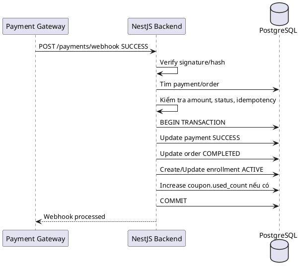
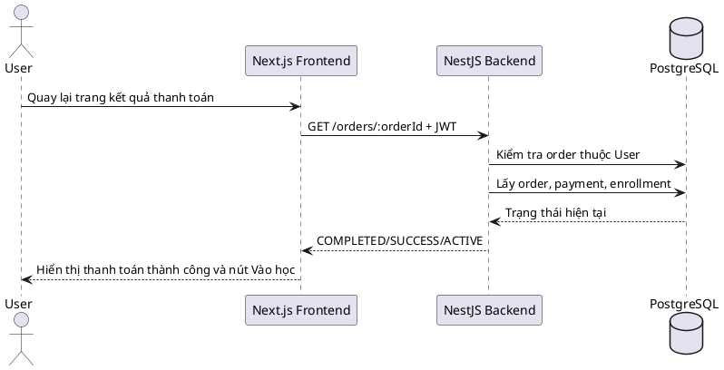

# SKILL.md — Use-case: Thanh toán khóa học

---

## 1. Mục tiêu use-case

Use-case **Thanh toán khóa học** cho phép học viên mua khóa học trả phí, áp dụng khuyến mãi/coupon, tạo đơn hàng, thực hiện thanh toán qua cổng thanh toán, theo dõi trạng thái giao dịch và được mở quyền học sau khi thanh toán thành công.

Hệ thống sử dụng:

```txt
Frontend: Next.js
Backend: NestJS
Database: PostgreSQL
ORM: Prisma
Auth: JWT access token
Payment Gateway: VNPay/Momo/Stripe hoặc cổng thanh toán tương đương
Video: Mux
Storage tài liệu: S3/R2 hoặc storage tương đương
```

Trong phạm vi tài liệu này, hệ thống **không sử dụng bảng refresh_tokens**. JWT access token được dùng để xác thực request; khi đăng xuất, frontend xóa token/cookie đang lưu.

Use-case này tập trung vào phía **User/Học viên** khi mua khóa học. Các chức năng đối soát doanh thu, hoàn tiền thủ công, quản lý tất cả đơn hàng của Admin hoặc thống kê doanh thu của giảng viên sẽ tách sang use-case khác.

---

## 2. Actor tham gia

| Actor | Mô tả |
|---|---|
| User | Người dùng thông thường/học viên trong hệ thống LMS, có thể mua khóa học |
| LMS System | Backend xử lý xác thực, tạo đơn hàng, tính giá, cập nhật thanh toán và mở enrollment |
| Payment Gateway | Cổng thanh toán bên ngoài xử lý giao dịch tiền |

Actor chính của use-case này:

```txt
User
```

Actor phụ:

```txt
Payment Gateway
LMS System
```

---

## 3. Phạm vi chức năng

Use-case **Thanh toán khóa học** bao gồm:

```txt
Xem thông tin thanh toán của khóa học
Tính giá gốc, promotion, coupon và giá cuối cùng
Nhập và kiểm tra coupon
Tạo order cho khóa học
Tạo payment tương ứng với order
Chuyển User sang cổng thanh toán
Nhận kết quả thanh toán từ cổng thanh toán
Nhận webhook/IPN từ cổng thanh toán
Cập nhật trạng thái payment
Cập nhật trạng thái order
Tạo hoặc kích hoạt enrollment sau khi thanh toán thành công
Kiểm tra trạng thái đơn hàng/thanh toán
Xử lý khóa học miễn phí
Chặn mua trùng khóa học đã đăng ký
```

Không bao gồm:

```txt
Admin xem tất cả đơn hàng
Admin hoàn tiền thủ công
Giảng viên xem doanh thu
Xuất hóa đơn VAT
Quản lý ví nội bộ
Thanh toán nhiều khóa học trong một giỏ hàng
Gia hạn subscription theo tháng
```

Các chức năng không bao gồm sẽ được tách sang use-case khác để báo cáo rõ ràng và dễ triển khai theo module.

---

## 4. Tiền điều kiện và hậu điều kiện

### 4.1. Mở trang thanh toán

| Mục | Nội dung |
|---|---|
| Tiền điều kiện | User đã đăng nhập; tài khoản có trạng thái `ACTIVE`; khóa học tồn tại và có trạng thái `PUBLISHED` |
| Hậu điều kiện | Frontend hiển thị thông tin khóa học, giá gốc, promotion nếu có, ô nhập coupon và tổng tiền cần thanh toán |

### 4.2. Áp dụng coupon

| Mục | Nội dung |
|---|---|
| Tiền điều kiện | User đã đăng nhập; coupon tồn tại; coupon còn hiệu lực; khóa học hợp lệ để mua |
| Hậu điều kiện | Hệ thống trả về số tiền giảm giá hợp lệ và giá cuối cùng sau khi áp dụng coupon |

### 4.3. Tạo order thanh toán

| Mục | Nội dung |
|---|---|
| Tiền điều kiện | User đã đăng nhập; khóa học chưa được User đăng ký `ACTIVE` hoặc `COMPLETED`; khóa học có trạng thái `PUBLISHED` |
| Hậu điều kiện | Một bản ghi `orders` được tạo với trạng thái `PENDING`; nếu có coupon/promotion thì lưu snapshot giảm giá vào order |

### 4.4. Tạo payment và chuyển sang cổng thanh toán

| Mục | Nội dung |
|---|---|
| Tiền điều kiện | Order tồn tại, thuộc về User hiện tại và có trạng thái `PENDING` |
| Hậu điều kiện | Một bản ghi `payments` được tạo với trạng thái `PENDING`; hệ thống trả về payment URL hoặc thông tin redirect sang cổng thanh toán |

### 4.5. Thanh toán thành công

| Mục | Nội dung |
|---|---|
| Tiền điều kiện | Cổng thanh toán gửi webhook/IPN hợp lệ; số tiền và mã giao dịch khớp với payment đang chờ |
| Hậu điều kiện | `payments.status = SUCCESS`, `orders.status = COMPLETED`, `enrollments.status = ACTIVE`, User được mở khóa học |

### 4.6. Thanh toán thất bại hoặc bị hủy

| Mục | Nội dung |
|---|---|
| Tiền điều kiện | Cổng thanh toán trả trạng thái thất bại/hủy hoặc User hủy giao dịch |
| Hậu điều kiện | `payments.status = FAILED`, `orders.status = FAILED` hoặc `CANCELLED`; enrollment không được kích hoạt |

---

## 5. Database liên quan

Use-case này chủ yếu sử dụng các bảng:

```txt
users
courses
coupons
promotions
promotion_courses
promotion_categories
orders
payments
enrollments
```

### 5.1. Bảng `users`

```dbml
Table users {
  id uuid [primary key]
  full_name varchar [not null]
  email varchar [not null, unique]
  password_hash text [not null]
  avatar_url text
  role user_role [not null, default: 'STUDENT']
  status user_status [not null, default: 'ACTIVE']
  created_at timestamp
  updated_at timestamp
}
```

Ý nghĩa trong use-case:

| Trường | Ý nghĩa |
|---|---|
| `id` | Dùng làm `student_id` trong `orders` và `enrollments` |
| `role` | User thường là `STUDENT`; Instructor/Admin vẫn có thể mua nếu nghiệp vụ cho phép |
| `status` | Chỉ tài khoản `ACTIVE` mới được tạo order và thanh toán |

Quy tắc xử lý:

```txt
Backend luôn lấy userId từ JWT.
Không cho frontend gửi student_id để tạo order.
Nếu user.status != ACTIVE thì từ chối thanh toán.
```

### 5.2. Bảng `courses`

```dbml
Table courses {
  id uuid [primary key]
  instructor_id uuid [not null]
  category_id uuid
  title varchar [not null]
  slug varchar [not null, unique]
  short_description text
  description text
  thumbnail_url text
  level course_level [not null, default: 'BEGINNER']
  status course_status [not null, default: 'DRAFT']
  price decimal(10,2) [not null, default: 0]
  created_at timestamp
  updated_at timestamp
}
```

Ý nghĩa trong use-case:

| Trường | Ý nghĩa |
|---|---|
| `id` | Khóa học được User mua |
| `category_id` | Dùng để kiểm tra promotion theo danh mục |
| `status` | Chỉ khóa học `PUBLISHED` mới được thanh toán |
| `price` | Giá gốc tại thời điểm mua, được snapshot vào `orders.base_price` |

Quy tắc xử lý:

```txt
Không cho mua khóa học DRAFT/HIDDEN/ARCHIVED.
Không tin giá gửi từ frontend.
Backend luôn lấy courses.price từ database.
```

### 5.3. Bảng `coupons`

```dbml
Table coupons {
  id uuid [primary key]
  code varchar [not null, unique]
  discount_type discount_type [not null]
  discount_value decimal(10,2) [not null]
  start_date timestamp
  end_date timestamp
  usage_limit integer
  used_count integer [default: 0]
  status coupon_status [not null, default: 'ACTIVE']
  created_by uuid [not null]
  created_at timestamp
  updated_at timestamp
}
```

Ý nghĩa trong use-case:

| Trường | Ý nghĩa |
|---|---|
| `code` | Mã User nhập khi thanh toán |
| `discount_type` | Giảm theo phần trăm hoặc số tiền cố định |
| `discount_value` | Giá trị giảm |
| `start_date`, `end_date` | Thời gian coupon có hiệu lực |
| `usage_limit`, `used_count` | Giới hạn số lần dùng |
| `status` | Chỉ coupon `ACTIVE` mới được áp dụng |

Quy tắc xử lý:

```txt
Coupon hết hạn không được áp dụng.
Coupon INACTIVE/EXPIRED không được áp dụng.
Nếu usage_limit khác null và used_count >= usage_limit thì không cho dùng.
Coupon discount không được lớn hơn số tiền còn lại sau promotion.
Chỉ tăng used_count khi thanh toán thành công, không tăng khi chỉ preview giá.
```

### 5.4. Bảng `promotions`

```dbml
Table promotions {
  id uuid [primary key]
  name varchar [not null]
  discount_percentage decimal(5,2) [not null]
  start_date timestamp [not null]
  end_date timestamp [not null]
  is_active boolean [default: true]
  created_at timestamp
  updated_at timestamp
}
```

Promotion có thể áp dụng trực tiếp cho khóa học hoặc danh mục thông qua:

```dbml
Table promotion_courses {
  promotion_id uuid [not null]
  course_id uuid [not null]

  indexes {
    (promotion_id, course_id) [primary key]
  }
}

Table promotion_categories {
  promotion_id uuid [not null]
  category_id uuid [not null]

  indexes {
    (promotion_id, category_id) [primary key]
  }
}
```

Ý nghĩa trong use-case:

| Bảng | Ý nghĩa |
|---|---|
| `promotions` | Lưu chương trình khuyến mãi trực tiếp |
| `promotion_courses` | Promotion áp dụng cho khóa học cụ thể |
| `promotion_categories` | Promotion áp dụng cho toàn bộ danh mục |

Quy tắc xử lý:

```txt
Promotion phải is_active = true.
Thời điểm hiện tại phải nằm trong start_date và end_date.
Nếu course có nhiều promotion hợp lệ thì backend chọn promotion tốt nhất hoặc theo rule của hệ thống.
promotion_discount được snapshot vào orders.promotion_discount.
```

### 5.5. Bảng `orders`

```dbml
Table orders {
  id uuid [primary key]
  student_id uuid [not null]
  course_id uuid [not null]
  coupon_id uuid
  promotion_id uuid
  base_price decimal(10,2) [not null]
  promotion_discount decimal(10,2) [default: 0]
  coupon_discount decimal(10,2) [default: 0]
  final_price decimal(10,2) [not null]
  status order_status [not null, default: 'PENDING']
  created_at timestamp
  updated_at timestamp
}
```

Ý nghĩa trong use-case:

| Trường | Ý nghĩa |
|---|---|
| `student_id` | User mua khóa học |
| `course_id` | Khóa học được mua |
| `coupon_id` | Coupon được áp dụng nếu có |
| `promotion_id` | Promotion được áp dụng nếu có |
| `base_price` | Giá gốc snapshot tại thời điểm mua |
| `promotion_discount` | Số tiền giảm do promotion |
| `coupon_discount` | Số tiền giảm do coupon |
| `final_price` | Số tiền cuối cùng cần thanh toán |
| `status` | Trạng thái đơn hàng: `PENDING`, `COMPLETED`, `FAILED`, `CANCELLED` |

Quy tắc xử lý:

```txt
Mỗi lần User bấm thanh toán có thể tạo một order PENDING.
Nếu User đã có enrollment ACTIVE/COMPLETED thì không tạo order mới.
Nếu có order PENDING cũ cho cùng course, có thể tái sử dụng hoặc hủy order cũ trước khi tạo order mới.
Không cho frontend tự gửi base_price, promotion_discount, coupon_discount, final_price.
Tất cả giá tiền phải do backend tính lại.
```

### 5.6. Bảng `payments`

```dbml
Table payments {
  id uuid [primary key]
  order_id uuid [not null]
  payment_method varchar [not null]
  transaction_reference varchar [unique]
  amount decimal(10,2) [not null]
  status payment_status [not null, default: 'PENDING']
  paid_at timestamp
  created_at timestamp
}
```

Ý nghĩa trong use-case:

| Trường | Ý nghĩa |
|---|---|
| `order_id` | Payment thuộc order nào |
| `payment_method` | Cổng/thể loại thanh toán, ví dụ `VNPAY`, `MOMO`, `STRIPE`, `BANK_TRANSFER` |
| `transaction_reference` | Mã giao dịch từ cổng thanh toán hoặc mã tham chiếu nội bộ |
| `amount` | Số tiền gửi sang cổng thanh toán |
| `status` | Trạng thái payment: `PENDING`, `SUCCESS`, `FAILED` |
| `paid_at` | Thời điểm thanh toán thành công |

Quy tắc xử lý:

```txt
Mỗi payment gắn với một order.
payment.amount phải bằng orders.final_price.
transaction_reference phải unique để xử lý webhook idempotent.
Không cập nhật SUCCESS nếu webhook không hợp lệ hoặc sai chữ ký.
```

### 5.7. Bảng `enrollments`

```dbml
Table enrollments {
  id uuid [primary key]
  student_id uuid [not null]
  course_id uuid [not null]
  order_id uuid
  status enrollment_status [not null, default: 'PENDING_PAYMENT']
  enrolled_at timestamp
  completed_at timestamp

  indexes {
    (student_id, course_id) [unique]
  }
}
```

Ý nghĩa trong use-case:

| Trường | Ý nghĩa |
|---|---|
| `student_id` | User được mở quyền học |
| `course_id` | Khóa học được mở |
| `order_id` | Order tạo ra enrollment |
| `status` | `PENDING_PAYMENT`, `ACTIVE`, `COMPLETED`, `CANCELLED` |
| `enrolled_at` | Thời điểm bắt đầu có quyền học |

Quy tắc xử lý:

```txt
Chỉ khi order COMPLETED/payment SUCCESS thì enrollment mới ACTIVE.
Nếu khóa học miễn phí, có thể tạo order COMPLETED với final_price = 0 và enrollment ACTIVE ngay.
Unique (student_id, course_id) giúp chặn đăng ký trùng khóa học.
Khi kiểm tra quyền học, chỉ cần kiểm tra enrollment.status = ACTIVE hoặc COMPLETED.
```

### 5.8. Enum liên quan

```dbml
Enum user_role {
  STUDENT
  INSTRUCTOR
  ADMIN
}

Enum user_status {
  ACTIVE
  INACTIVE
  BANNED
}

Enum course_status {
  DRAFT
  PUBLISHED
  HIDDEN
  ARCHIVED
}

Enum discount_type {
  PERCENTAGE
  FIXED_AMOUNT
}

Enum coupon_status {
  ACTIVE
  INACTIVE
  EXPIRED
}

Enum order_status {
  PENDING
  COMPLETED
  FAILED
  CANCELLED
}

Enum payment_status {
  PENDING
  SUCCESS
  FAILED
}

Enum enrollment_status {
  PENDING_PAYMENT
  ACTIVE
  COMPLETED
  CANCELLED
}
```

### 5.9. Quan hệ dữ liệu

```txt
users 1 - N orders thông qua orders.student_id
users 1 - N enrollments thông qua enrollments.student_id
courses 1 - N orders thông qua orders.course_id
courses 1 - N enrollments thông qua enrollments.course_id
orders 1 - N payments thông qua payments.order_id
orders 1 - 0..1 enrollments thông qua enrollments.order_id
coupons 1 - N orders thông qua orders.coupon_id
promotions 1 - N orders thông qua orders.promotion_id
```

### 5.10. Index gợi ý

```sql
CREATE INDEX idx_orders_student_id ON orders(student_id);
CREATE INDEX idx_orders_course_id ON orders(course_id);
CREATE INDEX idx_orders_status ON orders(status);
CREATE INDEX idx_orders_created_at ON orders(created_at);

CREATE INDEX idx_payments_order_id ON payments(order_id);
CREATE INDEX idx_payments_status ON payments(status);
CREATE UNIQUE INDEX idx_payments_transaction_reference ON payments(transaction_reference);

CREATE INDEX idx_enrollments_student_id ON enrollments(student_id);
CREATE INDEX idx_enrollments_course_id ON enrollments(course_id);
CREATE UNIQUE INDEX idx_enrollments_student_course ON enrollments(student_id, course_id);

CREATE INDEX idx_coupons_code ON coupons(code);
CREATE INDEX idx_promotions_active_time ON promotions(is_active, start_date, end_date);
```

---

## 6. Kiến trúc xử lý

### 6.1. Tổng quan kiến trúc

```txt
Next.js Frontend
   |
   | HTTP Request + JWT access token
   v
NestJS Backend
   |
   | OrdersModule / PaymentsModule / EnrollmentsModule / Guards / Services
   v
Prisma ORM
   |
   v
PostgreSQL Database

NestJS Backend
   |
   | Create payment URL / Verify webhook
   v
Payment Gateway
```

### 6.2. Các module NestJS liên quan

```txt
src/
├── auth/
│   ├── guards/
│   │   ├── jwt-auth.guard.ts
│   │   └── roles.guard.ts
│   └── strategies/
│       └── jwt.strategy.ts
│
├── courses/
│   ├── courses.module.ts
│   └── courses.service.ts
│
├── coupons/
│   ├── coupons.module.ts
│   └── coupons.service.ts
│
├── promotions/
│   ├── promotions.module.ts
│   └── promotions.service.ts
│
├── orders/
│   ├── orders.module.ts
│   ├── orders.controller.ts
│   ├── orders.service.ts
│   └── dto/
│       ├── create-order.dto.ts
│       ├── preview-checkout.dto.ts
│       └── query-my-orders.dto.ts
│
├── payments/
│   ├── payments.module.ts
│   ├── payments.controller.ts
│   ├── payments.service.ts
│   ├── gateways/
│   │   ├── payment-gateway.interface.ts
│   │   ├── vnpay.service.ts
│   │   ├── momo.service.ts
│   │   └── stripe.service.ts
│   └── dto/
│       ├── create-payment.dto.ts
│       ├── payment-return.dto.ts
│       └── payment-webhook.dto.ts
│
├── enrollments/
│   ├── enrollments.module.ts
│   └── enrollments.service.ts
│
└── prisma/
    ├── prisma.module.ts
    └── prisma.service.ts
```

### 6.3. Trách nhiệm từng thành phần

| Thành phần | Trách nhiệm |
|---|---|
| `OrdersController` | Nhận request tạo order, xem order của User, preview giá thanh toán |
| `OrdersService` | Kiểm tra course, tính giá, tạo order, kiểm tra owner của order |
| `PaymentsController` | Tạo payment URL, nhận return URL, nhận webhook/IPN |
| `PaymentsService` | Tạo payment, xác minh webhook, cập nhật payment/order/enrollment trong transaction |
| `CouponsService` | Validate coupon, tính coupon_discount |
| `PromotionsService` | Tìm promotion hợp lệ, tính promotion_discount |
| `EnrollmentsService` | Tạo hoặc kích hoạt enrollment khi thanh toán thành công |
| `JwtAuthGuard` | Xác thực User đăng nhập |
| `RolesGuard` | Giới hạn role nếu endpoint yêu cầu |
| `PrismaService` | Thao tác PostgreSQL |
| `PaymentGatewayService` | Tạo URL thanh toán và xác minh dữ liệu từ cổng thanh toán |

---

## 7. API design

### 7.1. Xem thông tin checkout của khóa học

```http
GET /courses/:courseId/checkout
Authorization: Bearer access_token
```

Mục đích:

```txt
Lấy thông tin khóa học, giá gốc, promotion hiện tại và trạng thái User đã đăng ký hay chưa.
```

Response:

```json
{
  "course": {
    "id": "uuid",
    "title": "NestJS PostgreSQL thực chiến",
    "thumbnailUrl": "https://...",
    "price": 499000,
    "status": "PUBLISHED"
  },
  "isEnrolled": false,
  "price": {
    "basePrice": 499000,
    "promotionId": "uuid",
    "promotionDiscount": 99000,
    "couponId": null,
    "couponDiscount": 0,
    "finalPrice": 400000
  }
}
```

### 7.2. Kiểm tra coupon trước khi tạo order

```http
POST /orders/preview
Authorization: Bearer access_token
```

Request body:

```json
{
  "courseId": "uuid",
  "couponCode": "SALE50"
}
```

Response:

```json
{
  "courseId": "uuid",
  "basePrice": 499000,
  "promotion": {
    "id": "uuid",
    "name": "Summer Sale",
    "discountPercentage": 20
  },
  "promotionDiscount": 99800,
  "coupon": {
    "id": "uuid",
    "code": "SALE50",
    "discountType": "FIXED_AMOUNT",
    "discountValue": 50000
  },
  "couponDiscount": 50000,
  "finalPrice": 349200
}
```

Lưu ý:

```txt
API này chỉ preview giá, chưa tạo order và chưa tăng used_count của coupon.
```

### 7.3. Tạo order mua khóa học

```http
POST /orders
Authorization: Bearer access_token
```

Request body:

```json
{
  "courseId": "uuid",
  "couponCode": "SALE50"
}
```

Response:

```json
{
  "message": "Tạo đơn hàng thành công",
  "order": {
    "id": "uuid",
    "courseId": "uuid",
    "status": "PENDING",
    "basePrice": 499000,
    "promotionDiscount": 99800,
    "couponDiscount": 50000,
    "finalPrice": 349200
  }
}
```

Trường hợp khóa học miễn phí hoặc final_price = 0:

```json
{
  "message": "Đăng ký khóa học miễn phí thành công",
  "order": {
    "id": "uuid",
    "status": "COMPLETED",
    "finalPrice": 0
  },
  "enrollment": {
    "id": "uuid",
    "status": "ACTIVE"
  }
}
```

### 7.4. Tạo payment cho order

```http
POST /payments
Authorization: Bearer access_token
```

Request body:

```json
{
  "orderId": "uuid",
  "paymentMethod": "VNPAY"
}
```

Response:

```json
{
  "payment": {
    "id": "uuid",
    "orderId": "uuid",
    "paymentMethod": "VNPAY",
    "amount": 349200,
    "status": "PENDING"
  },
  "paymentUrl": "https://payment-gateway.example/checkout?..."
}
```

Quy tắc:

```txt
Order phải thuộc User hiện tại.
Order phải có status = PENDING.
Order.final_price phải lớn hơn 0.
Nếu order.final_price = 0 thì không tạo payment, tạo enrollment ACTIVE luôn.
```

### 7.5. Payment return URL

```http
GET /payments/return?gateway=VNPAY&orderId=uuid&transactionRef=xxx&status=success
```

Mục đích:

```txt
Cổng thanh toán redirect User về frontend/backend sau khi thanh toán.
Return URL chỉ dùng để hiển thị trạng thái tạm thời.
Không nên chỉ dựa vào return URL để mở khóa học nếu chưa có xác minh chắc chắn.
```

Response gợi ý:

```json
{
  "message": "Đã nhận kết quả thanh toán, vui lòng chờ hệ thống xác nhận",
  "orderId": "uuid",
  "status": "PENDING"
}
```

Nếu hệ thống có thể xác minh chữ ký trong return URL và cổng thanh toán cho phép, có thể cập nhật ngay. Tuy nhiên, vẫn nên ưu tiên webhook/IPN làm nguồn xác nhận chính.

### 7.6. Payment webhook/IPN

```http
POST /payments/webhook/:gateway
```

Request body ví dụ:

```json
{
  "transactionReference": "VNPAY_123456",
  "orderId": "uuid",
  "amount": 349200,
  "status": "SUCCESS",
  "paidAt": "2026-06-19T10:00:00.000Z",
  "signature": "signed_payload"
}
```

Response:

```json
{
  "message": "Webhook processed"
}
```

Quy tắc xử lý:

```txt
Endpoint webhook có thể không cần JWT vì do payment gateway gọi.
Phải verify signature/hash/IP whitelist theo cổng thanh toán.
Webhook phải idempotent.
Nếu payment đã SUCCESS trước đó thì trả thành công và không xử lý lại.
Không tạo enrollment nhiều lần.
```

### 7.7. Kiểm tra trạng thái order

```http
GET /orders/:orderId
Authorization: Bearer access_token
```

Response:

```json
{
  "id": "uuid",
  "course": {
    "id": "uuid",
    "title": "NestJS PostgreSQL thực chiến"
  },
  "basePrice": 499000,
  "promotionDiscount": 99800,
  "couponDiscount": 50000,
  "finalPrice": 349200,
  "status": "COMPLETED",
  "payment": {
    "id": "uuid",
    "status": "SUCCESS",
    "paymentMethod": "VNPAY",
    "paidAt": "2026-06-19T10:00:00.000Z"
  },
  "enrollment": {
    "id": "uuid",
    "status": "ACTIVE"
  }
}
```

### 7.8. Lấy danh sách đơn hàng của tôi

```http
GET /orders/my?status=COMPLETED&page=1&limit=10
Authorization: Bearer access_token
```

Response:

```json
{
  "items": [
    {
      "id": "uuid",
      "courseTitle": "NestJS PostgreSQL thực chiến",
      "finalPrice": 349200,
      "status": "COMPLETED",
      "createdAt": "2026-06-19T10:00:00.000Z"
    }
  ],
  "pagination": {
    "page": 1,
    "limit": 10,
    "total": 1
  }
}
```

### 7.9. Hủy order đang chờ thanh toán

```http
PATCH /orders/:orderId/cancel
Authorization: Bearer access_token
```

Response:

```json
{
  "message": "Đã hủy đơn hàng",
  "order": {
    "id": "uuid",
    "status": "CANCELLED"
  }
}
```

Quy tắc:

```txt
Chỉ cho User hủy order của chính mình.
Chỉ hủy được order PENDING.
Nếu payment đã SUCCESS thì không cho hủy bằng API này.
```

---

## 8. Data flow

### 8.1. Data flow — Mở trang thanh toán

```txt
User mở trang checkout
→ Frontend gọi GET /courses/:courseId/checkout
→ Backend xác thực JWT nếu cần
→ Backend lấy thông tin User từ token
→ Backend kiểm tra user.status = ACTIVE
→ Backend lấy course theo courseId
→ Backend kiểm tra course.status = PUBLISHED
→ Backend kiểm tra enrollment đã tồn tại chưa
→ Backend tính promotion hợp lệ nếu có
→ Backend trả thông tin checkout
→ Frontend hiển thị giá và nút thanh toán
```

### 8.2. Data flow — Preview coupon

```txt
User nhập coupon code
→ Frontend gọi POST /orders/preview
→ Backend lấy course từ database
→ Backend tìm promotion hợp lệ
→ Backend tìm coupon theo code
→ Backend kiểm tra status, thời gian hiệu lực, usage_limit
→ Backend tính promotion_discount
→ Backend tính coupon_discount
→ Backend tính final_price
→ Backend trả kết quả preview
→ Frontend cập nhật tổng tiền
```

### 8.3. Data flow — Tạo order

```txt
User bấm Thanh toán
→ Frontend gọi POST /orders
→ Backend xác thực JWT
→ Backend kiểm tra User ACTIVE
→ Backend kiểm tra course PUBLISHED
→ Backend kiểm tra User chưa có enrollment ACTIVE/COMPLETED
→ Backend tính lại giá từ database
→ Backend validate coupon/promotion lại lần nữa
→ Backend tạo order PENDING
→ Nếu final_price = 0:
   → Backend cập nhật order COMPLETED
   → Backend tạo enrollment ACTIVE
   → Backend trả kết quả đăng ký thành công
→ Nếu final_price > 0:
   → Backend trả order PENDING
→ Frontend gọi tiếp API tạo payment
```

### 8.4. Data flow — Tạo payment

```txt
Frontend gọi POST /payments
→ Backend kiểm tra order thuộc User hiện tại
→ Backend kiểm tra order.status = PENDING
→ Backend kiểm tra order.final_price > 0
→ Backend tạo payment PENDING
→ Backend gọi Payment Gateway tạo paymentUrl
→ Backend lưu transaction_reference nếu có
→ Backend trả paymentUrl
→ Frontend redirect User sang Payment Gateway
```

### 8.5. Data flow — Webhook thanh toán thành công

```txt
Payment Gateway gửi webhook SUCCESS
→ Backend nhận POST /payments/webhook/:gateway
→ Backend verify signature/hash
→ Backend tìm payment/order theo transaction_reference hoặc orderId
→ Backend kiểm tra amount khớp order.final_price
→ Backend kiểm tra payment chưa SUCCESS trước đó
→ Backend mở database transaction
   → Cập nhật payments.status = SUCCESS
   → Cập nhật payments.paid_at = now()
   → Cập nhật orders.status = COMPLETED
   → Tạo hoặc cập nhật enrollments.status = ACTIVE
   → Set enrollments.enrolled_at = now()
   → Nếu có coupon thì tăng coupons.used_count
→ Commit transaction
→ Trả response thành công cho Payment Gateway
```

### 8.6. Data flow — Thanh toán thất bại

```txt
Payment Gateway gửi webhook FAILED
→ Backend verify signature/hash
→ Backend tìm payment/order
→ Backend cập nhật payments.status = FAILED
→ Backend cập nhật orders.status = FAILED hoặc giữ PENDING tùy chính sách retry
→ Không tạo enrollment ACTIVE
→ Frontend khi check order thấy FAILED và hiển thị nút thanh toán lại
```

### 8.99. Quy tắc xử lý dữ liệu chung

```txt
Luôn tính giá ở backend.
Không tin final_price gửi từ frontend.
Không mở enrollment từ return URL nếu chưa xác minh thanh toán.
Webhook phải xử lý idempotent.
Mọi thao tác cập nhật payment/order/enrollment phải chạy trong transaction.
Enrollment là nguồn quyền học cuối cùng.
```

---

## 9. Sequence diagram

### 9.1. Sequence — Tạo order và payment

``plantuml
@startuml
actor User
participant "Next.js Frontend" as FE
participant "NestJS Backend" as BE
database "PostgreSQL" as DB
participant "Payment Gateway" as PG

User -> FE: Bấm Thanh toán khóa học
FE -> BE: POST /orders + JWT
BE -> DB: Kiểm tra user, course, enrollment
BE -> DB: Tính promotion/coupon
BE -> DB: Tạo order PENDING
DB --> BE: Order
BE --> FE: orderId, finalPrice

FE -> BE: POST /payments + orderId
BE -> DB: Kiểm tra order thuộc User
BE -> DB: Tạo payment PENDING
BE -> PG: Tạo payment URL
PG --> BE: paymentUrl, transactionReference
BE -> DB: Lưu transactionReference
BE --> FE: paymentUrl
FE -> PG: Redirect User sang cổng thanh toán
@enduml
```

---

### 9.2. Sequence — Webhook thanh toán thành công



---

### 9.3. Sequence — User kiểm tra trạng thái sau thanh toán



---

## 10. Activity flow

### 10.1. Activity flow — Mua khóa học trả phí
```txt
Bắt đầu
→ User mở trang khóa học
→ Hệ thống kiểm tra đăng nhập
   ├── Chưa đăng nhập
   │   → Chuyển đến trang đăng nhập
   │   → Kết thúc
   └── Đã đăng nhập
       → Kiểm tra trạng thái tài khoản
          ├── Tài khoản không ACTIVE
          │   → Không cho thanh toán
          │   → Kết thúc
          └── Tài khoản ACTIVE
              → Kiểm tra trạng thái khóa học
                 ├── Course không phải PUBLISHED
                 │   → Không cho mua
                 │   → Kết thúc
                 └── Course PUBLISHED
                     → Kiểm tra enrollment của User
                        ├── Đã có enrollment ACTIVE/COMPLETED
                        │   → Hiển thị nút Tiếp tục học
                        │   → Kết thúc
                        └── Chưa có enrollment
                            → Hiển thị checkout
                            → User nhập coupon nếu có
                            → Backend tính final_price
                            → Kiểm tra final_price
                               ├── final_price = 0
                               │   → Tạo order COMPLETED
                               │   → Tạo enrollment ACTIVE
                               │   → Frontend hiển thị nút Vào học
                               │   → Kết thúc
                               └── final_price > 0
                                   → Tạo order PENDING
                                   → Tạo payment PENDING
                                   → Redirect sang cổng thanh toán
                                   → Chờ webhook từ Payment Gateway
                                      ├── Webhook SUCCESS
                                      │   → Update order COMPLETED
                                      │   → Update payment SUCCESS
                                      │   → Tạo hoặc cập nhật enrollment ACTIVE
                                      │   → Frontend hiển thị thanh toán thành công
                                      │   → Kết thúc
                                      └── Webhook FAILED/CANCELLED
                                          → Update payment FAILED
                                          → Update order FAILED/CANCELLED
                                          → Không tạo enrollment ACTIVE
                                          → Frontend hiển thị thanh toán thất bại
                                          → Cho phép thanh toán lại
                                          → Kết thúc
Kết thúc
```

### 10.2. Activity flow — Khóa học miễn phí

```txt
Bắt đầu
→ User bấm Đăng ký học miễn phí
→ Backend kiểm tra course PUBLISHED
   ├── Không phải PUBLISHED
   │   → Báo lỗi khóa học chưa mở đăng ký
   │   → Kết thúc
   └── Là PUBLISHED
       → Backend kiểm tra User chưa có enrollment
          ├── Đã có enrollment
          │   → Báo lỗi đã đăng ký khóa học
          │   → Kết thúc
          └── Chưa có enrollment
              → Tạo order với final_price = 0
              → Set order COMPLETED
              → Tạo enrollment ACTIVE
              → Frontend hiển thị nút Vào học
              → Kết thúc
Kết thúc
```

### 10.3. Activity flow — Thanh toán thất bại

```txt
Bắt đầu
→ User thanh toán tại gateway
→ Gateway trả kết quả
   ├── Failed/Cancel
   │   → Webhook FAILED hoặc return failed
   │   → Update payment FAILED
   │   → Update order FAILED/CANCELLED
   │   → Không tạo enrollment ACTIVE
   │   → Frontend hiển thị thanh toán thất bại
   │   → Cho phép thanh toán lại
   │   → Kết thúc
   └── Success
       → Không xử lý trong flow thất bại này
       → Chuyển sang flow thanh toán thành công
Kết thúc
```

## 11. Kiểm tra phân quyền

### 11.1. JWT payload

JWT payload nên chứa tối thiểu:

```json
{
  "sub": "user_id",
  "email": "user@example.com",
  "role": "STUDENT",
  "status": "ACTIVE"
}
```

Backend sử dụng:

```txt
sub: xác định student_id khi tạo order/enrollment
role: kiểm tra quyền nếu endpoint giới hạn role
status: kiểm tra tài khoản còn ACTIVE
```

### 11.2. Quyền truy cập API

| API | User | Instructor | Admin | Ghi chú |
|---|---:|---:|---:|---|
| `GET /courses/:courseId/checkout` | Có | Có | Có | Nếu nghiệp vụ cho phép mọi role mua khóa học |
| `POST /orders/preview` | Có | Có | Có | Chỉ preview giá |
| `POST /orders` | Có | Có | Có | `student_id` lấy từ JWT |
| `POST /payments` | Có | Có | Có | Chỉ order của chính mình |
| `GET /orders/:orderId` | Có | Có | Có | User chỉ xem order của mình; Admin có API riêng nếu cần |
| `GET /orders/my` | Có | Có | Có | Lấy đơn hàng của chính mình |
| `PATCH /orders/:orderId/cancel` | Có | Có | Có | Chỉ order của chính mình và đang PENDING |
| `POST /payments/webhook/:gateway` | Gateway | Gateway | Gateway | Không dùng JWT, dùng signature/hash |

### 11.3. Quy tắc quan trọng

```txt
User không được tạo order cho student_id khác.
User không được xem order của người khác.
User không được tự cập nhật orders.status.
User không được tự cập nhật payments.status.
User không được tự tạo enrollment ACTIVE.
Frontend không được gửi final_price để backend tin trực tiếp.
Webhook phải được xác minh trước khi mở khóa học.
```

---

## 12. Validation rules

### 12.1. CreateOrderDto

```ts
export class CreateOrderDto {
  @IsUUID()
  courseId: string;

  @IsOptional()
  @IsString()
  @MaxLength(50)
  couponCode?: string;
}
```

Validation nghiệp vụ:

```txt
courseId phải tồn tại.
Course phải PUBLISHED.
User phải ACTIVE.
User chưa có enrollment ACTIVE/COMPLETED với course đó.
Coupon nếu có phải hợp lệ.
```

### 12.2. PreviewCheckoutDto

```ts
export class PreviewCheckoutDto {
  @IsUUID()
  courseId: string;

  @IsOptional()
  @IsString()
  @MaxLength(50)
  couponCode?: string;
}
```

Validation nghiệp vụ:

```txt
Không tạo order.
Không tăng coupon.used_count.
Chỉ trả giá dự kiến tại thời điểm preview.
Khi tạo order vẫn phải tính lại giá một lần nữa.
```

### 12.3. CreatePaymentDto

```ts
export class CreatePaymentDto {
  @IsUUID()
  orderId: string;

  @IsString()
  @IsIn(['VNPAY', 'MOMO', 'STRIPE', 'BANK_TRANSFER'])
  paymentMethod: string;
}
```

Validation nghiệp vụ:

```txt
Order phải thuộc User hiện tại.
Order phải PENDING.
Order.final_price > 0.
Không tạo payment nếu order đã COMPLETED/CANCELLED/FAILED.
Nếu đã có payment PENDING, có thể tái sử dụng hoặc tạo payment mới tùy thiết kế.
```

### 12.4. PaymentWebhookDto

```ts
export class PaymentWebhookDto {
  @IsString()
  transactionReference: string;

  @IsUUID()
  orderId: string;

  @IsNumber()
  amount: number;

  @IsString()
  status: string;

  @IsOptional()
  @IsString()
  signature?: string;
}
```

Validation nghiệp vụ:

```txt
Phải verify signature/hash theo gateway.
amount phải khớp payment.amount/order.final_price.
transactionReference không được xử lý trùng.
status từ gateway phải được map sang payment_status nội bộ.
```

### 12.5. Ràng buộc database cần lưu ý

```txt
payments.transaction_reference unique để chống xử lý trùng webhook.
enrollments(student_id, course_id) unique để chống đăng ký trùng.
orders.final_price không được âm.
promotion_discount + coupon_discount không được lớn hơn base_price.
payment.amount phải bằng order.final_price.
```

---

## 13. Error handling

| Mã lỗi | Trường hợp | Response gợi ý |
|---|---|---|
| `401 Unauthorized` | Chưa đăng nhập | `Bạn cần đăng nhập để thanh toán` |
| `403 Forbidden` | Tài khoản không ACTIVE hoặc bị khóa | `Tài khoản không được phép thanh toán` |
| `404 Not Found` | Course/order/payment không tồn tại | `Không tìm thấy dữ liệu` |
| `409 Conflict` | User đã đăng ký khóa học | `Bạn đã sở hữu khóa học này` |
| `400 Bad Request` | Course chưa published | `Khóa học chưa mở bán` |
| `400 Bad Request` | Coupon không hợp lệ | `Mã giảm giá không hợp lệ` |
| `400 Bad Request` | Coupon hết hạn | `Mã giảm giá đã hết hạn` |
| `400 Bad Request` | Order không ở trạng thái PENDING | `Đơn hàng không thể thanh toán` |
| `400 Bad Request` | Payment amount không khớp | `Số tiền thanh toán không hợp lệ` |
| `409 Conflict` | Webhook đã xử lý trước đó | `Webhook already processed` |
| `500 Internal Server Error` | Lỗi gateway hoặc database | `Không thể xử lý thanh toán, vui lòng thử lại` |

Response lỗi chuẩn:

```json
{
  "statusCode": 400,
  "message": "Mã giảm giá không hợp lệ",
  "error": "Bad Request"
}
```

---

## 14. Bảo mật

Các nguyên tắc bảo mật bắt buộc:

```txt
Không tin dữ liệu giá tiền từ frontend.
Không cho frontend cập nhật orders.status hoặc payments.status.
Không mở enrollment chỉ vì frontend báo thanh toán thành công.
Luôn verify chữ ký/hash webhook từ payment gateway.
Luôn kiểm tra amount từ gateway có khớp order.final_price không.
Dùng transaction khi cập nhật payment/order/enrollment.
Webhook phải idempotent.
Không log thông tin nhạy cảm của gateway như secret key.
Không lưu thông tin thẻ thanh toán trong database.
Không để User xem order của User khác.
```

Quy tắc chống mua trùng:

```txt
Trước khi tạo order:
  kiểm tra enrollments(student_id, course_id) có ACTIVE/COMPLETED chưa.

Khi webhook thành công:
  tạo enrollment bằng upsert hoặc kiểm tra unique constraint.
```

Quy tắc chống replay webhook:

```txt
Nếu transaction_reference đã SUCCESS:
  không xử lý lại.
  trả response thành công cho gateway.

Nếu order đã COMPLETED:
  không tạo enrollment lần hai.
```

---

## 15. Prototype user flow

### 15.1. Flow — Mua khóa học trả phí

```txt
1. User mở trang chi tiết khóa học.
2. User bấm Mua khóa học.
3. Frontend mở trang checkout.
4. Hệ thống hiển thị:
   - Tên khóa học
   - Giá gốc
   - Khuyến mãi đang áp dụng
   - Ô nhập coupon
   - Tổng tiền cần thanh toán
5. User nhập coupon nếu có.
6. Frontend gọi API preview giá.
7. User bấm Thanh toán.
8. Backend tạo order PENDING.
9. Backend tạo payment PENDING.
10. Frontend redirect sang cổng thanh toán.
11. User hoàn tất thanh toán.
12. Payment Gateway gửi webhook về backend.
13. Backend cập nhật payment SUCCESS, order COMPLETED, enrollment ACTIVE.
14. User quay lại trang kết quả.
15. Frontend gọi API kiểm tra order.
16. Nếu order COMPLETED, hiển thị nút Vào học.
```

### 15.2. Flow — Khóa học miễn phí

```txt
1. User mở khóa học có price = 0 hoặc final_price = 0 sau giảm giá.
2. User bấm Đăng ký học.
3. Backend kiểm tra course PUBLISHED và chưa đăng ký.
4. Backend tạo order COMPLETED với final_price = 0.
5. Backend tạo enrollment ACTIVE.
6. Frontend hiển thị đăng ký thành công.
7. User bấm Vào học.
```

### 15.3. Flow — Thanh toán thất bại

```txt
1. User tạo order và payment.
2. User chuyển sang cổng thanh toán.
3. Giao dịch thất bại hoặc User hủy.
4. Gateway gửi trạng thái FAILED/CANCELLED.
5. Backend cập nhật payment FAILED và order FAILED/CANCELLED.
6. Frontend hiển thị thanh toán thất bại.
7. User có thể bấm Thanh toán lại.
```

### 15.4. Flow — User đã mua khóa học

```txt
1. User mở trang khóa học đã mua.
2. Backend kiểm tra enrollment ACTIVE/COMPLETED.
3. Frontend không hiển thị nút Mua khóa học nữa.
4. Frontend hiển thị nút Tiếp tục học.
```

---

## 16. Gợi ý màn hình giao diện

### 16.1. Trang checkout

Thông tin nên hiển thị:

```txt
Ảnh thumbnail khóa học
Tên khóa học
Tên giảng viên
Giá gốc
Promotion đang áp dụng
Ô nhập coupon
Số tiền giảm từ promotion
Số tiền giảm từ coupon
Tổng tiền cuối cùng
Nút Thanh toán
Nút Quay lại khóa học
```

Trạng thái UI:

```txt
Loading khi kiểm tra coupon
Loading khi tạo order/payment
Disable nút Thanh toán khi đang xử lý
Thông báo coupon hợp lệ/không hợp lệ
Cảnh báo nếu khóa học đã mua
```

### 16.2. Trang kết quả thanh toán

Thông tin nên hiển thị:

```txt
Trạng thái thanh toán
Mã đơn hàng
Tên khóa học
Số tiền đã thanh toán
Phương thức thanh toán
Thời gian thanh toán
Nút Vào học nếu thành công
Nút Thanh toán lại nếu thất bại
Nút Xem đơn hàng của tôi
```

### 16.3. Trang lịch sử đơn hàng

Thông tin nên hiển thị:

```txt
Danh sách order của User
Tên khóa học
Số tiền cuối cùng
Trạng thái order
Thời gian tạo order
Trạng thái payment
Nút xem chi tiết
Nút tiếp tục thanh toán nếu order PENDING
```

### 16.4. Component trạng thái

```txt
PENDING: Đang chờ thanh toán
COMPLETED: Thanh toán thành công
FAILED: Thanh toán thất bại
CANCELLED: Đã hủy
```

---

## 17. Test cases cơ bản

| STT | Test case | Kết quả mong đợi |
|---:|---|---|
| 1 | User chưa đăng nhập tạo order | Trả `401 Unauthorized` |
| 2 | User bị BANNED tạo order | Trả `403 Forbidden` |
| 3 | Course không tồn tại | Trả `404 Not Found` |
| 4 | Course DRAFT/HIDDEN/ARCHIVED | Không cho thanh toán |
| 5 | User đã có enrollment ACTIVE | Không cho mua trùng |
| 6 | User nhập coupon đúng | Trả discount và final_price đúng |
| 7 | User nhập coupon hết hạn | Trả lỗi coupon hết hạn |
| 8 | Coupon vượt usage_limit | Trả lỗi coupon đã hết lượt dùng |
| 9 | Tạo order thành công | Order `PENDING`, giá được snapshot đúng |
| 10 | Tạo payment cho order không thuộc User | Trả `403 Forbidden` |
| 11 | Tạo payment cho order COMPLETED | Trả lỗi order không thể thanh toán |
| 12 | Webhook SUCCESS hợp lệ | Payment `SUCCESS`, order `COMPLETED`, enrollment `ACTIVE` |
| 13 | Webhook SUCCESS gửi lại lần hai | Không tạo enrollment trùng, trả OK |
| 14 | Webhook sai signature | Không cập nhật payment/order/enrollment |
| 15 | Webhook amount không khớp | Không mở khóa học |
| 16 | Thanh toán FAILED | Payment `FAILED`, order `FAILED`, không có enrollment ACTIVE |
| 17 | Khóa học miễn phí | Tạo order `COMPLETED`, enrollment `ACTIVE`, không tạo payment |
| 18 | Coupon dùng thành công | `coupons.used_count` tăng đúng một lần |
| 19 | User xem order của người khác | Trả `403 Forbidden` |
| 20 | User hủy order PENDING | Order chuyển `CANCELLED` |

---

## 18. Checklist triển khai backend

```txt
Tạo OrdersModule.
Tạo PaymentsModule.
Tạo DTO: CreateOrderDto, PreviewCheckoutDto, CreatePaymentDto, PaymentWebhookDto.
Tạo API preview checkout.
Tạo API tạo order.
Tạo API tạo payment.
Tạo API webhook payment gateway.
Tạo API xem order của User.
Tạo API lịch sử order của User.
Tạo API hủy order PENDING.
Validate User ACTIVE.
Validate Course PUBLISHED.
Validate chưa enrollment ACTIVE/COMPLETED.
Tính promotion tự động.
Validate coupon.
Snapshot base_price, promotion_discount, coupon_discount, final_price vào order.
Không tin giá từ frontend.
Verify signature webhook.
Kiểm tra amount khớp.
Cập nhật payment/order/enrollment trong transaction.
Đảm bảo webhook idempotent.
Tăng coupon.used_count chỉ khi thanh toán thành công.
Xử lý khóa học miễn phí.
Viết unit test cho service tính giá.
Viết integration test cho webhook.
```

---

## 19. Checklist triển khai frontend

```txt
Tạo trang checkout khóa học.
Hiển thị thông tin khóa học và giá.
Hiển thị promotion đang áp dụng.
Tạo ô nhập coupon.
Gọi API preview khi nhập coupon.
Hiển thị tổng tiền cuối cùng.
Gọi API tạo order khi bấm Thanh toán.
Gọi API tạo payment nếu final_price > 0.
Redirect sang paymentUrl.
Tạo trang kết quả thanh toán.
Sau khi redirect về, gọi API GET /orders/:orderId để kiểm tra trạng thái thật.
Hiển thị nút Vào học nếu enrollment ACTIVE.
Hiển thị nút Thanh toán lại nếu FAILED/PENDING.
Tạo trang lịch sử đơn hàng của tôi.
Disable nút khi đang xử lý.
Hiển thị lỗi rõ ràng khi coupon không hợp lệ.
Không tự tính final_price để gửi lên backend.
Không tự mở khóa học ở frontend nếu backend chưa trả enrollment ACTIVE.
```

---

## 20. Gợi ý cải tiến DB sau MVP

Database hiện tại đã đủ cho MVP thanh toán một khóa học một lần. Nếu hệ thống mở rộng, có thể cân nhắc bổ sung:

### 20.1. Thêm trạng thái hoàn tiền

```dbml
Enum order_status {
  PENDING
  COMPLETED
  FAILED
  CANCELLED
  REFUNDED
}

Enum payment_status {
  PENDING
  SUCCESS
  FAILED
  REFUNDED
}

Enum enrollment_status {
  PENDING_PAYMENT
  ACTIVE
  COMPLETED
  CANCELLED
  REFUNDED
}
```

### 20.2. Thêm thời gian thanh toán vào orders

```dbml
Table orders {
  paid_at timestamp
  cancelled_at timestamp
  refunded_at timestamp
}
```

### 20.3. Thêm bảng payment_events

Dùng để lưu toàn bộ webhook raw từ cổng thanh toán:

```dbml
Table payment_events {
  id uuid [primary key]
  payment_id uuid
  gateway varchar [not null]
  event_type varchar [not null]
  transaction_reference varchar
  raw_payload jsonb
  received_at timestamp
}
```

Mục đích:

```txt
Đối soát webhook.
Debug lỗi thanh toán.
Kiểm tra lịch sử trạng thái giao dịch.
```

### 20.4. Thêm giỏ hàng nếu muốn mua nhiều khóa học

Nếu sau này muốn User mua nhiều khóa học cùng lúc, nên thêm:

```txt
carts
cart_items
order_items
```

Hiện tại DB của hệ thống đang thiết kế `orders.course_id`, tức là một order tương ứng một khóa học. Với MVP, thiết kế này là hợp lý.

---

## 21. Kết luận

Use-case **Thanh toán khóa học** là cầu nối giữa việc mua khóa học và quyền học của User.

Luồng nghiệp vụ cốt lõi:

```txt
User chọn khóa học
→ Backend tính giá
→ Tạo order PENDING
→ Tạo payment PENDING
→ User thanh toán qua gateway
→ Webhook xác nhận SUCCESS
→ Order COMPLETED
→ Payment SUCCESS
→ Enrollment ACTIVE
→ User được học khóa học
```

Nguyên tắc quan trọng nhất:

```txt
orders/payments dùng để quản lý nghiệp vụ thanh toán.
enrollments dùng để quyết định User có quyền học hay không.
```

Vì vậy, khi User truy cập khóa học/bài học, hệ thống không cần kiểm tra payment trực tiếp mỗi lần. Backend chỉ cần kiểm tra:

```txt
enrollments.student_id = currentUser.id
enrollments.course_id = courseId
enrollments.status IN (ACTIVE, COMPLETED)
```

Nếu có enrollment hợp lệ thì User được học. Nếu không có, User phải mua hoặc đăng ký khóa học trước.
